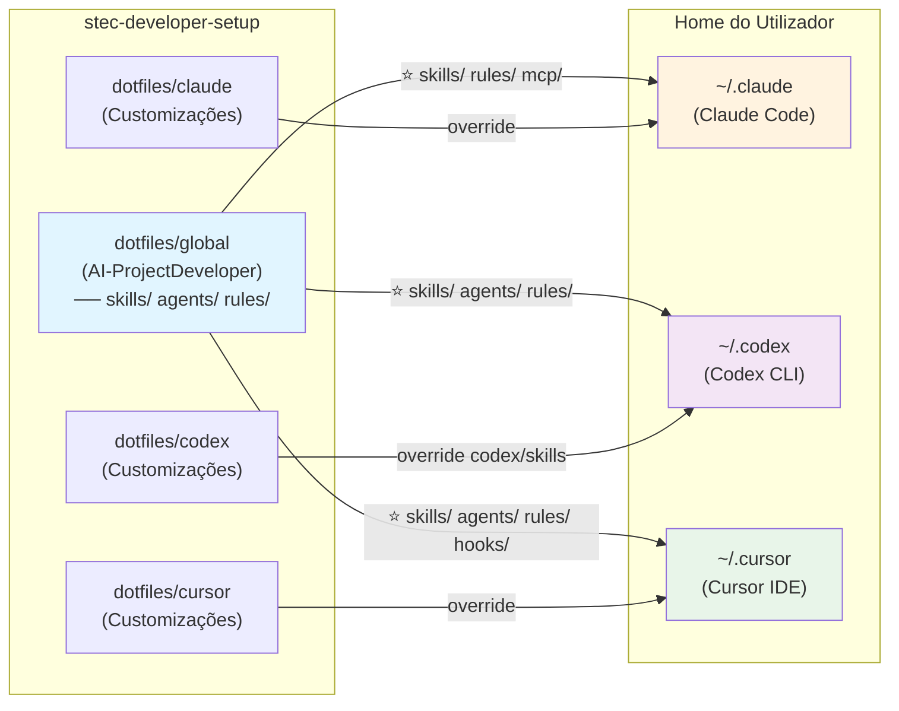

# 📋 Plano V2: Integração Total do AI-ProjectDeveloper em dotfiles/global

## 🎯 Objetivo

Trazer **todos os arquivos** do repositório **AI-ProjectDeveloper** (316+ skills, agents, rules, hooks, etc.) para uma pasta centralizada `dotfiles/global/`, removendo o git submodule e redistribuindo esses recursos através do `install.sh` para as configurações das 3 IDEs (Claude, Cursor, Codex), respeitando as especificações de cada ferramenta conforme mapeado em `docs/ferramentas/Mapeamento-Arquivos-IDEs.md`.

---

## 📊 Estado Atual

### Estrutura Existente
```
stec-developer-setup/
├── .cursor/                (git submodule → SERÁ REMOVIDO)
│   ├── agents/
│   ├── skills/
│   ├── rules/
│   ├── codex-skills/
│   ├── hooks/
│   ├── mcp/
│   └── plans/
├── dotfiles/
│   ├── claude/
│   │   └── scripts/
│   ├── cursor/
│   │   ├── agents/         (base mínimo)
│   │   ├── skills/         (16 skills)
│   │   └── scripts/
│   ├── codex/
│   │   ├── skills/         (2 skills)
│   │   ├── rules/
│   │   └── scripts/
│   └── home/
│       └── CLAUDE.md
├── install.sh              (atual: copia dotfiles → home)
├── .gitmodules             (SERÁ REMOVIDO)
└── ...
```

### Install.sh Atual
```bash
copy_recursive_tree "$DOTFILES_DIR/claude" "$CLAUDE_CONFIG_DIR" "Claude Code"
copy_recursive_tree "$DOTFILES_DIR/cursor" "$CURSOR_CONFIG_DIR" "Cursor IDE"
copy_recursive_tree "$DOTFILES_DIR/codex" "$CODEX_CONFIG_DIR" "Codex CLI"
```

---

## 🔄 Arquitetura Nova (Proposta)

### Estrutura de Pastas

```
dotfiles/
├── global/                          ← NOVO: Catálogo centralizado (do AI-ProjectDeveloper)
│   ├── agents/                      # 77 agents corporativos
│   ├── skills/                      # 316 skills corporativas (genéricas)
│   ├── rules/                       # Regras MDC corporativas
│   ├── hooks/                       # Hooks de integração
│   ├── mcp/                         # Configurações MCP
│   ├── plans/                       # Planos de trabalho
│   ├── schemas/                     # Schemas JSON
│   └── README.md                    # Documentação (origem: AI-ProjectDeveloper)
│
├── claude/                          ← Recursos específicos de Claude (override)
│   ├── scripts/                     # Scripts próprios de Claude
│   └── [skills personalizadas]      # Se houver
│
├── cursor/                          ← Recursos específicos de Cursor (override)
│   ├── agents/                      # Se houver customizações locais
│   ├── skills/                      # Se houver customizações locais
│   └── scripts/                     # Scripts próprios de Cursor
│
├── codex/                           ← Recursos específicos de Codex (override)
│   ├── skills/                      # ⭐ Skills Codex do AI-ProjectDeveloper (ex-codex-skills/)
│   ├── rules/                       # Se houver customizações locais
│   └── scripts/                     # Scripts próprios de Codex
│
└── home/
    └── CLAUDE.md
```

**Nota:** A pasta `codex-skills/` do AI-ProjectDeveloper (originalmente em `.cursor/codex-skills/`) é migrada **diretamente** para `dotfiles/codex/skills/` (não para global), pois contém skills já pré-convertidas e formatadas especificamente para o Codex CLI.

### Fluxo de Distribuição (install.sh)

```
Fase 1: Copia global → home (SOBRESCREVE arquivos existentes)
├── ⭐ dotfiles/global/skills/* → ~/.claude/skills/, ~/.cursor/skills/, ~/.codex/skills/ ← Skills para TODOS
├── ⭐ dotfiles/global/rules/* → ~/.claude/rules/, ~/.cursor/rules/, ~/.codex/rules/ ← Rules para TODOS
├── dotfiles/global/agents/* → ~/.cursor/agents/, ~/.codex/agents/
├── dotfiles/global/hooks/* → ~/.cursor/hooks.json, ~/.codex/rules/
└── dotfiles/global/mcp/* → ~/.claude/mcp/

Fase 2: Copia específicas → home (SOBRESCREVE Fase 1 e arquivos existentes)
├── dotfiles/claude/* → ~/.claude/ (pode conter skills/rules/mcp adicionais)
├── dotfiles/cursor/* → ~/.cursor/ (pode conter skills/agents/rules adicionais)
└── dotfiles/codex/* → ~/.codex/ (pode conter skills/agents/rules adicionais)
    └── ⭐ codex/skills/* → ~/.codex/skills/ (Skills Codex pré-convertidas, SOBRESCREVEM global/skills se houver conflito)

Resultado Final: Skills e Rules globais em TODAS as 3 IDEs + customizações locais específicas (locais sobrescrevem globais)
```

### 🔄 Política de Sobrescrita

**IMPORTANTE:** Todos os arquivos copiados nos passos acima **devem sobrescrever** versões existentes. Isto garante que:

1. **Atualizações são sempre aplicadas:** Quando há uma nova versão de uma skill, agente ou regra, ela substitui a versão antiga
2. **Sincronização garantida:** Cada execução do `install.sh` traz a versão mais recente de `dotfiles/global/`
3. **Sem risco de arquivos órfãos:** Versões antigas são sempre removidas/substituídas

**Implementação:**
- Usar `cp -r` (cópia recursiva com sobrescrita) em todos os comandos, **NUNCA** `-n` (no-clobber)
- Não usar `-n` que previne sobrescrita
- Garantir que customizações locais (`dotfiles/[claude|cursor|codex]/`) sejam copiadas **depois** de `global/`, sobrescrevendo se necessário

⭐ **Nota Importante:**
- **A pasta `dotfiles/global/skills/` é replicada para TODAS as 3 IDEs:**
  - `dotfiles/global/skills/` → `~/.claude/skills/` ✅ Claude Code
  - `dotfiles/global/skills/` → `~/.cursor/skills/` ✅ Cursor IDE
  - `dotfiles/global/skills/` → `~/.codex/skills/` ✅ Codex CLI
- **A pasta `dotfiles/codex/skills/`** contém skills já convertidas e formatadas especificamente para o **Codex CLI**. Diferente das skills genéricas, **estes arquivos são copiados em Fase 2 para `~/.codex/skills/` SEM qualquer transformação adicional**, pois já estão no formato esperado pelo Codex. Codex-specific skills SOBRESCREVEM global/skills se houver conflito de nome.

---

## 📐 Regra de Transcrição por IDE

**Referência:** `@docs/ferramentas/Mapeamento-Arquivos-IDEs.md`

⚠️ **IMPORTANTE — Skills E Rules são replicadas para as 3 ferramentas:**

**Skills:**
- `dotfiles/global/skills/` → `~/.claude/skills/` ✅ **Claude Code recebe skills**
- `dotfiles/global/skills/` → `~/.cursor/skills/` ✅ **Cursor IDE recebe skills**
- `dotfiles/global/skills/` → `~/.codex/skills/` ✅ **Codex CLI recebe skills**

**Rules:**
- `dotfiles/global/rules/` → `~/.claude/rules/` ✅ **Claude Code recebe rules** (Markdown com frontmatter)
- `dotfiles/global/rules/` → `~/.cursor/rules/` ✅ **Cursor IDE recebe rules** (formato `.mdc`)
- `dotfiles/global/rules/` → `~/.codex/rules/` ✅ **Codex CLI recebe rules** (formato `.rules`)

Todos os 3 IDEs recebem o mesmo catálogo de skills e rules em Markdown da pasta `global/`, mais skills/rules específicas de cada IDE em suas pastas overlay (`dotfiles/claude/`, `dotfiles/cursor/`, `dotfiles/codex/`).

### Origem: dotfiles/global/ → Destino: ~/.claude/, ~/.cursor/, ~/.codex/

| Artefatos em `dotfiles/global/` | Claude (`~/.claude`) | Cursor (`~/.cursor`) | Codex (`~/.codex`) |
|--------------------------------|----------------------|----------------------|---------------------|
| `agents/` (agents .md) | **Ignorar** (não usa agents nativos) | `agents/` ← cópia direta | `agents/` ← cópia direta |
| **`skills/**` (SKILL.md genéricos)** | **⭐ `skills/` ← cópia direta** | **⭐ `skills/` ← cópia direta** | **⭐ `skills/` ← cópia direta** |
| **`rules/*.mdc`** | **⭐ `rules/` ← cópia direta (Markdown+YAML)** | **⭐ `rules/` ← cópia direta (`.mdc`)** | **⭐ `rules/` ← cópia direta (`.rules`)** |
| `hooks/` + `hooks.json` | Converter para MCP server config | `hooks.json` ← cópia com **paths absolutos** | Converter para `.rules` DSL |
| `mcp/` | `mcp/` ← cópia direta | — | — |
| `plans/` | Opcional (se Claude consumir) | Opcional (se Cursor consumir) | Opcional (se Codex consumir) |
| `schemas/` | Opcional (estrutura) | Opcional (estrutura) | Opcional (estrutura) |

**⭐ ESPECIAL - Artefatos em `dotfiles/codex/`** | | | |
| `codex/skills/**` (ex-`codex-skills/` do AI-PD) | — | — | **⭐ `skills/` ← cópia direta (Fase 2, sobrescreve global/skills se conflito)** |

### Nota sobre Conversão e Transformação

**Recursos que NÃO precisam conversão** (cópia 1:1):
- ✅ `skills/**/*.md` — Formato genérico Markdown, nativo para todas as IDEs
- ✅ `agents/*.md` — Formato nativo para Cursor e Codex
- ✅ `codex/skills/**` — Já em formato Codex, cópia direta para `~/.codex/skills/`

**Recursos que REQUEREM conversão** (transformação necessária):
- 🔄 `hooks/` — JSON genérico → format específico por IDE
- 🔄 `rules/*.mdc` — Markdown Context → DSL específica (Cursor `.mdc`, Codex `.rules`)

### Roteamento e Conversão de Recursos

**Recursos que NÃO precisam conversão** (cópia direta):

1. **⭐ Skills** (`global/skills/*/SKILL.md`) — Formato Markdown unificado (REPLICADO para 3 IDEs)
   - → **Para Claude Code:** Copiar como-é em `~/.claude/skills/` ✅
   - → **Para Cursor IDE:** Copiar como-é em `~/.cursor/skills/` ✅
   - → **Para Codex CLI:** Copiar como-é em `~/.codex/skills/` ✅
   - ✅ Formato Markdown é nativo para todos os 3 IDEs
   - **Nota:** Claude Code usa skills em Markdown como mecanismo principal de personalização

2. **⭐ Rules** (`global/rules/*.mdc` ou `*.md`) — Formato Markdown+YAML (REPLICADO para 3 IDEs com transformação)
   - → **Para Claude Code:** Copiar como-é (Markdown+YAML) em `~/.claude/rules/` ✅
   - → **Para Cursor IDE:** Copiar como-é (`.mdc`) em `~/.cursor/rules/` ✅
   - → **Para Codex CLI:** Converter para `.rules` DSL em `~/.codex/rules/` 🔄
   - ✅ Formato Markdown+YAML é nativo para Claude e Cursor
   - **Nota:** Claude Code usa rules para contexto persistente; Cursor usa `.mdc` nativamente; Codex requer conversão para `.rules`

3. **Agents** (`global/agents/*.md`) — Formato Markdown+YAML
   - → Para Claude: Ignorar (não utiliza agents)
   - → Para Cursor: Copiar como-é em `~/.cursor/agents/`
   - → Para Codex: Copiar como-é em `~/.codex/agents/`
   - ✅ Formato nativo para Cursor e Codex

**Recursos que REQUEREM conversão** (transformação necessária):

4. **Hooks** (`global/hooks/`) — Formato JSON, mapeamento diferente por IDE
   - → Para Claude: Converter para MCP server config em `~/.claude/mcp/`
   - → Para Cursor: Copiar como `hooks.json` em `~/.cursor/hooks.json`
   - → Para Codex: Converter para `.rules` DSL em `~/.codex/rules/`
   - 🔄 Requer transformação de formato

---

## ⭐ Tratamento Especial: `claude-skills/` (global/skills/)

A pasta `dotfiles/global/skills/` contém um conjunto de **skills em Markdown** que definem agentes especializados personalizados para o Claude Code. Estas skills são formato genérico que funciona diretamente em todas as três IDEs sem necessidade de conversão.

### Regra de Cópia para Claude Skills

| Origem | Destino | Conversão | Nota |
|--------|---------|-----------|------|
| `global/skills/*/SKILL.md` | `~/.claude/skills/` | **NENHUMA** | Copiar diretamente, Claude lê Markdown nativamente |

### Justificativa

- Claude Code utiliza **Skills em Markdown** como mecanismo nativo de personalização
- Cada skill é uma pasta em `global/skills/{skill-name}/` contendo `SKILL.md`
- O arquivo `SKILL.md` define o comportamento e diretrizes da skill em linguagem natural
- Skills são automaticamente descobertas e invocáveis dentro do Claude Code quando presentes em `~/.claude/skills/`
- Não requer conversão — o formato Markdown é nativo e portável

### No install.sh

A linha de cópia deve ser (com sobrescrita de arquivos existentes):
```bash
copy_recursive_tree "$DOTFILES_DIR/global/skills" "$CLAUDE_CONFIG_DIR/skills" "Global Skills → Claude"
# A função copy_recursive_tree DEVE usar: cp -r (sem -n)
```

**Nota:** Diferente de agents (que Claude não usa), skills são **o mecanismo principal** de personalização do Claude Code.

**IMPORTANTE:** Se algum arquivo skill já existir em `~/.claude/skills/`, ele deve ser sobrescrito. Isto garante que atualizações sempre sejam aplicadas.

---

## ⭐ Tratamento Especial: `claude-rules/` (global/rules/)

A pasta `dotfiles/global/rules/` contém um conjunto de **rules em Markdown com frontmatter YAML** que definem diretrizes contextuais persistentes para o Claude Code. Estas rules são formato genérico que funciona diretamente em todas as três IDEs (com formato nativo específico para cada uma).

### Regra de Cópia para Claude Rules

| Origem | Destino | Conversão | Nota |
|--------|---------|-----------|------|
| `global/rules/*.mdc` ou `*.md` | `~/.claude/rules/` | **NENHUMA para Claude** | Copiar diretamente com frontmatter YAML, Claude lê Markdown+YAML nativamente |

### Justificativa

- Claude Code utiliza **Rules em Markdown com frontmatter YAML** como mecanismo nativo de contexto persistente
- Cada rule é um arquivo em `global/rules/{nome}.mdc` ou `.md` contendo YAML frontmatter + Markdown
- O frontmatter define âmbito (ex.: `globs: "**/*.ts"`, `alwaysApply: true`)
- Rules são automaticamente descobertas e aplicadas dentro do Claude Code quando presentes em `~/.claude/rules/`
- Não requer conversão para Claude — o formato Markdown+YAML é nativo
- Cursor utiliza `.mdc` nativamente; Codex converte para `.rules` DSL (transformação em Fase 2)

### No install.sh

A linha de cópia deve ser (com sobrescrita de arquivos existentes):
```bash
copy_recursive_tree "$DOTFILES_DIR/global/rules" "$CLAUDE_CONFIG_DIR/rules" "Global Rules → Claude"
# A função copy_recursive_tree DEVE usar: cp -r (sem -n)
```

**IMPORTANTE:** Se algum arquivo rule já existir em `~/.claude/rules/`, ele deve ser sobrescrito. Isto garante que atualizações sempre sejam aplicadas.

---

## ⭐ Tratamento Especial: `dotfiles/codex/skills/` (ex-`codex-skills/`)

A pasta `dotfiles/codex/skills/` contém um conjunto de **skills já pré-convertidas e formatadas especificamente para o Codex CLI**. Esta pasta recebe diretamente a migração de `codex-skills/` do repositório AI-ProjectDeveloper (que estava originalmente em `.cursor/codex-skills/` por erro arquitetural anterior). Diferente das skills genéricas em `global/skills/` (que são aplicáveis a múltiplas IDEs), o conteúdo de `codex/skills/` já foi transposto para o formato esperado pelo Codex.

### Regra de Cópia para codex/skills/

| Origem | Destino | Conversão | Nota | Fase |
|--------|---------|-----------|------|------|
| `.cursor/codex-skills/*` (AI-PD) | `dotfiles/codex/skills/` | **NENHUMA** | Migração direta (copiar conteúdo) | Fase 3 |
| `dotfiles/codex/skills/*` | `~/.codex/skills/` | **NENHUMA** | Copiar diretamente, arquivos já estão em formato Codex | Fase 2 |

### Justificativa

- Os arquivos em `.cursor/codex-skills/` do AI-ProjectDeveloper já passaram por uma **transcrição prévia** para o formato específico do Codex
- Migração: copiar para `dotfiles/codex/skills/` (não para `global/codex-skills/`) porque são recursos Codex-específicos, não globais
- Cópia para home: `dotfiles/codex/skills/*` → `~/.codex/skills/` (Fase 2 sobrescreve Fase 1 se houver conflito com global/skills/)

### No install.sh

Linhas de cópia (com sobrescrita de arquivos existentes):
```bash
# Fase 1: Skills genéricas globais também vão para Codex
copy_recursive_tree "$DOTFILES_DIR/global/skills" "$CODEX_CONFIG_DIR/skills" "Global Skills → Codex"

# Fase 2: Skills Codex-específicas sobrescrevem global se necessário
copy_recursive_tree "$DOTFILES_DIR/codex/skills" "$CODEX_CONFIG_DIR/skills" "Codex-Specific Skills (sobrescreve global se conflito)"
# A função copy_recursive_tree DEVE usar: cp -r (sem -n)
```

**IMPORTANTE:** Se algum arquivo já existir em `~/.codex/skills/`, ele deve ser sobrescrito. Isto garante sincronização completa e que skills Codex-específicas prevalecem sobre genéricas em caso de nome duplicado.

---

## 🗂️ Estrutura de Pastas Esperada em dotfiles/

(Réplica do AI-ProjectDeveloper com `codex-skills/` movido para `dotfiles/codex/skills/`)

```
dotfiles/
├── global/                           # Catálogo centralizado (ex-AI-ProjectDeveloper)
│   ├── agents/                       # Agentes classificados (~77 agents)
│   │   ├── INDEX.md
│   │   ├── arquitetura-validar-limpa.md
│   │   ├── cicd-quality-gates-advisor.md
│   │   ├── ...
│   │   └── README.md
│   │
│   ├── skills/                       # Skills genéricas com prefixos funcionais (~316 skills)
│   │   ├── code-consultar-regras/
│   │   │   ├── SKILL.md
│   │   │   ├── README.md
│   │   │   └── scripts/
│   │   ├── gate-arquitetura/
│   │   │   ├── SKILL.md
│   │   │   └── ...
│   │   ├── ...
│   │   ├── INDEX.md
│   │   └── README.md
│   │
│   ├── rules/                        # Regras MDC corporativas
│   │   ├── submodule-premise.mdc
│   │   ├── INDEX.md
│   │   └── ...
│   │
│   ├── hooks/                        # Hooks de integração
│   │   ├── hooks.json
│   │   ├── ...
│   │   └── README.md
│   │
│   ├── mcp/                          # Configurações MCP
│   │   ├── servers/
│   │   │   ├── server-1.json
│   │   │   └── ...
│   │   └── config.json
│   │
│   ├── plans/                        # Planos de trabalho
│   │   ├── template-sdd-feature.plan.md
│   │   └── ...
│   │
│   ├── schemas/                      # Schemas JSON
│   │   ├── ...
│   │   └── README.md
│   │
│   ├── docs/                         # Documentação (origem AI-ProjectDeveloper)
│   │   ├── governanca/
│   │   ├── codex/
│   │   └── ...
│   │
│   └── README.md                     # Cópia do README.md do AI-ProjectDeveloper
│
├── codex/                            # Recursos específicos de Codex
│   ├── skills/                       # ⭐ Skills Codex-específicas (ex-codex-skills/ de AI-PD)
│   │   ├── ...
│   │   └── README.md
│   ├── rules/                        # Rules específicas de Codex (se houver)
│   └── scripts/                      # Scripts específicos de Codex
│
├── claude/                           # Recursos específicos de Claude
│   ├── scripts/                      # Scripts próprios
│   └── [skills personalizadas]
│
├── cursor/                           # Recursos específicos de Cursor
│   ├── agents/                       # Agents Cursor-específicas (se houver customizações)
│   ├── skills/                       # Skills Cursor-específicas (se houver customizações)
│   └── scripts/
│
└── home/
    └── CLAUDE.md
```

---

## 🔄 Diagrama de Fluxo da Arquitetura



**Fluxo:**
1. **Global** (`dotfiles/global/`) → Distribui recursos para as três IDEs (Fase 1 do install.sh)
2. **Overlays** (`dotfiles/[ide]/`) → Sobrescrevem configurações globais com customizações locais (Fase 2 do install.sh)
3. **Resultado**: Cada IDE recebe config global + sobreposição local

---

## ⚠️ Riscos e Decisões a Fechar

### **Risco 1: Colisão entre `global/skills/` e `codex/skills/` em `~/.codex/skills/`**

**Cenário:** Fase 1 copia `global/skills/*` para `~/.codex/skills/`, depois Fase 2 copia `codex/skills/*` para o mesmo destino. Se houver nomes duplicados, qual prevale?

**Mitigação:**
- ✅ **Precedência definida:** `codex/skills/` (Fase 2) SEMPRE sobrescreve `global/skills/` (Fase 1) em caso de nome duplicado
- ✅ **Separação clara:** Documente em `dotfiles/codex/README.md` que estas são skills Codex-específicas (já pré-convertidas) que sobrescrevem genéricas
- ✅ **Teste de colisão:** Validar em Fase 7 se há nomes duplicados e confirmar que sobrescrita funciona como esperado
- ✅ **Naming convention:** Opcionalmente, prefixar skills genéricas com `generic-` se forem conflituosas com Codex-específicas

---

### **Risco 2: Conflito de nome entre `global/skills/<x>/` e `global/agents/<x>.md` para Claude**

**Cenário:** Um agente `.md` e uma skill com mesmo nome (ex.: `code-reviewer`) precisam ambos existir em `~/.claude/skills/`.

**Mitigação:**
- ✅ **Claude não usa agents nativos**, apenas skills — ignorar agents completamente para Claude
- ✅ **Naming convention:** Agentes em cursor/codex recebem prefixo se necessário (ex.: `agent-code-reviewer`)
- ✅ **Documentação:** Clarificar que agents são Cursor/Codex, skills são genéricas

---

### **Risco 3: `hooks.json` — merge entre hooks corporativos e locais**

**Cenário:** `dotfiles/global/hooks.json` (corporativo) + `dotfiles/cursor/hooks.json` (STEC-local) podem estar em conflito.

**Mitigação:**
- ✅ **Fonte única canônica:** `dotfiles/global/hooks.json` contém lista corporativa completa
- ✅ **Local override:** `dotfiles/cursor/hooks.json` sobrescreve Fase 1 (usar `copy_recursive_tree` com sobrescrita)
- ✅ **Validação:** Script de merge/validação em `scripts/validate-hooks.sh` compara ambas e alerta sobre conflitos
- ✅ **Paths absolutos:** Documentar que `hooks.json` DEVE conter paths absolutos `~/.cursor/hooks/...` para instalação global

---

### **Risco 4: Referências relativas em `.mdc` para `../agents/` podem quebrar após instalação**

**Cenário:** Um arquivo `.mdc` em `dotfiles/global/rules/` referencia `../agents/agente.md`, mas em `~/.cursor/rules/` essa estrutura não existe.

**Mitigação:**
- ✅ **Validação estrutural:** Fase 7 testa se links relativos funcionam após instalação
- ✅ **Documentação:** Adicionar seção em `dotfiles/global/rules/README.md` sobre estrutura esperada
- ✅ **Se necessário:** Converter referências relativas em links absolutos ou avisos comentados

---

### **Risco 5: Sincronização de `dotfiles/global/` com AI-ProjectDeveloper futura**

**Cenário:** Após primeira sincronização, como manter `dotfiles/global/` atualizado quando AI-ProjectDeveloper mudar?

**Mitigação:**
- ✅ **Script de sincronização:** Criar `scripts/sync-from-ai-projectdeveloper.sh` (ver D3 abaixo)
- ✅ **Processo documentado:** Guia em `docs/ATUALIZACAO-CATÁLOGO.md` explicando procedimento
- ✅ **Safety checks:** Script deve validar integridade e pedir aprovação antes de commit
- ✅ **Versionamento:** Cada sincronização é um commit com referência ao rev do AI-ProjectDeveloper

---

## 📝 Fases de Implementação

### **Fase 1: Preparação e Análise**

**Objetivo:** Catalogar e validar estrutura do AI-ProjectDeveloper

- [ ] Exportar/clonar repositório AI-ProjectDeveloper em local temporário
- [ ] Validar quantidade real de arquivos (agents, skills, rules, etc.)
- [ ] Mapeaar dependências internas (ex: skills que referenciam agents)
- [ ] Documentar tamanho total (para decidir se vai versionado em stec-developer-setup)
- [ ] Criar checklist de arquivos para migração

**Saídas:**
- Lista de arquivos a migrar
- Documentação de dependências

---

### **Fase 2: Criar Estrutura de dotfiles/global/**

**Objetivo:** Preparar pasta de destino e validar mapeamento

- [ ] Criar pasta `dotfiles/global/` com subdiretorias
- [ ] Criar `dotfiles/global/README.md` (documentação de origem)
- [ ] Validar que estrutura espelha AI-ProjectDeveloper
- [ ] Preparar script de cópia/migração (pode ser parcial inicialmente)

**Saídas:**
- Estrutura vazia pronta para receber arquivos
- Script de migração (se necessário)

---

### **Fase 3: Migrar Arquivos do AI-ProjectDeveloper**

**Objetivo:** Trazer conteúdo para dotfiles/global/

**Opções:**
- **3a (Recomendado):** Copiar arquivos manualmente em commits pequenos (rastreabilidade)
- **3b:** Bulk copy com script (mais rápido)
- **3c:** Usar `git subtree` para trazer AI-ProjectDeveloper como subdir histórico

- [ ] Copiar `agents/` → `dotfiles/global/agents/`
- [ ] Copiar `skills/` → `dotfiles/global/skills/`
- [ ] Copiar `rules/` → `dotfiles/global/rules/`
- [ ] Copiar `codex-skills/` → `dotfiles/codex/skills/` ⭐ (ex-erro arquitetural em `.cursor/codex-skills/`)
- [ ] Copiar `hooks/` → `dotfiles/global/hooks/`
- [ ] Copiar `mcp/` → `dotfiles/global/mcp/`
- [ ] Copiar `plans/` → `dotfiles/global/plans/`
- [ ] Copiar `schemas/` → `dotfiles/global/schemas/`
- [ ] Copiar `docs/` → `dotfiles/global/docs/`
- [ ] Validar integridade após cópia

**Saídas:**
- Todos os arquivos em `dotfiles/global/`
- Commits documentando migração

---

### **Fase 4: Ajustar dotfiles/[claude|cursor|codex]/**

**Objetivo:** Mover/reorganizar recursos específicos por IDE, com especial atenção a codex-skills

- [ ] Revisar `dotfiles/claude/` — manter apenas scripts específicos (remover duplicatas)
- [ ] Revisar `dotfiles/cursor/` — mover base mínimo para `global/`, manter customizações
- [ ] **Revisar `dotfiles/codex/`** — recebe `codex-skills/` migrado de AI-PD, manter como overlay que sobrescreve `global/skills/` se necessário
- [ ] Aplicar **Regra de Transcrição** se houver formatos diferentes
- [ ] Documentar o que fica em cada pasta (e por quê)

**Exemplo:**
```
# Antes
dotfiles/cursor/skills/ → 16 skills base (duplicadas em global)
dotfiles/codex/skills/  → [vazio]

# Depois
dotfiles/cursor/skills/ → [vazio ou apenas customizações locais]
dotfiles/codex/skills/  → skills Codex-específicas (ex-codex-skills/ de AI-PD)

# E em global:
dotfiles/global/skills/ → 316 skills genéricas (inclui as 16 anteriores, menos as Codex-específicas)
```

**Nota sobre `codex-skills/`:**
- Contém skills já convertidas especificamente para Codex
- Cópia na instalação: `dotfiles/codex/skills/* → ~/.codex/skills/` (Fase 2 sobrescreve Fase 1)
- Em caso de nome duplicado com `global/skills/`, a skill Codex-específica prevalece

**Saídas:**
- Estrutura limpa sem redundâncias
- Documentação clara de precedência

---

### **Fase 5: Ajustar install.sh**

**Objetivo:** Implementar novo fluxo de cópia com **sobrescrita garantida** de arquivos existentes

**Pseudocódigo:**

```bash
# ⚠️ IMPORTANTE: Todos os comandos cp/copy_recursive_tree DEVEM sobrescrever
# Usar: cp -r (não usar -n)
# Isto garante que toda atualização em dotfiles/ seja refletida em ~/.*/

# Função auxiliar (implementação recomendada)
copy_recursive_tree() {
    local SRC="$1"
    local DST="$2"
    local DESC="$3"
    
    if [ -d "$SRC" ]; then
        echo "📋 Copiando $DESC..."
        # USAR cp -r (com sobrescrita) em vez de cp -rn (sem sobrescrita)
        cp -r "$SRC"/* "$DST/" 2>/dev/null || true
        echo "✅ $DESC copiado (arquivos existentes foram SOBRESCRITOS)"
    else
        echo "⚠️  Origem não encontrada: $SRC"
    fi
}

# Fase 1: Copiar global para configurações (SOBRESCREVE tudo)
copy_from_global() {
    # ⭐ IMPORTANTE: Skills vão para TODAS as 3 ferramentas
    copy_recursive_tree "$DOTFILES_DIR/global/skills" "$CLAUDE_CONFIG_DIR/skills" "⭐ Global Skills → Claude Code"
    copy_recursive_tree "$DOTFILES_DIR/global/skills" "$CURSOR_CONFIG_DIR/skills" "⭐ Global Skills → Cursor IDE"
    copy_recursive_tree "$DOTFILES_DIR/global/skills" "$CODEX_CONFIG_DIR/skills" "⭐ Global Skills → Codex CLI"
    
    # ⭐ IMPORTANTE: Rules vão para TODAS as 3 ferramentas
    copy_recursive_tree "$DOTFILES_DIR/global/rules" "$CLAUDE_CONFIG_DIR/rules" "⭐ Global Rules → Claude Code"
    copy_recursive_tree "$DOTFILES_DIR/global/rules" "$CURSOR_CONFIG_DIR/rules" "⭐ Global Rules → Cursor IDE"
    copy_recursive_tree "$DOTFILES_DIR/global/rules" "$CODEX_CONFIG_DIR/rules" "⭐ Global Rules → Codex CLI"
    
    # Agents vão para Cursor e Codex (Claude não usa agents nativos)
    copy_recursive_tree "$DOTFILES_DIR/global/agents" "$CURSOR_CONFIG_DIR/agents" "Global Agents → Cursor"
    copy_recursive_tree "$DOTFILES_DIR/global/agents" "$CODEX_CONFIG_DIR/agents" "Global Agents → Codex"
    
    # MCP vai para Claude
    copy_recursive_tree "$DOTFILES_DIR/global/mcp" "$CLAUDE_CONFIG_DIR/mcp" "Global MCP → Claude"
    
    # Hooks: precisam conversão (ver função separada)
    copy_hooks_to_tools
}

# Fase 2: Copiar específicas (SOBRESCREVE Fase 1)
# Esta fase permite customizações locais e skills Codex-específicas sobrescreverem o global
copy_specific_overrides() {
    copy_recursive_tree "$DOTFILES_DIR/claude" "$CLAUDE_CONFIG_DIR" "Claude Overrides (sobrescreve global)"
    copy_recursive_tree "$DOTFILES_DIR/cursor" "$CURSOR_CONFIG_DIR" "Cursor Overrides (sobrescreve global)"
    
    # Codex: skills-específicas já estão em formato Codex, cópia direta SEM conversão (SOBRESCREVE Fase 1)
    copy_recursive_tree "$DOTFILES_DIR/codex" "$CODEX_CONFIG_DIR" "Codex Overrides (sobrescreve global)"
    # Isto inclui: codex/skills/* → ~/.codex/skills/ (sobrescreve global/skills se conflito)
}

# Executar ambas as fases
copy_from_global
copy_specific_overrides

echo ""
echo "✅ Instalação completa! Todos os arquivos foram copiados/atualizados."
echo "   Arquivos existentes foram SOBRESCRITOS para garantir sincronização."
```

**Pontos-chave de implementação:**

1. **Função `copy_recursive_tree` deve usar `cp -r` (nunca `-n`)**
   - `cp -r` = copia recursivamente E sobrescreve arquivos existentes
   - `cp -rn` = copia recursivamente MAS não sobrescreve (❌ NÃO USAR)

2. **Ordem de execução garante precedência:**
   - Fase 1 copia `global/` para todos os `~/.*/`
   - Fase 2 copia `dotfiles/[claude|cursor|codex]/` **depois**, sobrescrevendo Fase 1
   - Resultado: customizações locais ganham de global

3. **Cada execução de `install.sh` é idempotente e atualiza tudo**

**Saídas:**
- `install.sh` atualizado com novo fluxo
- Função `copy_recursive_tree` implementada com sobrescrita garantida
- Testado em ambiente local

---

### **Fase 6: Remover Git Submodule**

**Objetivo:** Limpar repositório de submodule

- [ ] Remover `.cursor/` do git
- [ ] Remover entrada em `.gitmodules`
- [ ] Remover configuração do `.git/config`
- [ ] Validar que `.cursor/` pode ser completamente deletado
- [ ] Commit: "chore: remove .cursor submodule, migrated to dotfiles/global/"

**Comandos:**
```bash
git rm --cached .cursor
rm -rf .cursor
git config --file .gitmodules --remove-section submodule.".cursor"
git config --file .git/config --remove-section submodule.".cursor"
git add .gitmodules .git/config
git commit -m "chore: remove .cursor submodule, migrated to dotfiles/global/"
```

**Saídas:**
- Submodule completamente removido
- Repositório limpo

---

### **Fase 7: Testar em Projeto Piloto**

**Objetivo:** Validar novo fluxo de instalação

- [ ] Criar projeto teste (ou usar projeto existente)
- [ ] Executar `bash install.sh`
- [ ] Validar que ~/.claude/, ~/.cursor/, ~/.codex/ recebem arquivos corretos
- [ ] Testar descoberta de skills em cada IDE (Claude, Cursor, Codex)
- [ ] Testar invocação de agents em Cursor e Codex
- [ ] Validar que não há conflitos ou sobrescritas indesejadas
- [ ] Testar que customizações locais (dotfiles/[claude|cursor|codex]/) sobrescrevem global se necessário

**Saídas:**
- Validação de funcionalidade
- Documentação de issues encontrados (se houver)

---

### **Fase 8: Documentação e Comunicação**

**Objetivo:** Documentar nova arquitetura para equipe

- [ ] Atualizar `docs/ferramentas/Mapeamento-Arquivos-IDEs.md` com nova estrutura
- [ ] Criar `docs/ARQUITETURA-DOTFILES-V2.md` explicando nova estrutura
- [ ] Atualizar `README.md` do repo (sessão de instalação)
- [ ] Criar guia de migração para projetos existentes (se necessário)
- [ ] Documentar precedência de carregamento (global < específicas)
- [ ] Atualizar CLAUDE.md com referências novas

**Saídas:**
- Documentação clara
- Guias para manutenção futura

---

## 🎯 Decisões Arquiteturais a Tomar

### **D1: Versionar dotfiles/global/ em stec-developer-setup?**

**Opções:**
- **Sim (A):** Incluir todos os 316 skills no repositório stec-developer-setup
  - ✅ Offline-friendly, sem dependência de submodule
  - ✅ Histórico versionado neste repositório
  - ❌ Repo fica maior (~XX MB, estimar)
  - ❌ Sincronização manual com AI-ProjectDeveloper futura

- **Não (B):** Deixar dotfiles/global/ como submodule (nova solução)
  - ✅ Mantém clean stec-developer-setup
  - ✅ Sincronização automática com AI-ProjectDeveloper
  - ❌ Volta a ter dependência de submodule (problema que tentamos resolver)
  - ❌ Requer clone do submodule para usar localmente

**Recomendação:** **Opção A** (versionar tudo)
- Motivo: Remove complexidade de submodule, simplifica install.sh, offline-friendly

---

### **D2: Estrutura de dotfiles/global/ será imutável?**

**Opções:**
- **Sim (A):** dotfiles/global/ é cópia exata do AI-ProjectDeveloper (read-only logicamente)
  - ✅ Rastreabilidade clara (origem = AI-ProjectDeveloper)
  - ✅ Sem risco de divergência
  - ❌ Dificuldade se precisar corrigir algo localmente
  - ❌ Difícil de manter sincronizado com origem futura

- **Não (B):** Permitir edições locais em dotfiles/global/
  - ✅ Flexibilidade para correções e adaptações
  - ❌ Risco de divergência com AI-ProjectDeveloper
  - ❌ Difícil rastrear origem real de um recurso

**Recomendação:** **Opção A** (imutável logicamente)
- Motivo: Clareza de origem, menos confusão futura. Se precisar editar, faz em dotfiles/[claude|cursor|codex]/ específicas.

---

### **D3: Como atualizar dotfiles/global/ quando AI-ProjectDeveloper muda?**

**Opções:**
- **Manual:** Git pull do AI-ProjectDeveloper, cópia manual para stec-developer-setup
- **Script:** Criar `scripts/sync-from-ai-projectdeveloper.sh` que automatiaza cópia
- **Merge Request:** Alguém cria MR com mudanças do AI-ProjectDeveloper

**Recomendação:** **Script automatizado**
- Criar `scripts/update-global-from-source.sh` que:
  1. Clona/puxa AI-ProjectDeveloper em `/tmp/`
  2. Copia para `dotfiles/global/`
  3. Gera commit com mensagem "chore: sync dotfiles/global from AI-ProjectDeveloper (rev: XXX)"
  4. Pede review antes de push (safety check)

---

## 📊 Comparação: Anterior vs Novo

| Aspecto | V1 (Submodule) | V2 (Centralizado) |
|---------|----------------|-----------------|
| **Dependência Submodule** | ✅ Sim | ❌ Não |
| **Complexidade install.sh** | 🟡 Média | 🟡 Média |
| **Tamanho repo** | 🟢 Pequeno | 🟡 Maior (~XX MB) |
| **Offline-friendly** | ❌ Requer submodule | ✅ Sim |
| **Sincronização com origem** | 🟢 Automática (git) | 🟡 Manual (script) |
| **Clareza de arquivo** | 🟡 Incerta (onde vem) | ✅ Clara (dotfiles/global/) |
| **Customizações locais** | 🟡 Difícil | ✅ Fácil (dotfiles/[claude\|...]) |
| **Rastreabilidade** | 🟢 Via submodule | 🟢 Via commits |
| **Manutenção** | 🟡 Média | 🟢 Baixa |

---

## ❓ Perguntas para Decisão Final

**P1:** Deve versionarmos todos os 316 skills em dotfiles/global/?  
→ **Decisão necessária:**
  - A) Sim, versionado (offline, sem submodule)
  - B) Não, deixar como submodule novo

**P2:** Qual é o tamanho estimado de dotfiles/global/ (com todos os arquivos)?  
→ **Necessário para confirmar que é viável versionado**

**P3:** Existe processo de atualização esperado do AI-ProjectDeveloper?  
→ **Decisão sobre frequência de sincronização e processo**

**P4:** Os arquivos existentes em dotfiles/[claude|cursor|codex] devem ser preservados ou descartados?  
→ **Decisão sobre migração de assets existentes**

---

---

## ✅ Checklist de Trabalho (TODOs Estruturados)

| ID | Atividade | Status | Fase | Bloqueante |
|----|-----------|---------|----|-----------|
| **TODO-1** | Inventariar árvore AI-ProjectDeveloper e listar topo obrigatório de dotfiles/global (incl. hooks.json, mcp, plans, schemas) | ⏳ Pending | 1 | Não |
| **TODO-2** | Criar dotfiles/global/ espelhando AI-PD e popular cópia definitiva (origem: último .cursor/ ou clone) | ⏳ Pending | 2-3 | Após TODO-1 |
| **TODO-3** | Mover/dedup conteúdos de dotfiles/[claude\|codex\|cursor] para global ou manter como overlay; unificar scripts harness numa fonte única | ⏳ Pending | 4 | Após TODO-2 |
| **TODO-4** | Transcrições: hooks.json paths absolutos; Codex .rules vs Cursor .mdc; agents .md → ~/.claude/skills/ + Cursor ~/.cursor/agents; AGENTS.md Codex conforme mapeamento | ⏳ Pending | 4 | Após TODO-3 |
| **TODO-5** | Reescrever install.sh: stage_global + stage_overlay; cópia sempre com substituição (rsync/cp sem preservar destinos antigos) + chmod scripts | ⏳ Pending | 5 | Após TODO-4 |
| **TODO-6** | Validar install.sh com testes; atualizar validate-install.sh/README; marcar PLANO-INTEGRACAO antigo como superado; preparar passo opcional remoção submodule | ⏳ Pending | 5-7 | Após TODO-5 |

**Legenda:**
- ⏳ Pending = Não iniciado
- 🔄 In Progress = Em execução
- ✅ Completed = Concluído
- 🚫 Blocked = Bloqueado por outro

---

## 🚀 Próximas Ações (após aprovação)

### **Imediato (antes da Fase 1):**
1. ✅ **Responder decisões arquiteturais (D1-D3):**
   - D1: Versionar `dotfiles/global/`? (Recomendado: **Sim**)
   - D2: `dotfiles/global/` será imutável? (Recomendado: **Sim**)
   - D3: Processo de atualização de `dotfiles/global/`? (Recomendado: **Script automatizado**)

2. ✅ **Responder perguntas de planejamento (P1-P4):**
   - P1: Todos os 316 skills em `dotfiles/global/`?
   - P2: Tamanho estimado (estimar com TODO-1)
   - P3: Frequência de atualização do AI-ProjectDeveloper?
   - P4: Preservar conteúdo de `dotfiles/[claude|cursor|codex]` existente?

### **Fases de Execução:**

| Fase | Atividades | Responsável | Estimado |
|------|-----------|-------------|----------|
| **Fase 1** | TODO-1: Inventário e catalogação | — | 2-3 horas |
| **Fase 2-3** | TODO-2: Criar estrutura e migrar | — | 4-6 horas |
| **Fase 4** | TODO-3 + TODO-4: Reorganizar e transcrever | — | 3-4 horas |
| **Fase 5** | TODO-5: Reescrever install.sh | — | 2-3 horas |
| **Fase 6** | Remover submodule (opcional, depois) | — | 30 min |
| **Fase 7** | TODO-6: Testes e validação | — | 2-3 horas |
| **Fase 8** | Documentação e comunicação | — | 2-3 horas |

---

## 📚 Documentação Relacionada

- **Mapeamento de IDEs:** `docs/ferramentas/Mapeamento-Arquivos-IDEs.md` (atualizar com nova estrutura)
- **Plano anterior (deprecado):** `docs/PLANO-INTEGRACAO-CURSOR-SKILLS.md` (marcar como superado)
- **Guias de sincronização:** Criar `docs/ATUALIZACAO-CATÁLOGO.md`
- **Arquitetura nova:** Criar `docs/ARQUITETURA-DOTFILES-V2.md`

---

**Documento criado em:** 10 de maio de 2026  
**Última atualização:** 11 de maio de 2026  
**Status:** ✨ Unificado (integração de V2 + Cursor Plan completa)  
**Próximo passo:** Aprovação de D1-D3 e P1-P4, depois Fase 1
