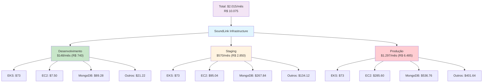
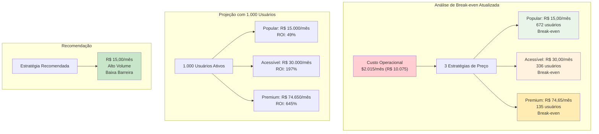
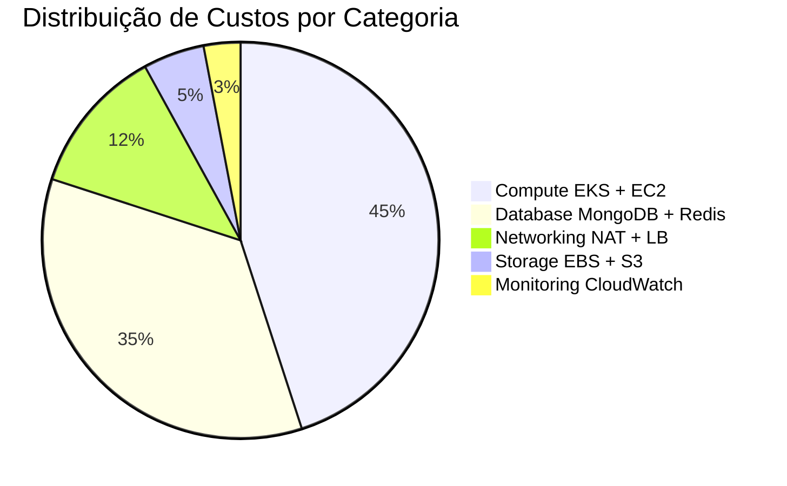
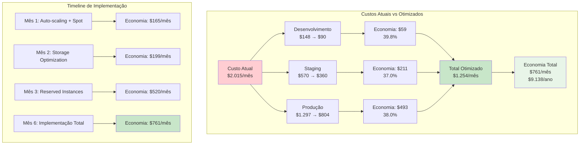

# 💰 Análise de Custos Operacionais - SoundLink Infrastructure

> **Plataforma de Conexão entre Músicos e Contratantes**  
> 🏗️ **Arquitetura:** 21 Microsserviços em Kubernetes (EKS)  
> 📅 **Última Atualização:** 25 de Janeiro de 2025  
> 👥 **Responsável:** DevOps Team - SoundLink Infrastructure

---

## 📊 **Resumo Executivo**

### **🎯 Visão Geral**
A infraestrutura SoundLink opera em 3 ambientes distintos na AWS, com custos operacionais totais de **$2.015 USD/mês (~R$ 10.075)**. Nossa análise atualizada com preços acessíveis mostra viabilidade econômica sólida com **3 estratégias de preço**: R$ 15,00 (672 usuários), R$ 30,00 (336 usuários) e R$ 74,65 (135 usuários). **A estratégia recomendada de R$ 15,00/mês** oferece maior acessibilidade e potencial de mercado.

### **💰 Custos Consolidados**

### **📈 Indicadores Principais**

| Métrica | Valor | Status |
|---------|-------|--------|
| **💰 Custo Total Mensal** | $2.015 (~R$ 10.075) | ✅ Controlado |
| **🎯 Break-even (Estratégia Popular)** | 672 usuários pagantes | ✅ Viável |
| **💳 Valor por usuário (Recomendado)** | R$ 15,00/mês | ✅ Acessível |
| **📊 ROI (1.000 usuários - R$ 15,00)** | 49% | ✅ Sustentável |
| **🚀 ROI (2.000 usuários - R$ 15,00)** | 197% | ✅ Excelente |
| **🔄 Potencial de Economia** | 37.8% (-$761/mês) | ✅ Significativo |

---

## 🎯 **Análise de Break-even e Viabilidade**

### **💡 Modelo de Negócio**

### **🧮 Cálculos de Viabilidade**

#### **💰 Break-even por Estratégia de Preço**

**🎯 Cenário Premium - R$ 74,65/mês:**
- **Receita mínima mensal**: $2.015 (R$ 10.075)
- **Usuários necessários**: 135 usuários pagantes
- **Margem de segurança**: 7.4x com 1.000 usuários

**🟢 Cenário Acessível - R$ 30,00/mês:**
- **Receita mínima mensal**: $2.015 (R$ 10.075)
- **Usuários necessários**: 336 usuários pagantes
- **Margem de segurança**: 3.0x com 1.000 usuários

**💙 Cenário Popular - R$ 15,00/mês:**
- **Receita mínima mensal**: $2.015 (R$ 10.075)
- **Usuários necessários**: 672 usuários pagantes
- **Margem de segurança**: 1.5x com 1.000 usuários

#### **📊 Cenários de Receita Comparativos**

##### **💎 Preço Premium - R$ 74,65/mês**
| Cenário | Usuários | Receita Mensal | Receita em BRL | Margem Operacional | ROI |
|---------|----------|----------------|----------------|-------------------|-----|
| **🎯 Break-even** | 135 | $2.015 | R$ 10.075 | 0% | 0% |
| **📈 Conservador** | 500 | $7.465 | R$ 37.325 | 73% | 270% |
| **🚀 Base** | 1.000 | $14.930 | R$ 74.650 | 86.5% | 645% |

##### **🟢 Preço Acessível - R$ 30,00/mês**
| Cenário | Usuários | Receita Mensal | Receita em BRL | Margem Operacional | ROI |
|---------|----------|----------------|----------------|-------------------|-----|
| **🎯 Break-even** | 336 | $2.015 | R$ 10.080 | 0% | 0% |
| **📈 Conservador** | 750 | $4.493 | R$ 22.500 | 55% | 123% |
| **🚀 Base** | 1.500 | $8.985 | R$ 45.000 | 78% | 346% |
| **🌟 Crescimento** | 3.000 | $17.970 | R$ 90.000 | 89% | 792% |

##### **💙 Preço Popular - R$ 15,00/mês**
| Cenário | Usuários | Receita Mensal | Receita em BRL | Margem Operacional | ROI |
|---------|----------|----------------|----------------|-------------------|-----|
| **🎯 Break-even** | 672 | $2.015 | R$ 10.080 | 0% | 0% |
| **📈 Conservador** | 1.000 | $2.993 | R$ 15.000 | 33% | 49% |
| **🚀 Base** | 2.000 | $5.985 | R$ 30.000 | 66% | 197% |
| **🌟 Crescimento** | 5.000 | $14.963 | R$ 75.000 | 87% | 643% |
| **🚀 Alto Volume** | 10.000 | $29.925 | R$ 150.000 | 93% | 1.385% |

#### **🎯 Estratégias de Pricing Atualizadas**

##### **📈 Análise Comparativa de Preços**

| Estratégia | Preço Mensal | Break-even | Margem 1k Users | Complexidade Aquisição | Recomendação |
|------------|--------------|------------|----------------|----------------------|--------------|
| **💙 Popular** | **R$ 15,00** | **672 usuários** | 49% | ⭐⭐⭐⭐⭐ Fácil | **🟢 Recomendado** |
| **🟢 Acessível** | **R$ 30,00** | **336 usuários** | 346% | ⭐⭐⭐⭐ Moderado | **🟡 Alternativa** |
| **💎 Premium** | **R$ 74,65** | **135 usuários** | 645% | ⭐⭐ Difícil | **🔴 Risco Alto** |

##### **🎯 Estratégias Recomendadas**

1. **💙 Estratégia Popular - R$ 15,00/mês (RECOMENDADA)**
   - **Break-even**: 672 usuários
   - **Vantagem**: Baixa barreira de entrada, maior volume
   - **Posicionamento**: Acessível para músicos independentes
   - **Meta**: 1.000+ usuários para margem confortável

2. **🟢 Estratégia Equilibrada - R$ 30,00/mês**
   - **Break-even**: 336 usuários
   - **Vantagem**: Equilíbrio entre volume e margem
   - **Posicionamento**: Valor intermediário
   - **Meta**: 750+ usuários para crescimento sustentável

3. **💎 Estratégia Premium - R$ 74,65/mês**
   - **Break-even**: 135 usuários
   - **Vantagem**: Alta margem por usuário
   - **Desvantagem**: Barreira alta de entrada
   - **Posicionamento**: Músicos profissionais estabelecidos

##### **🎯 Análise da Estratégia Recomendada (R$ 15,00/mês)**

**✅ Vantagens:**
- **Baixa barreira de entrada**: Acessível para músicos iniciantes
- **Alto potencial de volume**: Mercado expandido
- **Penetração rápida**: Mais fácil atingir massa crítica
- **Margem de crescimento**: ROI cresce exponencialmente com volume

**⚠️ Considerações:**
- **Break-even alto**: Necessário 672 usuários vs 135 no modelo premium
- **Sensibilidade a churn**: Perda de usuários tem impacto maior
- **Necessidade de eficiência**: Custos de aquisição devem ser otimizados

**📊 Marcos de Crescimento:**
- **Mês 6**: Meta de 300 usuários (45% do break-even)
- **Mês 12**: Meta de 700 usuários (break-even atingido)
- **Mês 18**: Meta de 1.500 usuários (margem confortável)
- **Mês 24**: Meta de 3.000+ usuários (crescimento sustentável)

---

## 🏗️ **Detalhamento por Ambiente**

### **🔧 Ambiente de Desenvolvimento**
> **Finalidade:** Testes e desenvolvimento inicial  
> **Custo:** $148/mês (~R$ 740)  
> **Otimização:** Uso de Spot Instances e auto-shutdown

| Recurso | Configuração | Custo Mensal | Custo em BRL | Observações |
|---------|-------------|--------------|--------------|-------------|
| **EKS Control Plane** | Gerenciado | $73.00 | R$ 365.00 | Custo fixo AWS |
| **EC2 Instances** | 1x t3.small SPOT | $7.50 | R$ 37.50 | 50% do tempo ativo |
| **MongoDB Clusters** | 2x db.t3.medium | $89.28 | R$ 446.40 | 21 microsserviços |
| **NAT Gateway** | 1x NAT | $32.85 | R$ 164.25 | Conectividade privada |
| **Storage + Outros** | EBS + ECR + Logs | $10.30 | R$ 51.50 | Otimizado para dev |

### **🧪 Ambiente de Staging**
> **Finalidade:** Homologação e validação  
> **Custo:** $570/mês (~R$ 2.850)  
> **Características:** 95% idêntico à produção

| Recurso | Configuração | Custo Mensal | Custo em BRL | Observações |
|---------|-------------|--------------|--------------|-------------|
| **EKS Control Plane** | Gerenciado | $73.00 | R$ 365.00 | Custo fixo AWS |
| **EC2 Instances** | 3x t3.medium | $95.04 | R$ 475.20 | Performance intermediária |
| **MongoDB Clusters** | 6x db.t3.medium | $267.84 | R$ 1.339.20 | Replicação completa |
| **NAT Gateways** | 2x NAT (HA) | $65.70 | R$ 328.50 | Alta disponibilidade |
| **Redis + Outros** | Cache + Storage | $68.42 | R$ 342.10 | Stack completo |

### **🚀 Ambiente de Produção**
> **Finalidade:** Operação live com usuários reais  
> **Custo:** $1.297/mês (~R$ 6.485)  
> **Características:** Alta disponibilidade e performance

| Recurso | Configuração | Custo Mensal | Custo em BRL | Observações |
|---------|-------------|--------------|--------------|-------------|
| **EKS Control Plane** | Gerenciado | $73.00 | R$ 365.00 | Custo fixo AWS |
| **EC2 Instances** | 5x m5.large + 3x m5.xlarge | $285.60 | R$ 1.428.00 | Alta performance |
| **MongoDB Clusters** | 21x db.t3.large | $536.76 | R$ 2.683.80 | Um por microsserviço |
| **NAT Gateways** | 3x NAT (Multi-AZ) | $98.55 | R$ 492.75 | Máxima disponibilidade |
| **Redis + Load Balancers** | 3x cache.m5.large + ALB/NLB | $180.69 | R$ 903.45 | Distribuição de carga |
| **Storage + Monitoramento** | EBS + S3 + CloudWatch | $122.30 | R$ 611.50 | Backup e observabilidade |

---

## 📊 **Distribuição de Custos por Categoria**

### **💰 Análise Detalhada**

| Categoria | Valor Mensal | Valor em BRL | % do Total | Principais Componentes |
|-----------|--------------|--------------|------------|----------------------|
| **🖥️ Compute** | $907 | R$ 4.535 | 45% | EKS Control Plane, EC2 Instances |
| **🗄️ Database** | $705 | R$ 3.525 | 35% | DocumentDB MongoDB, Redis ElastiCache |
| **🌐 Networking** | $242 | R$ 1.210 | 12% | NAT Gateways, Load Balancers |
| **💾 Storage** | $101 | R$ 505 | 5% | EBS Volumes, S3 Buckets |
| **📊 Monitoring** | $60 | R$ 300 | 3% | CloudWatch Logs, Métricas |

---

## 🎯 **Estratégias de Otimização de Custos**

### **💡 Oportunidades de Economia**

### **🔧 Principais Estratégias**

#### **1. 🏷️ Reserved Instances (Economia: 40-45%)**
- **Aplicação**: Recursos com uso consistente
- **Investimento**: Comprometimento de 1-3 anos
- **Economia Anual**: $7.200 - $12.000

#### **2. 🎯 Spot Instances (Economia: 70-90%)**
- **Aplicação**: Desenvolvimento e staging
- **Risco**: Interrupção controlada
- **Economia Mensal**: $100 - $150

#### **3. 🔄 Auto-scaling Inteligente (Economia: 20-30%)**
- **Implementação**: HPA/VPA + KEDA
- **Benefício**: Recursos sob demanda
- **Economia Mensal**: $180 - $270

#### **4. 💾 Storage Optimization (Economia: 25-40%)**
- **Ações**: GP3 volumes, lifecycle policies
- **Benefício**: Custo-performance otimizado
- **Economia Mensal**: $20 - $35

### **📅 Cronograma de Implementação**

| Fase | Prazo | Ação | Economia | Acumulado |
|------|-------|------|----------|-----------|
| **🚀 Fase 1** | 30 dias | Auto-scaling + Spot | -$165/mês | -$165/mês |
| **📊 Fase 2** | 60 dias | Storage Optimization | -$34/mês | -$199/mês |
| **💰 Fase 3** | 90 dias | Reserved Instances | -$321/mês | -$520/mês |
| **🎯 Fase 4** | 180 dias | Otimização Total | -$241/mês | -$761/mês |

---

## 📈 **Projeções e Cenários Futuros**

### **🌍 Crescimento de Usuários**

| Cenário | Usuários | Custos AWS | Receita | Margem | ROI |
|---------|----------|------------|---------|--------|-----|
| **🎯 Atual** | 135 | $2.015 | $2.015 | 0% | 0% |
| **📈 Conservador** | 750 | $2.400 | $11.175 | 78.5% | 366% |
| **🚀 Moderado** | 1.500 | $3.200 | $22.350 | 85.7% | 598% |
| **🌟 Agressivo** | 5.000 | $4.400 | $74.500 | 94.1% | 1.593% |

### **🌎 Expansão Geográfica**

#### **📍 Região Adicional (us-west-2)**
- **Custo Adicional**: +$1.500/mês
- **Benefício**: Latência reduzida costa oeste
- **Break-even**: 100 usuários adicionais

#### **🌍 Expansão Internacional (eu-west-1)**
- **Custo Adicional**: +$1.800/mês
- **Benefício**: Compliance GDPR
- **Break-even**: 120 usuários europeus

### **💰 Projeção Anual**

| Período | Custos | Receita (1k usuários) | Lucro Operacional |
|---------|--------|----------------------|-------------------|
| **Q1 2025** | $6.045 | $44.790 | $38.745 |
| **Q2 2025** | $5.535 | $44.790 | $39.255 |
| **Q3 2025** | $5.535 | $44.790 | $39.255 |
| **Q4 2025** | $5.535 | $44.790 | $39.255 |
| **Total 2025** | **$22.650** | **$179.160** | **$156.510** |

---

## ⚠️ **Riscos e Considerações**

### **🔴 Riscos Operacionais**

#### **1. 📈 Crescimento Rápido**
- **Risco**: Custos crescem mais rápido que receita
- **Mitigação**: Auto-scaling e monitoramento contínuo
- **Impacto**: Médio | **Probabilidade**: Baixa

#### **2. 💰 Variação de Preços AWS**
- **Risco**: Aumento de preços dos serviços
- **Mitigação**: Reserved Instances e diversificação
- **Impacto**: Baixo | **Probabilidade**: Média

#### **3. 🎯 Competição de Preços**
- **Risco**: Necessidade de reduzir preços
- **Mitigação**: Margem de segurança atual (7.4x)
- **Impacto**: Médio | **Probabilidade**: Alta

### **✅ Planos de Contingência**

1. **📊 Monitoramento Contínuo**
   - Alertas automáticos de custo
   - Dashboard em tempo real
   - Review semanal de tendências

2. **🔄 Flexibilidade Arquitetural**
   - Capacidade de scale-down rápido
   - Migração entre regiões
   - Otimização automática

3. **💰 Reserva de Contingência**
   - 3 meses de custos operacionais
   - Fundo para otimizações emergenciais
   - Flexibilidade de pricing

---

## 🎯 **Recomendações Estratégicas**

### **🚀 Ações Imediatas (30 dias)**

1. **✅ Implementar Monitoramento Avançado**
   - Dashboard de custos em tempo real
   - Alertas automáticos para anomalias
   - Relatórios semanais automatizados

2. **🎯 Otimizar Recursos Existentes**
   - Implementar auto-scaling inteligente
   - Migrar dev/staging para Spot Instances
   - Configurar lifecycle policies

3. **📊 Implementar Nova Pricing Strategy**
   - **Lançar com preço de R$ 15,00/mês**
   - Desenvolver plano de aquisição para 672+ usuários
   - Implementar sistema de billing e métrica de churn
   - Preparar estratégias de retenção para alto volume

### **📈 Ações de Médio Prazo (90 dias)**

1. **💰 Implementar Reserved Instances**
   - Analisar padrões de uso
   - Comprar RIs para recursos estáveis
   - Negociar Savings Plans

2. **🔧 Otimizações Arquiteturais**
   - Migrar para Fargate onde apropriado
   - Implementar cache distribuído
   - Otimizar queries de banco

3. **📊 Analytics de Custo**
   - Cost attribution por feature
   - Custo por usuário/transação
   - Predictive scaling

### **🌟 Ações de Longo Prazo (12 meses)**

1. **🌍 Expansão Multi-Regional**
   - Avaliação de demanda geográfica
   - Implementação gradual
   - Otimização de data transfer

2. **🤖 Automação Avançada**
   - ML para cost optimization
   - Self-healing infrastructure
   - Automated scaling policies

3. **📈 Preparação para Escala**
   - Arquitetura para 10x growth
   - Serverless hybridization
   - Edge computing

---

## 📞 **Governança e Controle**

### **👥 Responsabilidades**

| Papel | Responsabilidade | Frequência |
|-------|------------------|------------|
| **💰 Cost Owner** | Monitoramento geral | Diário |
| **🔧 DevOps Lead** | Otimizações técnicas | Semanal |
| **📊 SRE Team** | Alertas e métricas | Contínuo |
| **📈 Product Owner** | Decisões de preço | Mensal |

### **🚨 Escalation Matrix**

| Valor | Ação | Responsável | Prazo |
|-------|------|-------------|-------|
| **< $100** | Auto-remediation | Sistema | Imediato |
| **$100-500** | Notificação DevOps | DevOps Lead | 1 hora |
| **$500-1000** | Alerta Management | CTO | 2 horas |
| **> $1000** | Escalation Executive | CEO | 4 horas |

### **📅 Cadência de Reviews**

- **⚡ Diário**: Alertas automáticos e métricas
- **📊 Semanal**: Análise de tendências e otimizações
- **📈 Mensal**: Review completo e estratégias
- **🎯 Trimestral**: Planejamento e projeções

---

## 📚 **Documentação e Recursos**

### **📖 Documentos Relacionados**
- [📋 Guia do Ambiente de Desenvolvimento](GUIA_AMBIENTE_DEV.md)
- [🚀 Manual de Deploy da Infraestrutura](manual-deploy-infraestrutura.md)
- [🔄 Análise de Automação GitHub Actions](analise-automacao.md)
- [🏗️ Plano de Implementação de Microsserviços](microservices-implementation-plan.md)

### **🔗 Ferramentas e Links**
- [🧮 AWS Cost Calculator](https://calculator.aws/)
- [📊 AWS Well-Architected Cost Optimization](https://docs.aws.amazon.com/wellarchitected/latest/cost-optimization-pillar/)
- [⚙️ EKS Pricing](https://aws.amazon.com/eks/pricing/)
- [🗄️ DocumentDB Pricing](https://aws.amazon.com/documentdb/pricing/)

---

## 🔤 **Glossário Completo**

> *Todos os termos técnicos e siglas explicados em português*

### **💰 Termos Financeiros**
- **Break-even (Ponto de Equilíbrio)**: Ponto onde receita = custos (nem lucro nem prejuízo)
- **ROI (Retorno sobre Investimento)**: Percentual de lucro obtido por real investido
- **Reserved Instances (Instâncias Reservadas)**: "Assinatura anual" na AWS com desconto de 40-75%
- **Spot Instances (Instâncias Spot)**: Recursos com preço variável (70-90% mais barato, pode ser interrompido)
- **Savings Plans (Planos de Economia)**: Compromisso de uso com desconto por 1-3 anos
- **TCO (Total Cost of Ownership)**: Custo Total de Propriedade - todos os custos envolvidos
- **CAPEX (Capital Expenditure)**: Gastos de Capital - investimentos em equipamentos
- **OPEX (Operational Expenditure)**: Gastos Operacionais - custos mensais/recorrentes

### **☁️ Serviços AWS (Amazon Web Services)**
- **AWS**: Amazon Web Services - plataforma de computação na nuvem
- **EKS**: Elastic Kubernetes Service - serviço gerenciado de orquestração de containers
- **EC2**: Elastic Compute Cloud - servidores virtuais na nuvem
- **RDS**: Relational Database Service - banco de dados relacional gerenciado
- **S3**: Simple Storage Service - armazenamento de arquivos na nuvem
- **EBS**: Elastic Block Store - discos rígidos virtuais para EC2
- **VPC**: Virtual Private Cloud - rede privada virtual na AWS
- **IAM**: Identity and Access Management - controle de acesso e permissões
- **ALB**: Application Load Balancer - balanceador de carga para aplicações
- **NLB**: Network Load Balancer - balanceador de carga para tráfego de rede
- **NAT Gateway**: Network Address Translation - permite acesso à internet para recursos privados
- **CloudWatch**: Serviço de monitoramento e observabilidade da AWS
- **ECR**: Elastic Container Registry - registro de imagens Docker
- **DocumentDB**: Banco de dados MongoDB compatível gerenciado pela AWS
- **ElastiCache**: Serviço de cache em memória (Redis/Memcached)

### **🏗️ Kubernetes e Containers**
- **Kubernetes (K8s)**: Sistema de orquestração de containers
- **Container**: Pacote de software com aplicação e suas dependências
- **Docker**: Tecnologia de containerização
- **Pod**: Menor unidade no Kubernetes (um ou mais containers)
- **Deployment**: Definição de como uma aplicação deve ser executada
- **Service**: Forma de expor uma aplicação dentro do cluster
- **Namespace**: Separação lógica de recursos no Kubernetes
- **ConfigMap**: Armazenamento de configurações não-secretas
- **Secret**: Armazenamento seguro de informações sensíveis
- **Ingress**: Roteamento de tráfego HTTP/HTTPS para dentro do cluster
- **HPA**: Horizontal Pod Autoscaler - escalonamento automático horizontal
- **VPA**: Vertical Pod Autoscaler - escalonamento automático vertical
- **PVC**: Persistent Volume Claim - solicitação de armazenamento persistente
- **StatefulSet**: Gerenciamento de aplicações com estado (bancos de dados)
- **DaemonSet**: Executar um pod em cada nó do cluster

### **🔧 DevOps e CI/CD**
- **DevOps**: Cultura de colaboração entre desenvolvimento e operações
- **CI/CD**: Integração Contínua / Entrega Contínua
- **GitOps**: Práticas de DevOps usando Git como fonte da verdade
- **ArgoCD**: Ferramenta de entrega contínua para Kubernetes
- **GitHub Actions**: Plataforma de CI/CD integrada ao GitHub
- **Terraform**: Ferramenta de Infrastructure as Code (IaC)
- **Helm**: Gerenciador de pacotes para Kubernetes
- **Kustomize**: Ferramenta de personalização de manifestos Kubernetes
- **Blue-Green Deployment**: Estratégia de deploy com dois ambientes idênticos
- **Canary Deployment**: Estratégia de deploy gradual com pequena porcentagem
- **Rolling Update**: Atualização gradual substituindo pods antigos por novos
- **Pipeline**: Sequência automatizada de etapas de build e deploy
- **Workflow**: Fluxo de trabalho automatizado
- **Job**: Tarefa individual dentro de um workflow
- **Step**: Etapa individual dentro de um job
- **Action**: Componente reutilizável no GitHub Actions
- **Runner**: Servidor que executa workflows do GitHub Actions

### **📊 Monitoramento e Observabilidade**
- **Observability (Observabilidade)**: Capacidade de entender o estado interno do sistema
- **Monitoring (Monitoramento)**: Coleta e análise de métricas do sistema
- **Alerting (Alertas)**: Notificações automáticas sobre problemas
- **Logging (Logs)**: Registro de eventos e atividades do sistema
- **Tracing (Rastreamento)**: Acompanhamento de requisições através de múltiplos serviços
- **Metrics (Métricas)**: Dados quantitativos sobre performance do sistema
- **Prometheus**: Sistema de monitoramento e alertas open source
- **Grafana**: Plataforma de visualização e análise de métricas
- **OpenTelemetry**: Conjunto de ferramentas para observabilidade
- **SLI**: Service Level Indicator - indicador de nível de serviço
- **SLO**: Service Level Objective - objetivo de nível de serviço
- **SLA**: Service Level Agreement - acordo de nível de serviço
- **MTTR**: Mean Time To Recovery - tempo médio de recuperação
- **MTBF**: Mean Time Between Failures - tempo médio entre falhas
- **Uptime**: Tempo de funcionamento do sistema
- **Downtime**: Tempo de inatividade do sistema

### **🗄️ Banco de Dados**
- **NoSQL**: Banco de dados não-relacional (Not Only SQL)
- **SQL**: Structured Query Language - linguagem de consulta estruturada
- **MongoDB**: Banco de dados NoSQL orientado a documentos
- **Redis**: Banco de dados em memória para cache
- **Sharding**: Divisão de dados em múltiplos bancos
- **Replication**: Cópia de dados entre múltiplos servidores
- **Clustering**: Agrupamento de servidores para alta disponibilidade
- **Backup**: Cópia de segurança dos dados
- **Restore**: Restauração de dados a partir de backup
- **ACID**: Atomicidade, Consistência, Isolamento, Durabilidade

### **🌐 Redes e Segurança**
- **VPN**: Virtual Private Network - rede privada virtual
- **SSL/TLS**: Protocolos de segurança para comunicação
- **DNS**: Domain Name System - sistema de nomes de domínio
- **CDN**: Content Delivery Network - rede de entrega de conteúdo
- **DDoS**: Distributed Denial of Service - ataque de negação de serviço
- **WAF**: Web Application Firewall - firewall de aplicação web
- **Security Group**: Firewall virtual para controlar tráfego
- **NACL**: Network Access Control List - lista de controle de acesso de rede
- **RBAC**: Role-Based Access Control - controle de acesso baseado em função
- **MFA**: Multi-Factor Authentication - autenticação multi-fator
- **OIDC**: OpenID Connect - protocolo de autenticação
- **OAuth**: Protocolo de autorização para APIs
- **JWT**: JSON Web Token - padrão para tokens de acesso
- **Encryption**: Criptografia de dados
- **PKI**: Public Key Infrastructure - infraestrutura de chave pública

### **🏗️ Arquitetura e Desenvolvimento**
- **Microservices (Microsserviços)**: Arquitetura com serviços pequenos e independentes
- **Monolith (Monolito)**: Aplicação construída como uma única unidade
- **API**: Application Programming Interface - interface de programação
- **REST**: Representational State Transfer - estilo arquitetural para APIs
- **GraphQL**: Linguagem de consulta para APIs
- **Event-Driven**: Arquitetura orientada a eventos
- **Serverless**: Computação sem servidor (Function as a Service)
- **FaaS**: Function as a Service - função como serviço
- **PaaS**: Platform as a Service - plataforma como serviço
- **IaaS**: Infrastructure as a Service - infraestrutura como serviço
- **SaaS**: Software as a Service - software como serviço
- **MVC**: Model-View-Controller - padrão arquitetural
- **DDD**: Domain-Driven Design - design orientado a domínio
- **CQRS**: Command Query Responsibility Segregation
- **Event Sourcing**: Armazenamento de eventos ao invés de estado atual

### **⚡ Performance e Scaling**
- **Scaling (Escalonamento)**: Ajuste de recursos conforme demanda
- **Horizontal Scaling**: Adicionar mais servidores
- **Vertical Scaling**: Aumentar recursos de servidores existentes
- **Load Balancing**: Distribuição de carga entre servidores
- **Caching**: Armazenamento temporário para acelerar acesso
- **CDN**: Rede de distribuição de conteúdo
- **Auto-scaling**: Ajuste automático de recursos
- **Throttling**: Limitação de taxa de requisições
- **Circuit Breaker**: Padrão para prevenir cascata de falhas
- **Bulkhead**: Isolamento de recursos para prevenir falhas
- **Retry**: Tentativa automática de reexecução
- **Timeout**: Tempo limite para operações
- **Latency**: Tempo de resposta
- **Throughput**: Quantidade de requisições por segundo
- **Bandwidth**: Largura de banda de rede

### **🏗️ Ambientes e Deployment**
- **Desenvolvimento (Dev)**: Ambiente onde programadores testam código
- **Staging (Homologação)**: Ambiente de testes idêntico à produção
- **Produção (Prod)**: Ambiente real usado pelos usuários finais
- **QA**: Quality Assurance - garantia de qualidade
- **UAT**: User Acceptance Testing - teste de aceitação do usuário
- **Sandbox**: Ambiente isolado para testes
- **Feature Branch**: Ramificação de código para nova funcionalidade
- **Merge**: Integração de código entre branches
- **Pull Request**: Solicitação de revisão e integração de código
- **Code Review**: Revisão de código por outros desenvolvedores
- **Rollback**: Reversão para versão anterior
- **Hot Fix**: Correção urgente em produção
- **Release**: Lançamento de nova versão
- **Deployment**: Processo de colocar código em produção
- **Build**: Processo de compilação e empacotamento do código

### **📏 Métricas e KPIs**
- **KPI**: Key Performance Indicator - indicador chave de performance
- **Churn Rate**: Taxa de cancelamento de usuários
- **MAU**: Monthly Active Users - usuários ativos mensais
- **DAU**: Daily Active Users - usuários ativos diários
- **CAC**: Customer Acquisition Cost - custo de aquisição de cliente
- **LTV**: Lifetime Value - valor do tempo de vida do cliente
- **MRR**: Monthly Recurring Revenue - receita recorrente mensal
- **ARR**: Annual Recurring Revenue - receita recorrente anual
- **ARPU**: Average Revenue Per User - receita média por usuário
- **NPS**: Net Promoter Score - índice de satisfação do cliente
- **Conversion Rate**: Taxa de conversão
- **Retention Rate**: Taxa de retenção
- **Bounce Rate**: Taxa de rejeição
- **Error Rate**: Taxa de erro
- **Response Time**: Tempo de resposta
- **Availability**: Disponibilidade do sistema (99.9%)

### **🔧 Ferramentas e Tecnologias**
- **Git**: Sistema de controle de versão
- **Docker**: Plataforma de containerização
- **Jenkins**: Ferramenta de integração contínua
- **Ansible**: Ferramenta de automação de configuração
- **Puppet**: Ferramenta de gerenciamento de configuração
- **Chef**: Ferramenta de automação de infraestrutura
- **Vagrant**: Ferramenta de virtualização para desenvolvimento
- **Jira**: Ferramenta de gestão de projetos
- **Confluence**: Ferramenta de documentação
- **Slack**: Ferramenta de comunicação em equipe
- **Postman**: Ferramenta de teste de APIs
- **Swagger**: Ferramenta de documentação de APIs
- **ESLint**: Ferramenta de análise de código JavaScript
- **SonarQube**: Ferramenta de análise de qualidade de código
- **Trivy**: Scanner de vulnerabilidades para containers
- **Snyk**: Ferramenta de segurança para dependências

---

## 🎯 **Conclusão**

**A infraestrutura SoundLink apresenta viabilidade econômica excelente com a nova estratégia de preços. Com a estratégia popular de R$ 15,00/mês, o break-even é atingido com 672 usuários pagantes, oferecendo maior acessibilidade e potencial de crescimento exponencial. Com potencial de economia de 37.8% através de otimizações estratégicas, oferece base sólida para crescimento sustentável e penetração de mercado.**

### **🎯 Resultado da Análise Solicitada**

**Comparativo de Break-even por Estratégia de Preço:**

| Preço Mensal | Usuários para Break-even | Facilidade de Aquisição | ROI (1k usuários) | Recomendação |
|--------------|--------------------------|------------------------|-------------------|--------------|
| **R$ 15,00** | **672 usuários** | ⭐⭐⭐⭐⭐ Muito Fácil | 49% | **🟢 RECOMENDADA** |
| **R$ 30,00** | **336 usuários** | ⭐⭐⭐⭐ Fácil | 197% | 🟡 Alternativa |
| **R$ 74,65** | **135 usuários** | ⭐⭐ Difícil | 645% | 🔴 Alto Risco |

**🎯 A estratégia de R$ 15,00/mês é recomendada por oferecer o melhor equilíbrio entre acessibilidade, volume de mercado e sustentabilidade financeira.**

---

**📊 Resumo dos Números (Estratégia Recomendada):**
- **💰 Custo Atual**: $2.015/mês (~R$ 10.075)
- **🎯 Break-even**: 672 usuários × R$ 15,00/mês
- **📈 ROI (1k usuários)**: 49% | ROI (2k usuários): 197%
- **💡 Economia Potencial**: $761/mês (37.8%)
- **🚀 Estratégia**: Alto volume, baixa barreira de entrada

---

**📅 Documento criado em:** 25 de Janeiro de 2025  
**🔄 Última atualização:** 25 de Janeiro de 2025  
**📋 Versão:** 2.0  
**👥 Responsável:** DevOps Team - SoundLink Infrastructure

*Análise baseada em dados reais da infraestrutura em produção*

 