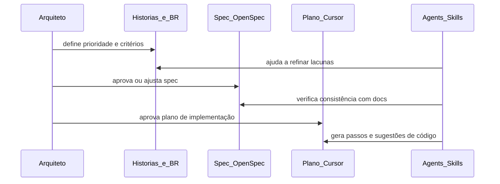

# Fluxo de IA assistida e SDD (gates humanos)

> **Estado:** ATIVO | **Data:** 2026-04-08

Este documento define o **fluxo operacional** entre arquiteto/engenheiro, documentação de produto e ferramentas de IA (Cursor, Codex, Claude), alinhado ao catálogo em [`README.md`](../../README.md).

## Princípio

A **especificação** (histórias, regras de negócio, fluxos, UI/navegação) é a referência; o código e os prompts seguem-na. A IA **propoem**; o humano **aprova** gates de produto e arquitetura.

## Diagrama de sequência

## Gates humanos (obrigatórios)

| Gate | Quem | Critério |
|------|------|----------|
| G1 — Escopo | Arquiteto | User story ou épico identificado; fora de escopo explícito |
| G2 — Regras de negócio | Arquiteto / PO | BR e fluxos atualizados ou follow-up registado |
| G3 — Desenho técnico | Arquiteto | ADR ou seção de spec para decisões estruturais |
| G4 — Implementação | Engenheiro | Diff alinhado à spec; testes acordados |
| G5 — Documentação | Equipe | `docs/produto/fluxo/` coerente com código entregue ou follow-up |

**Entrega técnica local (Cursor):** após G4, o fluxo operacional **código → testes → hooks opcionais → CI → git → fecho de tarefa** está descrito em [fluxo-workflow-agent-hooks-ci.md](fluxo-workflow-agent-hooks-ci.md) (rules, skills, Cursor Hooks, integração com backlog). Não substitui aprovação humana onde a política da organização o exige.

## Onde vive cada artefato

| Artefato | Local sugerido |
|-----------|------------------|
| Regras de negócio | `docs/produto/fluxo/business-rules/` |
| Fluxos de usuário | `docs/produto/fluxo/user-flows/` |
| Histórias | `docs/produto/fluxo/user-stories/` ou equivalente |
| Motor/API | `docs/produto/fluxo/api-specifications/` |
| Mudança formal | `openspec/changes/` (se em uso) |
| Planos de trabalho | `plans/*.plan.md` |

## Ferramentas externas

O mesmo fluxo lógico aplica-se a **Cursor**, **Codex** e **Claude**: ver skill [workflow-ferramentas-ia](../../skills/workflow-ferramentas-ia/SKILL.md).

## Referências

- Rule [00-sdd-governance.mdc](../../rules/00-sdd-governance.mdc)
- Agent [sdd-orquestrador](../../agents/sdd-orquestrador.md)
