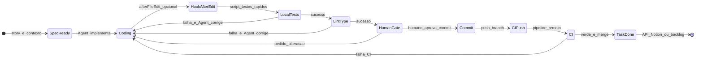

# Fluxo: workflow Agent, hooks, CI e fecho de tarefa

> **Estado:** ATIVO | **Data:** 2026-04-07  
> **Relação:** complementa [fluxo-ia-sdd.md](fluxo-ia-sdd.md) (gates G4–G5) com **máquina de estados operacional** no Cursor e no pipeline remoto.

Este documento descreve **como combinar** conversa com o Agent, rules, skills, **Cursor Hooks** (scripts locais), CI e APIs de backlog (ex.: Notion). **Não** existe um motor de estados executável só com arquivos Markdown: o LLM **não** é um scheduler; hooks e CI são **determinísticos**.

## Princípio

| Camada | Papel |
|--------|--------|
| **Rule** (`rules/*.mdc`) | Instruir o modelo: após alterar código, correr testes/lint quando existirem; não encerrar com falhas. |
| **Skill** | Playbook reutilizável (passos, comandos sugeridos, limites). Ver [workflow-cursor-agent-entrega](../../skills/workflow-cursor-agent-entrega/SKILL.md). |
| **Agent** | Persona orquestradora da entrega local. Ver [workflow-cursor-entrega-guia](../../agents/workflow-cursor-entrega-guia.md). |
| **Hook** (`hooks.json` + scripts) | Programa local em eventos do ciclo de vida do Agent (ex.: após edição de arquivos, ao parar). Ver [Cursor Hooks](https://cursor.com/docs/hooks). |
| **CI** | Fonte de verdade para merge: testes, lint, typecheck no remoto. |
| **Humano** | Aprovação de commit sensível, push para branches protegidas, produto/arquitetura (gates SDD). |

## Limitações do Cursor (importante)

- **Hooks não “chamam outro agente”** por nome. Não há API declarativa no repositório do tipo `onFailure: agent-fix-guia`.
- **Orquestração “agente A → teste → agente B”** realiza-se na **mesma conversa** (instrução explícita ao Agent) ou por **produto** (Cursor/enterprise), não por Markdown sozinho.
- **Hooks** recebem contexto via **stdin** (JSON); para eventos informativos (`afterFileEdit`, `stop`), o uso típico é logging ou comandos auxiliares. Consultar a documentação da **tua versão** do Cursor para o protocolo exato e campos disponíveis (API em evolução).
- **Segredos** (Notion, GitHub): nunca em repositório; usar variáveis de ambiente ou secret store no CI.

## Máquina de estados (referência)

### Leitura dos estados

- **SpecReady:** história/spec alinhada a [fluxo-ia-sdd.md](fluxo-ia-sdd.md) (G1–G3 quando aplicável).
- **Coding / LocalTests / LintType:** Agent + terminal; reforçado pela rule [agent-implementation-quality](../../rules/agent-implementation-quality.mdc).
- **HookAfterEdit:** opcional; configurar [`hooks.json`](../../hooks.json) e scripts em [`hooks/`](../../hooks/). Depuração: **Output → Hooks** no Cursor.
- **HumanGate:** recomendado antes de **push** para `main`/produção ou quando a política da org exigir revisão.
- **CI:** obrigatório como rede de segurança mesmo com testes locais.
- **TaskDone:** integração externa (ver seção abaixo).

## Configuração de hooks (resumo)

1. Arquivo [`hooks.json`](../../hooks.json) na raiz do projeto (ou caminho suportado pela doc global/enterprise).
2. Scripts executáveis em [`hooks/`](../../hooks/).
3. Comando de teste opcional via variável de ambiente `CURSOR_HOOK_TEST_CMD` ou arquivo **local** `hooks.local.env` (não versionado — ver exemplo em `hooks/README.md`).
4. Nunca commitar tokens; revisar scripts antes de merge (rule [cursor-hooks-safety](../../rules/cursor-hooks-safety.mdc)).

## Perfil de arquitetura (novo)

Para automação assistida orientada por estilo arquitetural, o repositório pode declarar um **`architecture-profile`**.

- Contrato e regras: [architecture-profile.schema.md](./architecture-profile.schema.md)
- Exemplo: [architecture-profile.example.yaml](./architecture-profile.example.yaml)
- Matriz de decisão: [architecture-style-agent-skill-matrix.md](./architecture-style-agent-skill-matrix.md)

Princípios operacionais:

1. **Profile-first:** agents priorizam `stack`, `styles` e `artifacts_enabled` do perfil.
2. **Hooks continuam determinísticos:** o perfil pode influenciar apenas seleção de comando (`CURSOR_HOOK_TEST_CMD`), nunca orquestração de agents.
3. **CI espelha o perfil por módulo/workspace:** manter jobs por área impactada quando aplicável.

## Fecho de tarefa (Notion / API genérica)

### Abordagem genérica

1. Identificador da tarefa (URL, ID) conhecido pelo humano ou lido de branch/commit message.
2. **MCP Notion** ou **REST API** com token fora do repo (`NOTION_TOKEN`, etc.).
3. Hook **`stop`** ou job de **CI** após merge: script que chama API para marcar estado “Done” / mover cartão.

### Exemplo Notion (sem segredos no repo)

- Integração típica: aplicação Notion + secret no CI ou no ambiente local do desenvolvedor.
- Payload (ilustrativo): `PATCH` à API Notion com `properties.Status = "Done"` — consultar [Notion API](https://developers.notion.com/) para o modelo exato da base.
- O script stub [`hooks/on-stop.sh`](../../hooks/on-stop.sh) documenta extensão via `CURSOR_HOOK_STOP_CMD`.

## Anti-padrões

- Push automático para branch protegida sem política organizacional.
- Depender **só** do LLM para correr testes (sem hook opcional e sem CI).
- Colocar API keys ou PATs em arquivos versionados.

## Referências cruzadas

- [fluxo-ia-sdd.md](fluxo-ia-sdd.md) — gates humanos SDD.
- [workflow-ferramentas-ia](../../skills/workflow-ferramentas-ia/SKILL.md) — mesmo fluxo lógico noutras ferramentas.
- [00-sdd-governance.mdc](../../rules/00-sdd-governance.mdc) — comportamento e documentação de produto.
- [limites-linhas-agents-skills-rules.md](./limites-linhas-agents-skills-rules.md) — limites de linhas para reduzir custo de contexto em LLMs.
- [llm-context-file-size-limits.mdc](../../rules/llm-context-file-size-limits.mdc) — regra operacional da política balanced.
