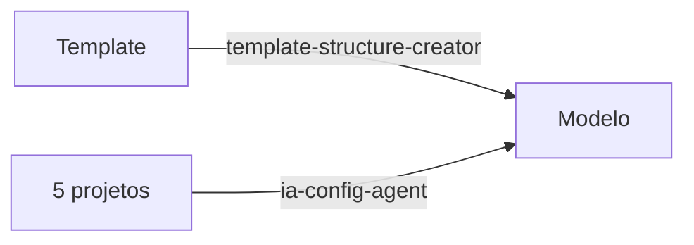

# Fluxo de Replicação de Template

## 1. Objetivo

Replicação de template é o processo de **duplicar a estrutura de documentos, agents e skills** da Origem para o Destino. Existem **dois fluxos distintos**:

- **Fluxo A – Atualizar o Modelo**: 5 projetos da plataforma → Modelo. Usado apenas para montar/atualizar o Modelo. **Não ocorre** na duplicação para outros projetos.
- **Fluxo B – Replicar para Projeto Template**: Modelo → projeto template. Projeto template escolhe o que trazer (cópia seletiva ou estrutura completa).

**Modelo** (path canônico): `/home/jesus/Projetos/Holding-STEC-Template`. Quando o prompt mencionar "o modelo", usar este path.

**Princípio invariável**: Projetos fonte (5 projetos ou Modelo) são somente leitura. Agents apenas copiam para o destino.

---

## 2. Pré-requisitos

| Item | Descrição |
|------|------------|
| **Modelo** | Path canônico: `/home/jesus/Projetos/Holding-STEC-Template`. Agents interpretam "o modelo" como este path. |
| **Path do destino** | Fluxo A: destino = Modelo. **Fluxo B**: path = **base** + (projectName em minúsculas) + `-` + **sufixo** (ver seção Fluxo B – Variáveis). |
| **Nome do projeto** | **Fluxo B**: usado para substituir "Modelo" nos documentos e para montar path/repo (projectName em minúsculas + sufixo); se não for informado no chat, o orquestrador pergunta. **Fluxo A**: usa sempre "Modelo". |
| **Domínio** | Descrição do negócio/domínio do destino |
| **Princípios do negócio** | Guardrails e princípios invioláveis adaptados |
| **Perfis/entidades** | Perfis de usuário e entidades do domínio |
| **Paths dos 5 projetos fonte** | Ver [projetos-plataforma-paths-jesus.md](../referencia/migracao/projetos-plataforma-paths-jesus.md) |

---

## 3. Fluxo de Execução

### Fluxo A: Atualizar o Modelo (copiar estrutura e agents/skills para o Modelo)

**Destino**: sempre o Modelo (`/home/jesus/Projetos/Holding-STEC-Template`). Usado apenas para montar ou atualizar o Modelo.

**Origens**:
- **Estrutura** (docs/, .cursor/): Template (modelo-template-frontend)
- **Agents e skills**: 5 projetos da plataforma

**Agent a invocar**: **template-replication-orchestrator** com path destino = Modelo.



**Ordem dos agents** (igual ao Fluxo B, com destino = Modelo):
1. template-structure-creator (se destino existe) — copia estrutura seletiva: docs/ (_model + _templates + referencia apenas tech-stack e cursor-agent-cli-guide) e .cursor/ (agents, skills; plans: pasta vazia)
2. **adapt-north-star-features-section** (skill) — após a cópia ser concluída com sucesso, altera somente o north-star.md no destino: substitui a seção "Como Todas as Features se Conectam" pelo formato template (instruções + bloco padrão + exemplo + blocos para preenchimento posterior)
3. guardrails-adapter (com projectName = "Modelo") → templates-copier (com projectName) → doc-structure-initializer → business-rules-generator → user-flows-generator → api-specs-generator
4. ia-config-agent — copia agents e skills dos **5 projetos** para o Modelo (destino = Modelo → Fluxo A)
5. **copy-cursorrules-to-templates** (skill, Fluxo A apenas) — copia .cursorrules dos 5 projetos para `docs/_templates/referencia/dev/cursorrules-templates/` no Modelo, renomeados por tipo de software: cursorrules-template-frontend.md, cursorrules-frontend.md, cursorrules-bff.md, cursorrules-api.md, cursorrules-infrastructure.md (tecnologia reconhecível por humanos e agents)
6. planning-structure-agent → template-replication-verifier
7. **generate-modelo-readme** (skill) — gera README.md na raiz com guia de próximos passos, tecnologias, comandos e agents
8. **substitute-modelo-in-destination** (skill) — substitui "Modelo"/"modelo" em todos os arquivos em docs/, .cursor/ e .cursorrules no destino usando projectName = "Modelo"

**Resultado**: Estrutura completa + agents/skills dos 5 projetos no Modelo + README.md guia na raiz + documentos sem referências Modelo indevidas.

### Fluxo B: Replicar do Modelo para Projeto Template

```mermaid
flowchart LR
    O[Orchestrator] --> G[github-repo-creator]
    G --> S1[structure-creator]
    S1 --> S2[guardrails-adapter]
    S2 --> S3[templates-copier]
    S3 --> S4[doc-structure-initializer]
    S4 --> S5[business-rules-generator]
    S5 --> S6[user-flows-generator]
    S6 --> S7[api-specs-generator]
    S7 --> S8[ia-config-agent]
    S8 --> S9[planning-structure-agent]
    S9 --> V[template-replication-verifier]
    V --> O
```



**Origem**: Modelo. **Destino**: projeto template. O ia-config-agent copia **do Modelo** (não dos 5 projetos). O model-catalog-selector permite cópia seletiva.

#### Fluxo B – Variáveis (path e repositório)

Valores padrão (configuráveis via [docs/referencia/replication-defaults.json](../referencia/replication-defaults.json) quando o arquivo existir):

| Variável | Valor padrão | Descrição |
|----------|----------------|-----------|
| **base** | `/home/jesus/Projetos/` | Diretório onde ficam os projetos; **não** inclui o nome da pasta do projeto. |
| **Organização** | `STEC-Corporate` | Organização GitHub para novos repositórios. |
| **sufixo** | `template-frontend` | Sufixo obrigatório no nome da pasta e no nome do repositório (concatena-se com hífen: `-template-frontend`). |

- **Path do destino** = **base** + (projectName em minúsculas) + `-` + **sufixo**. Ex.: `/home/jesus/Projetos/construlink-template-frontend`.
- **Nome do repositório** = (projectName em minúsculas) + `-` + **sufixo**. Ex.: `construlink-template-frontend`.
- **Repositório completo (GitHub)** = **Organização** + `/` + nome do repositório. Ex.: `STEC-Corporate/construlink-template-frontend`.

O orquestrador, **na primeira ação** (ao coletar inputs), pergunta o **nome do projeto** para substituir "Modelo" nos documentos se o usuário não tiver informado no chat. Esse valor é repassado aos agents/skills e usado no passo final substitute-modelo-in-destination.

**Ordem dos agents**: Orchestrator (coleta projectName; pergunta se Fluxo B e ausente) → github-repo-creator → template-structure-creator → **adapt-north-star-features-section** (skill, após a cópia) → guardrails-adapter (projectName) → templates-copier (projectName) → doc-structure-initializer → business-rules-generator → user-flows-generator → api-specs-generator → ia-config-agent → planning-structure-agent → template-replication-verifier → **substitute-modelo-in-destination** (skill, com destinationPath e projectName).

Quando o destino já existe, o Orchestrator pode chamar `template-structure-creator` diretamente (sem github-repo-creator).

### Agent em Todo Projeto: model-fetch-agent

Todo projeto deve ter o **model-fetch-agent**, que busca atualizações do Modelo ou recupera documentos importantes (definições de negócio, padrões de mercado, processos internos da holding).

---

## 4. Como Executar

### 4.1 Execução manual por agent

1. Invocar **template-replication-orchestrator** com path do destino
2. O orquestrador pergunta nome/org (se criar novo repo) ou usa path destino; em **Fluxo B**, pergunta o nome do projeto para substituir "Modelo" se não foi informado no chat
3. Seguir ordem dos agents conforme diagrama
4. Cada agent retorna `{ success, outputPath, nextAgent?, errors? }`
5. Orquestrador avança apenas se `success === true`

### 4.2 Execução via Cursor

```
> Use o agent template-replication-orchestrator para replicar o template para Holding-STEC-Template
```

### 4.3 Reexecutar agent isolado

Cada agent pode ser invocado isoladamente para reexecutar uma etapa:

```
> Use o agent guardrails-adapter para adaptar guardrails no destino [path]
```

---

## 5. Checklist de Completude

### Estrutura

- [ ] Path do destino existe e está acessível (ex.: Holding-STEC-Template)
- [ ] docs/fluxo/business-rules/[perfil]/ existe
- [ ] docs/fluxo/user-flows/[perfil]/ existe
- [ ] docs/fluxo/api-specifications/[perfil]/ existe
- [ ] .cursor/docs/ia/guardrails.md existe e está adaptado
- [ ] docs/_templates/ com 6+ templates
- [ ] .cursor/agents/ com agents dos 5 projetos + novos de replicação (orquestrador, github-repo-creator, etc.)
- [ ] .cursor/skills/ com skills dos 5 projetos + novas de replicação (clone-template-structure, etc.)
- [ ] .cursor/plans/ existe (pasta vazia; conteúdo não replicado)
- [ ] docs/planejamento/ existe
- [ ] docs/decisoes/ existe
- [ ] docs/referencia/ existe (tech-stack-versions.md, architecture/, migracao/, etc. — gerados ou copiados)
- [ ] docs/_templates/referencia/dev/cursorrules-templates/ contém os 5 arquivos cursorrules-*.md (template-frontend, frontend, bff, api, infrastructure) — Fluxo A
- [ ] README.md na raiz (Fluxo A / Modelo — guia de próximos passos)

### Conteúdo Mínimo

- [ ] Pelo menos 1 fe-*.md em business-rules
- [ ] Pelo menos 1 fe-*-user-flow.md em user-flows
- [ ] Pelo menos 1 pasta em api-specifications com endpoints.md
- [ ] guardrails.md adaptado ao domínio (sem referências Modelo indevidas)
- [ ] Agents e skills copiados dos 5 projetos + novos de replicação
- [ ] Documentos no destino não contêm "Modelo" indevido (substituído por nome do projeto ou "Modelo")

---

## 6. Validação

O **template-replication-verifier** executa o checklist acima e retorna:

- **Relatório de conformidade**: quais itens passaram
- **Lista de gaps**: itens faltantes ou incompletos
- **Sugestões de correção**: como resolver cada gap

O orquestrador pode reexecutar o verifier após cada agent (modo paranoico) ou apenas no final.

---

## 7. Estrutura Copiada (template-structure-creator)

**docs/** — Cópia seletiva: pastas `_model` em fluxo, planejamento, decisoes, verificacao, dev + _templates (inclui _templates/referencia/) + dependências. Documentação de IA canônica fica em **`.cursor/docs/ia/`** (não em `docs/ia`).

**docs/referencia/** — Copiados pelo clone-template-structure: apenas `tech-stack-versions.md` e `docs/referencia/cursor/tutoriais/cursor-agent-cli-guide.md` (não são templates; referência de tecnologias). Demais arquivos e pastas (architecture, migracao, template-replication-config.schema.json, status, features, business, known-issues, corporate, dev, etc.) são **gerados** pelo templates-copier via skill **generate-referencia-docs** a partir de docs/_templates/referencia/.

**docs/planejamento/** — Apenas `metrics/north-star.md` é copiado. `okrs-kpis-q1-2026.md` **não** é copiado (específico do Template; Modelo/projetos definem seus próprios OKRs).

**NÃO copia**: perfis Modelo (admin, musician, etc.), docs/arquivo.

**.cursor/** — agents, skills. **Plans**: pasta vazia criada; conteúdo **não é copiado** (planos são gerados por projeto).

---

## 8. Exclusões

| Item | Motivo |
|------|--------|
| src/ | Estrutura criada pelo framework no projeto destino |
| docs/arquivo/ | Conteúdo arquivado e histórico específico do Template — **não é replicado** |
| .cursor/plans/* | Planos são gerados por projeto; apenas pasta vazia é criada |

---

## 9. Troubleshooting

| Problema | Causa provável | Solução |
|----------|----------------|---------|
| Path destino inacessível | Pasta não existe ou sem permissão | Criar pasta ou verificar permissões |
| Guardrails não adaptados | Domínio não informado | Fornecer descrição do negócio e princípios |
| Agents/skills incompletos | ia-config-agent não copiou de todos os projetos | Verificar paths dos 5 projetos fonte; reexecutar ia-config-agent |
| Estrutura de pastas faltando | template-structure-creator falhou | Reexecutar template-structure-creator com path correto |
| Checklist com gaps | Algum agent anterior falhou | Verificar logs; reexecutar agent que falhou |

---

## 10. Exemplos

### Fluxo A: Atualizar o Modelo

1. **Path destino**: `/home/jesus/Projetos/Holding-STEC-Template` (Modelo)
2. **Execução**: Invocar **template-replication-orchestrator** com path destino = Modelo
   ```
   > Use o agent template-replication-orchestrator para replicar o template para Holding-STEC-Template
   ```
3. **Resultado**: Estrutura (docs/, .cursor/) copiada do Template + agents e skills dos 5 projetos copiados para o Modelo

### Fluxo B: Replicar para Projeto Template

1. **Variáveis**: **base** = `/home/jesus/Projetos/`, **Organização** = `STEC-Corporate`, **sufixo** = `template-frontend` (ou ler de [docs/referencia/replication-defaults.json](../referencia/replication-defaults.json) se existir).
2. **Path destino** = **base** + (projectName em minúsculas) + `-` + **sufixo**. Ex.: ConstruLink → `/home/jesus/Projetos/construlink-template-frontend`.
3. **Repositório** (se novo) = **Organização** + `/` + (projectName em minúsculas) + `-` + **sufixo**. Ex.: `STEC-Corporate/construlink-template-frontend`.
4. **Domínio**: Descrição do negócio para guardrails e geração de docs.
5. **Perfis**: A definir conforme negócio (ex.: admin, usuário).
6. **Execução**: Invocar template-replication-orchestrator com path destino (ou informar projectName e deixar orquestrador montar path/repo).
7. **Validação**: Rodar template-replication-verifier e corrigir gaps.
8. **Cópia seletiva**: Usar model-catalog-selector para escolher o que trazer do Modelo.
