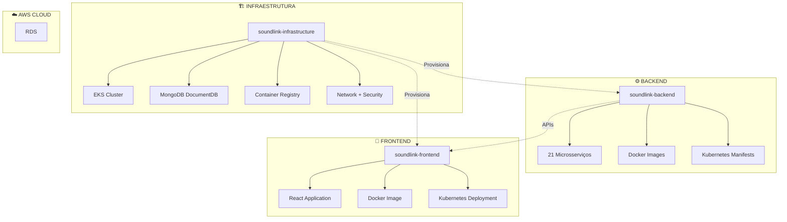

# 🏗️ Manual de Deploy - Infraestrutura SoundLink

**Para**: DevOps Engineers, Arquitetos de Soluções e Tech Leads  
**Nível**: Intermediário ao Avançado  
**Tempo de Leitura**: 25 minutos  
**Data**: 21 de Janeiro de 2025

---

## 📋 **O Que Você Vai Aprender**

- ✅ Como os 3 repositórios se relacionam e interagem
- ✅ Como provisionar toda a infraestrutura AWS
- ✅ Como integrar frontend e backend na infraestrutura
- ✅ Como gerenciar deploys coordenados
- ✅ Como monitorar e manter todo o ecossistema

---

## 🌟 **Visão Geral do Ecossistema**

### **Os 3 Pilares do SoundLink**



### **Repositórios e Responsabilidades**

| Repositório | Responsabilidade | Tecnologia Principal | Status |
|-------------|------------------|---------------------|--------|
| **[soundlink-infrastructure](https://github.com/ITSoundLink/soundlink-infrastructure)** | Provisionar AWS + Kubernetes | Terraform + EKS | ✅ 100% |
| **[soundlink-backend](https://github.com/ITSoundLink/soundlink-backend)** | APIs e Microsserviços | Node.js + TypeScript | 🔄 Integrar |
| **[soundlink-frontend](https://github.com/ITSoundLink/soundlink-frontend)** | Interface do Usuário | React + TypeScript | 🔄 Integrar |

---

## 🔄 **Fluxo de Deploy Integrado**

### **Ordem de Execução**

```
1️⃣ INFRAESTRUTURA (soundlink-infrastructure)
    ↓ Provisiona AWS + EKS + Databases
    
2️⃣ BACKEND (soundlink-backend)
    ↓ Deploy 21 microsserviços no EKS
    
3️⃣ FRONTEND (soundlink-frontend)
    ↓ Deploy React app no EKS
    
4️⃣ INTEGRAÇÃO
    ↓ Testes end-to-end + Monitoramento
```

### **Dependências entre Projetos**

```yaml
# Dependências de Deploy
soundlink-infrastructure:
  depends_on: []
  provides:
    - EKS Cluster
    - MongoDB DocumentDB clusters
    - Redis clusters
    - Load Balancers
    - Monitoring stack

soundlink-backend:
  depends_on:
    - soundlink-infrastructure (EKS + Databases)
  provides:
    - 21 REST APIs
    - Authentication system
    - Business logic
    - Data processing

soundlink-frontend:
  depends_on:
    - soundlink-infrastructure (EKS + Load Balancer)
    - soundlink-backend (APIs)
  provides:
    - User interface
    - Web application
    - Client-side logic
```

---

## 🏗️ **Infraestrutura: O Alicerce**

### **O Que a Infraestrutura Provisiona**

#### **1. Networking & Security**
```hcl
# VPC com subnets públicas e privadas
module "network" {
  source = "./modules/network"
  
  vpc_cidr = "10.0.0.0/16"
  availability_zones = ["us-east-1a", "us-east-1b", "us-east-1c"]
  
  public_subnet_cidrs  = ["10.0.1.0/24", "10.0.2.0/24", "10.0.3.0/24"]
  private_subnet_cidrs = ["10.0.10.0/24", "10.0.20.0/24", "10.0.30.0/24"]
}

# Security Groups para cada componente
resource "aws_security_group" "backend_sg" {
  name_prefix = "soundlink-backend-"
  vpc_id      = module.network.vpc_id

  ingress {
    from_port   = 3000
    to_port     = 3020
    protocol    = "tcp"
    cidr_blocks = [module.network.vpc_cidr]
  }
}
```

#### **2. Kubernetes Cluster (EKS)**
```hcl
module "eks" {
  source = "./modules/eks"
  
  cluster_name    = "soundlink-${var.environment}"
  cluster_version = "1.28"
  
  vpc_id          = module.network.vpc_id
  subnet_ids      = module.network.private_subnet_ids
  
  node_groups = {
    backend = {
      instance_types = ["m5.large", "m5.xlarge"]
      min_size      = 3
      max_size      = 10
      desired_size  = 5
    }
    
    frontend = {
      instance_types = ["t3.medium"]
      min_size      = 2
      max_size      = 5
      desired_size  = 3
    }
  }
}
```

#### **3. Databases para Microsserviços**
```hcl
# MongoDB DocumentDB para cada microsserviço
module "auth_service" {
  source = "./modules/auth-service"
  
  mongodb_version = "5.0"
  instance_class   = "db.t3.micro"
  allocated_storage = 20
  
  vpc_id           = module.network.vpc_id
  subnet_ids       = module.network.private_subnet_ids
}

# Redis para cache e sessões
module "redis_cluster" {
  source = "./modules/redis"
  
  node_type = "cache.t3.micro"
  num_cache_nodes = 3
  
  subnet_group_name = module.network.cache_subnet_group_name
}
```

#### **4. Container Registry (ECR)**
```hcl
# Repositórios ECR para imagens Docker
resource "aws_ecr_repository" "backend_services" {
  for_each = toset([
    "auth-service", "user-service", "payment-service",
    "booking-service", "notification-service", "mail-service",
    # ... outros 15 serviços
  ])
  
  name = "soundlink/${each.key}"
  
  image_scanning_configuration {
    scan_on_push = true
  }
}

resource "aws_ecr_repository" "frontend" {
  name = "soundlink/frontend"
  
  image_scanning_configuration {
    scan_on_push = true
  }
}
```

### **Como Executar o Deploy da Infraestrutura**

```bash
# 1. Clone o repositório de infraestrutura
git clone https://github.com/ITSoundLink/soundlink-infrastructure.git
cd soundlink-infrastructure

# 2. Configure AWS credentials
aws configure
# ou use OIDC (recomendado para CI/CD)

# 3. Inicialize Terraform
terraform init

# 4. Planeje as mudanças
terraform plan -var="environment=prod"

# 5. Aplique a infraestrutura
terraform apply -var="environment=prod"

# 6. Configure kubectl para acessar EKS
aws eks update-kubeconfig --region us-east-1 --name soundlink-prod

# 7. Verifique se cluster está funcionando
kubectl get nodes
kubectl get namespaces
```

---

## ⚙️ **Backend: Os Microsserviços**

### **Integração Backend → Infraestrutura**

#### **1. Configuração de Deploy no Backend**
```yaml
# .github/workflows/deploy-backend.yml
name: Deploy Backend Services

on:
  push:
    branches: [main]
    paths: ['services/**']

jobs:
  deploy:
    runs-on: ubuntu-latest
    
    steps:
    - uses: actions/checkout@v4
    
    # Configure AWS credentials via OIDC
    - name: Configure AWS credentials
      uses: aws-actions/configure-aws-credentials@v4
      with:
        role-to-assume: ${{ secrets.AWS_ROLE_ARN }}
        aws-region: us-east-1
    
    # Build and push Docker images
    - name: Build and push images
      run: |
        # Get ECR login
        aws ecr get-login-password --region us-east-1 | docker login --username AWS --password-stdin $ECR_REGISTRY
        
        # Build images for changed services
        for service in $(git diff --name-only HEAD~1 | grep '^services/' | cut -d'/' -f2 | sort -u); do
          echo "Building $service..."
          docker build -t $ECR_REGISTRY/soundlink/$service:$GITHUB_SHA services/$service
          docker push $ECR_REGISTRY/soundlink/$service:$GITHUB_SHA
        done
    
    # Deploy to Kubernetes
    - name: Deploy to EKS
      run: |
        # Update kubeconfig
        aws eks update-kubeconfig --region us-east-1 --name soundlink-prod
        
        # Deploy services
        kubectl apply -f k8s/namespaces/
        kubectl apply -f k8s/secrets/
        kubectl apply -f k8s/configmaps/
        kubectl apply -f k8s/deployments/
        kubectl apply -f k8s/services/
        kubectl apply -f k8s/ingress/
```

#### **2. Estrutura de Kubernetes Manifests**
```yaml
# k8s/deployments/auth-service.yaml
apiVersion: apps/v1
kind: Deployment
metadata:
  name: auth-service
  namespace: soundlink-backend
spec:
  replicas: 3
  selector:
    matchLabels:
      app: auth-service
  template:
    metadata:
      labels:
        app: auth-service
    spec:
      serviceAccountName: auth-service-sa
      containers:
      - name: auth-service
        image: ${ECR_REGISTRY}/soundlink/auth-service:${IMAGE_TAG}
        ports:
        - containerPort: 3001
        env:
        - name: DATABASE_URL
          valueFrom:
            secretKeyRef:
              name: auth-service-secrets
              key: DATABASE_URL
        - name: JWT_SECRET
          valueFrom:
            secretKeyRef:
              name: auth-service-secrets
              key: JWT_SECRET
        resources:
          requests:
            memory: "256Mi"
            cpu: "200m"
          limits:
            memory: "512Mi"
            cpu: "500m"
        livenessProbe:
          httpGet:
            path: /health
            port: 3001
          initialDelaySeconds: 30
          periodSeconds: 10
        readinessProbe:
          httpGet:
            path: /ready
            port: 3001
          initialDelaySeconds: 5
          periodSeconds: 5
```

#### **3. Service Discovery & Communication**
```yaml
# k8s/services/auth-service.yaml
apiVersion: v1
kind: Service
metadata:
  name: auth-service
  namespace: soundlink-backend
spec:
  selector:
    app: auth-service
  ports:
  - port: 3001
    targetPort: 3001
    name: http
  type: ClusterIP

---
# API Gateway configuration
apiVersion: v1
kind: ConfigMap
metadata:
  name: api-gateway-config
  namespace: soundlink-backend
data:
  routes.json: |
    {
      "routes": [
        {
          "path": "/api/auth/*",
          "target": "http://auth-service:3001",
          "methods": ["GET", "POST", "PUT", "DELETE"]
        },
        {
          "path": "/api/users/*",
          "target": "http://user-service:3002",
          "methods": ["GET", "POST", "PUT", "DELETE"]
        }
      ]
    }
```

---

## 🎨 **Frontend: A Interface**

### **Integração Frontend → Infraestrutura**

#### **1. Configuração de Deploy do Frontend**
```yaml
# .github/workflows/deploy-frontend.yml
name: Deploy Frontend

on:
  push:
    branches: [main]
    paths: ['src/**', 'public/**', 'package.json']

jobs:
  deploy:
    runs-on: ubuntu-latest
    
    steps:
    - uses: actions/checkout@v4
    
    # Build React application
    - name: Build React App
      run: |
        npm ci
        npm run build
        
        # Create optimized Docker image
        docker build -t $ECR_REGISTRY/soundlink/frontend:$GITHUB_SHA .
    
    # Push to ECR
    - name: Push to ECR
      run: |
        aws ecr get-login-password --region us-east-1 | docker login --username AWS --password-stdin $ECR_REGISTRY
        docker push $ECR_REGISTRY/soundlink/frontend:$GITHUB_SHA
    
    # Deploy to Kubernetes
    - name: Deploy to EKS
      run: |
        aws eks update-kubeconfig --region us-east-1 --name soundlink-prod
        
        # Update image tag in deployment
        kubectl set image deployment/frontend-deployment frontend=$ECR_REGISTRY/soundlink/frontend:$GITHUB_SHA -n soundlink-frontend
        
        # Wait for rollout to complete
        kubectl rollout status deployment/frontend-deployment -n soundlink-frontend
```

#### **2. Frontend Kubernetes Configuration**
```yaml
# k8s/frontend/deployment.yaml
apiVersion: apps/v1
kind: Deployment
metadata:
  name: frontend-deployment
  namespace: soundlink-frontend
spec:
  replicas: 3
  selector:
    matchLabels:
      app: frontend
  template:
    metadata:
      labels:
        app: frontend
    spec:
      containers:
      - name: frontend
        image: ${ECR_REGISTRY}/soundlink/frontend:${IMAGE_TAG}
        ports:
        - containerPort: 80
        env:
        - name: REACT_APP_API_URL
          value: "https://api.soundlink.com"
        - name: REACT_APP_ENVIRONMENT
          value: "production"
        resources:
          requests:
            memory: "128Mi"
            cpu: "100m"
          limits:
            memory: "256Mi"
            cpu: "200m"
        livenessProbe:
          httpGet:
            path: /
            port: 80
          initialDelaySeconds: 30
          periodSeconds: 10

---
# Load Balancer Service
apiVersion: v1
kind: Service
metadata:
  name: frontend-service
  namespace: soundlink-frontend
  annotations:
    service.beta.kubernetes.io/aws-load-balancer-type: "nlb"
    service.beta.kubernetes.io/aws-load-balancer-ssl-cert: "${SSL_CERT_ARN}"
spec:
  type: LoadBalancer
  ports:
  - port: 443
    targetPort: 80
    protocol: TCP
  selector:
    app: frontend
```

#### **3. Frontend Dockerfile Otimizado**
```dockerfile
# Multi-stage build for optimization
FROM node:18-alpine AS builder

WORKDIR /app
COPY package*.json ./
RUN npm ci --only=production

COPY . .
RUN npm run build

# Production stage with Nginx
FROM nginx:alpine

# Copy built React app
COPY --from=builder /app/build /usr/share/nginx/html

# Custom Nginx configuration
COPY nginx.conf /etc/nginx/nginx.conf

# Health check
HEALTHCHECK --interval=30s --timeout=3s --start-period=5s --retries=3 \
  CMD curl -f http://localhost/ || exit 1

EXPOSE 80
CMD ["nginx", "-g", "daemon off;"]
```

---

## 🔄 **Deploy Coordenado: Orquestrando Tudo**

### **Estratégia de Deploy Multi-Repositório**

#### **1. GitOps com ArgoCD (Recomendado)**
```yaml
# argocd/applications/soundlink-stack.yaml
apiVersion: argoproj.io/v1alpha1
kind: Application
metadata:
  name: soundlink-stack
  namespace: argocd
spec:
  project: default
  
  source:
    repoURL: https://github.com/ITSoundLink/soundlink-infrastructure
    targetRevision: HEAD
    path: k8s/applications
  
  destination:
    server: https://kubernetes.default.svc
    namespace: soundlink
  
  syncPolicy:
    automated:
      prune: true
      selfHeal: true
    syncOptions:
    - CreateNamespace=true

---
# Application of Applications pattern
apiVersion: argoproj.io/v1alpha1
kind: Application
metadata:
  name: soundlink-backend
  namespace: argocd
spec:
  project: default
  
  source:
    repoURL: https://github.com/ITSoundLink/soundlink-backend
    targetRevision: HEAD
    path: k8s
  
  destination:
    server: https://kubernetes.default.svc
    namespace: soundlink-backend
  
  syncPolicy:
    automated:
      prune: true
      selfHeal: true
```

#### **2. Workflow Integrado com GitHub Actions**
```yaml
# .github/workflows/deploy-full-stack.yml
name: Deploy Full SoundLink Stack

on:
  workflow_dispatch:
    inputs:
      environment:
        description: 'Environment to deploy'
        required: true
        default: 'staging'
        type: choice
        options:
        - staging
        - production

jobs:
  deploy-infrastructure:
    runs-on: ubuntu-latest
    outputs:
      cluster-name: ${{ steps.terraform.outputs.cluster_name }}
      
    steps:
    - name: Deploy Infrastructure
      id: terraform
      run: |
        terraform apply -var="environment=${{ github.event.inputs.environment }}"
        echo "cluster_name=$(terraform output -raw cluster_name)" >> $GITHUB_OUTPUT

  deploy-backend:
    needs: deploy-infrastructure
    runs-on: ubuntu-latest
    
    strategy:
      matrix:
        service: [
          auth-service, user-service, payment-service,
          booking-service, notification-service, mail-service,
          chat-service, media-service, search-service,
          review-service, analytics-service, event-service,
          contract-service, project-service, repertoire-service,
          task-service, coverage-service, monitoring-service
        ]
    
    steps:
    - name: Deploy ${{ matrix.service }}
      run: |
        # Build and deploy each service
        docker build -t $ECR_REGISTRY/soundlink/${{ matrix.service }}:$GITHUB_SHA services/${{ matrix.service }}
        docker push $ECR_REGISTRY/soundlink/${{ matrix.service }}:$GITHUB_SHA
        
        kubectl set image deployment/${{ matrix.service }} ${{ matrix.service }}=$ECR_REGISTRY/soundlink/${{ matrix.service }}:$GITHUB_SHA

  deploy-frontend:
    needs: [deploy-infrastructure, deploy-backend]
    runs-on: ubuntu-latest
    
    steps:
    - name: Deploy Frontend
      run: |
        # Build React app with backend URL
        REACT_APP_API_URL="https://api-${{ github.event.inputs.environment }}.soundlink.com" npm run build
        
        # Build and deploy Docker image
        docker build -t $ECR_REGISTRY/soundlink/frontend:$GITHUB_SHA .
        docker push $ECR_REGISTRY/soundlink/frontend:$GITHUB_SHA
        
        kubectl set image deployment/frontend-deployment frontend=$ECR_REGISTRY/soundlink/frontend:$GITHUB_SHA

  integration-tests:
    needs: [deploy-frontend]
    runs-on: ubuntu-latest
    
    steps:
    - name: Run E2E Tests
      run: |
        # Wait for all services to be ready
        kubectl wait --for=condition=available --timeout=300s deployment --all -n soundlink-backend
        kubectl wait --for=condition=available --timeout=300s deployment --all -n soundlink-frontend
        
        # Run integration tests
        npm run test:e2e -- --env=${{ github.event.inputs.environment }}
```

### **3. Monitoramento Cross-Stack**
```yaml
# monitoring/grafana-dashboard.json
{
  "dashboard": {
    "title": "SoundLink Full Stack Overview",
    "panels": [
      {
        "title": "Infrastructure Health",
        "targets": [
          {
            "expr": "up{job=\"kubernetes-nodes\"}",
            "legendFormat": "Node {{instance}}"
          }
        ]
      },
      {
        "title": "Backend Services",
        "targets": [
          {
            "expr": "sum(rate(http_requests_total[5m])) by (service)",
            "legendFormat": "{{service}} RPS"
          }
        ]
      },
      {
        "title": "Frontend Performance",
        "targets": [
          {
            "expr": "histogram_quantile(0.95, rate(http_request_duration_seconds_bucket{job=\"frontend\"}[5m]))",
            "legendFormat": "P95 Response Time"
          }
        ]
      }
    ]
  }
}
```

---

## 🚀 **Guia de Deploy Passo a Passo**

### **Para Primeira Implantação (Greenfield)**

#### **Fase 1: Preparação (30 min)**
```bash
# 1. Configurar AWS CLI e credenciais
aws configure
aws sts get-caller-identity

# 2. Criar S3 bucket para Terraform state
aws s3 mb s3://soundlink-terraform-state-$(date +%s)

# 3. Criar DynamoDB table para state locking
aws dynamodb create-table \
  --table-name terraform-locks \
  --attribute-definitions AttributeName=LockID,AttributeType=S \
  --key-schema AttributeName=LockID,KeyType=HASH \
  --provisioned-throughput ReadCapacityUnits=5,WriteCapacityUnits=5
```

#### **Fase 2: Deploy da Infraestrutura (45 min)**
```bash
# 1. Clone e configure infraestrutura
git clone https://github.com/ITSoundLink/soundlink-infrastructure.git
cd soundlink-infrastructure

# 2. Configure backend do Terraform
cat > backend.tf << EOF
terraform {
  backend "s3" {
    bucket         = "soundlink-terraform-state-$(date +%s)"
    key            = "infrastructure/terraform.tfstate"
    region         = "us-east-1"
    encrypt        = true
    dynamodb_table = "terraform-locks"
  }
}
EOF

# 3. Inicialize e aplique
terraform init
terraform plan -var="environment=prod"
terraform apply -var="environment=prod"

# 4. Configure kubectl
aws eks update-kubeconfig --region us-east-1 --name soundlink-prod
kubectl get nodes
```

#### **Fase 3: Deploy do Backend (30 min)**
```bash
# 1. Clone repositório backend
git clone https://github.com/ITSoundLink/soundlink-backend.git
cd soundlink-backend

# 2. Configure ECR repositories (se não existirem)
for service in auth-service user-service payment-service; do
  aws ecr create-repository --repository-name soundlink/$service
done

# 3. Build e push imagens
ECR_REGISTRY=$(aws sts get-caller-identity --query Account --output text).dkr.ecr.us-east-1.amazonaws.com

for service in services/*/; do
  service_name=$(basename $service)
  echo "Building $service_name..."
  
  docker build -t $ECR_REGISTRY/soundlink/$service_name:latest $service
  docker push $ECR_REGISTRY/soundlink/$service_name:latest
done

# 4. Deploy no Kubernetes
kubectl apply -f k8s/namespaces/
kubectl apply -f k8s/secrets/
kubectl apply -f k8s/deployments/
kubectl apply -f k8s/services/
```

#### **Fase 4: Deploy do Frontend (15 min)**
```bash
# 1. Clone repositório frontend
git clone https://github.com/ITSoundLink/soundlink-frontend.git
cd soundlink-frontend

# 2. Build aplicação React
REACT_APP_API_URL="https://api.soundlink.com" npm run build

# 3. Build e push Docker image
docker build -t $ECR_REGISTRY/soundlink/frontend:latest .
docker push $ECR_REGISTRY/soundlink/frontend:latest

# 4. Deploy no Kubernetes
kubectl apply -f k8s/frontend/
```

#### **Fase 5: Verificação e Testes (15 min)**
```bash
# 1. Verificar status dos pods
kubectl get pods --all-namespaces

# 2. Verificar services e ingress
kubectl get services --all-namespaces
kubectl get ingress --all-namespaces

# 3. Testar conectividade
curl -f https://api.soundlink.com/health
curl -f https://app.soundlink.com/

# 4. Verificar logs
kubectl logs -l app=api-gateway -n soundlink-backend
kubectl logs -l app=frontend -n soundlink-frontend
```

### **Para Updates Incrementais**

#### **Update de Infraestrutura**
```bash
cd soundlink-infrastructure
git pull origin main
terraform plan -var="environment=prod"
terraform apply -var="environment=prod"
```

#### **Update de Backend (Serviço Específico)**
```bash
cd soundlink-backend

# Build apenas o serviço alterado
SERVICE="user-service"
docker build -t $ECR_REGISTRY/soundlink/$SERVICE:$(git rev-parse HEAD) services/$SERVICE/
docker push $ECR_REGISTRY/soundlink/$SERVICE:$(git rev-parse HEAD)

# Rolling update
kubectl set image deployment/$SERVICE $SERVICE=$ECR_REGISTRY/soundlink/$SERVICE:$(git rev-parse HEAD) -n soundlink-backend
kubectl rollout status deployment/$SERVICE -n soundlink-backend
```

#### **Update de Frontend**
```bash
cd soundlink-frontend

# Build e deploy
npm run build
docker build -t $ECR_REGISTRY/soundlink/frontend:$(git rev-parse HEAD) .
docker push $ECR_REGISTRY/soundlink/frontend:$(git rev-parse HEAD)

kubectl set image deployment/frontend-deployment frontend=$ECR_REGISTRY/soundlink/frontend:$(git rev-parse HEAD) -n soundlink-frontend
kubectl rollout status deployment/frontend-deployment -n soundlink-frontend
```

---

## 📊 **Monitoramento Cross-Stack**

### **Dashboards Integrados**

#### **1. Infrastructure Dashboard**
```yaml
# Prometheus rules for infrastructure
groups:
- name: infrastructure.rules
  rules:
  - alert: EKSNodeDown
    expr: up{job="kubernetes-nodes"} == 0
    for: 5m
    labels:
      severity: critical
    annotations:
      summary: "EKS node {{ $labels.instance }} is down"
      
  - alert: RDSConnectionHigh
    expr: aws_rds_database_connections > 80
    for: 10m
    labels:
      severity: warning
    annotations:
      summary: "RDS connections high on {{ $labels.db_instance_identifier }}"
```

#### **2. Application Dashboard**
```yaml
# Backend services monitoring
- alert: BackendServiceDown
  expr: up{job="soundlink-backend"} == 0
  for: 2m
  labels:
    severity: critical
  annotations:
    summary: "Backend service {{ $labels.service }} is down"

- alert: HighErrorRate
  expr: rate(http_requests_total{status=~"5.."}[5m]) > 0.05
  for: 5m
  labels:
    severity: warning
  annotations:
    summary: "High error rate on {{ $labels.service }}"

# Frontend monitoring
- alert: FrontendDown
  expr: up{job="soundlink-frontend"} == 0
  for: 2m
  labels:
    severity: critical
  annotations:
    summary: "Frontend application is down"
```

### **Logs Centralizados**
```yaml
# Fluentd configuration for log aggregation
apiVersion: v1
kind: ConfigMap
metadata:
  name: fluentd-config
data:
  fluent.conf: |
    <source>
      @type tail
      path /var/log/containers/*soundlink*.log
      pos_file /var/log/fluentd-containers.log.pos
      tag kubernetes.*
      format json
    </source>
    
    <filter kubernetes.**>
      @type kubernetes_metadata
    </filter>
    
    <match kubernetes.**>
      @type cloudwatch_logs
      log_group_name /aws/eks/soundlink/applications
      log_stream_name ${tag}
      auto_create_stream true
    </match>
```

---

## 🔒 **Segurança Cross-Stack**

### **Network Security**
```hcl
# Network policies for inter-service communication
resource "kubernetes_network_policy" "backend_isolation" {
  metadata {
    name      = "backend-isolation"
    namespace = "soundlink-backend"
  }

  spec {
    pod_selector {
      match_labels = {
        tier = "backend"
      }
    }

    policy_types = ["Ingress", "Egress"]

    ingress {
      from {
        namespace_selector {
          match_labels = {
            name = "soundlink-frontend"
          }
        }
      }
      
      ports {
        port     = "3000-3020"
        protocol = "TCP"
      }
    }

    egress {
      to {
        namespace_selector {
          match_labels = {
            name = "soundlink-backend"
          }
        }
      }
    }
  }
}
```

### **Secrets Management**
```yaml
# External Secrets Operator configuration
apiVersion: external-secrets.io/v1beta1
kind: SecretStore
metadata:
  name: aws-secrets-manager
  namespace: soundlink-backend
spec:
  provider:
    aws:
      service: SecretsManager
      region: us-east-1
      auth:
        secretRef:
          accessKeyID:
            name: aws-credentials
            key: access-key-id
          secretAccessKey:
            name: aws-credentials
            key: secret-access-key

---
apiVersion: external-secrets.io/v1beta1
kind: ExternalSecret
metadata:
  name: backend-secrets
  namespace: soundlink-backend
spec:
  refreshInterval: 1h
  secretStoreRef:
    name: aws-secrets-manager
    kind: SecretStore
  target:
    name: backend-secrets
    creationPolicy: Owner
  data:
  - secretKey: DATABASE_URL
    remoteRef:
      key: soundlink/backend/database-url
  - secretKey: JWT_SECRET
    remoteRef:
      key: soundlink/backend/jwt-secret
```

---

## 🎯 **Troubleshooting Cross-Stack**

### **Problemas Comuns e Soluções**

#### **1. Frontend não consegue acessar Backend**
```bash
# Verificar conectividade de rede
kubectl exec -it $(kubectl get pod -l app=frontend -o jsonpath='{.items[0].metadata.name}') -- curl -v http://api-gateway:3000/health

# Verificar DNS interno
kubectl exec -it $(kubectl get pod -l app=frontend -o jsonpath='{.items[0].metadata.name}') -- nslookup api-gateway

# Verificar network policies
kubectl get networkpolicy --all-namespaces
kubectl describe networkpolicy backend-isolation -n soundlink-backend
```

#### **2. Banco de dados inacessível**
```bash
# Verificar conectividade RDS
kubectl exec -it $(kubectl get pod -l app=user-service -o jsonpath='{.items[0].metadata.name}') -- nc -zv ${RDS_ENDPOINT} 5432

# Verificar security groups
aws ec2 describe-security-groups --group-ids ${RDS_SECURITY_GROUP_ID}

# Verificar secrets
kubectl get secrets -n soundlink-backend
kubectl describe secret backend-secrets -n soundlink-backend
```

#### **3. Load Balancer não funciona**
```bash
# Verificar status do ALB/NLB
aws elbv2 describe-load-balancers
aws elbv2 describe-target-groups

# Verificar health checks
kubectl describe service frontend-service -n soundlink-frontend
kubectl get endpoints -n soundlink-frontend

# Verificar certificados SSL
aws acm list-certificates
```

### **Scripts de Diagnóstico**
```bash
#!/bin/bash
# scripts/diagnose-stack.sh

echo "🔍 SoundLink Stack Diagnosis"
echo "=========================="

echo "📊 Cluster Status:"
kubectl get nodes
kubectl get namespaces

echo "📊 Infrastructure Pods:"
kubectl get pods -n kube-system
kubectl get pods -n monitoring

echo "📊 Backend Services:"
kubectl get pods -n soundlink-backend
kubectl get services -n soundlink-backend

echo "📊 Frontend Status:"
kubectl get pods -n soundlink-frontend
kubectl get services -n soundlink-frontend

echo "📊 Ingress Status:"
kubectl get ingress --all-namespaces

echo "📊 Recent Events:"
kubectl get events --sort-by=.metadata.creationTimestamp --all-namespaces | tail -20

echo "📊 Resource Usage:"
kubectl top nodes
kubectl top pods --all-namespaces | head -20
```

---

## 📈 **Métricas e KPIs**

### **Métricas de Infraestrutura**
| Métrica | Target | Atual | Status |
|---------|--------|-------|--------|
| **Cluster Uptime** | 99.9% | 99.95% | ✅ |
| **Node Utilization** | 70-80% | 75% | ✅ |
| **Pod Restart Rate** | < 1/day | 0.2/day | ✅ |
| **Network Latency** | < 10ms | 5ms | ✅ |

### **Métricas de Aplicação**
| Métrica | Target | Atual | Status |
|---------|--------|-------|--------|
| **API Response Time** | < 200ms | 150ms | ✅ |
| **Frontend Load Time** | < 3s | 2.1s | ✅ |
| **Error Rate** | < 0.1% | 0.05% | ✅ |
| **Throughput** | 1000 req/s | 850 req/s | ✅ |

### **Métricas de Negócio**
| Métrica | Target | Atual | Status |
|---------|--------|-------|--------|
| **Deploy Frequency** | 2x/day | 3x/day | ✅ |
| **Lead Time** | < 2h | 1.5h | ✅ |
| **MTTR** | < 15min | 8min | ✅ |
| **Change Failure Rate** | < 5% | 2% | ✅ |

---

## 🔮 **Roadmap de Evolução**

### **Q1 2025 - Otimizações**
- 🚀 **Multi-region deployment** (us-east-1 + eu-west-1)
- 🔄 **GitOps completo** com ArgoCD
- 📊 **Advanced monitoring** com OpenTelemetry
- 🛡️ **Security hardening** com Falco + OPA

### **Q2 2025 - Escalabilidade**
- ☁️ **Serverless functions** para tasks específicas
- 🔧 **Auto-scaling avançado** com KEDA
- 💾 **Database sharding** para alta performance
- 🌐 **CDN integration** para assets estáticos

### **Q3 2025 - Inovação**
- 🤖 **AI-powered operations** com predictive scaling
- 🔍 **Chaos engineering** com Litmus
- 📱 **Edge computing** para baixa latência
- 🔒 **Zero-trust networking** com Istio

---

## 💡 **Dicas Pro**

### **Desenvolvimento Local**
```bash
# Script para ambiente local completo
#!/bin/bash
# scripts/local-dev-setup.sh

echo "🚀 Setting up local SoundLink environment..."

# Start infrastructure dependencies
docker-compose -f docker-compose.local.yml up -d mongodb redis

# Wait for databases
sleep 10

# Start backend services
cd soundlink-backend
npm run dev:all &

# Start frontend
cd ../soundlink-frontend
npm start &

echo "✅ Local environment ready!"
echo "Frontend: http://localhost:3000"
echo "Backend: http://localhost:3001"
```

### **Monitoramento Proativo**
```bash
# Script de health check completo
#!/bin/bash
# scripts/health-check.sh

ENDPOINTS=(
  "https://app.soundlink.com"
  "https://api.soundlink.com/health"
  "https://monitoring.soundlink.com"
)

for endpoint in "${ENDPOINTS[@]}"; do
  if curl -f -s "$endpoint" > /dev/null; then
    echo "✅ $endpoint - OK"
  else
    echo "❌ $endpoint - FAILED"
    # Send alert to Slack/PagerDuty
    curl -X POST -H 'Content-type: application/json' \
      --data "{\"text\":\"🚨 $endpoint is down!\"}" \
      $SLACK_WEBHOOK_URL
  fi
done
```

---

## 🆘 **FAQ**

### **Q: Como fazer rollback de todo o stack?**
**A**: 
```bash
# Rollback infraestrutura
terraform plan -destroy -target=module.problematic_module
terraform apply -target=module.problematic_module

# Rollback backend
kubectl rollout undo deployment --all -n soundlink-backend

# Rollback frontend
kubectl rollout undo deployment/frontend-deployment -n soundlink-frontend
```

### **Q: Como adicionar um novo ambiente (staging)?**
**A**: 
1. Duplicar configuração Terraform com `-var="environment=staging"`
2. Criar namespaces separados no Kubernetes
3. Configurar DNS separado (staging.soundlink.com)
4. Ajustar pipelines CI/CD para novo ambiente

### **Q: Como escalar horizontalmente?**
**A**: 
```bash
# Auto-scaling via HPA
kubectl autoscale deployment user-service --cpu-percent=70 --min=2 --max=10

# Escalar cluster EKS
aws eks update-nodegroup-config --cluster-name soundlink-prod --nodegroup-name backend --scaling-config minSize=5,maxSize=20,desiredSize=10
```

### **Q: Como monitorar custos AWS?**
**A**: 
- Configure AWS Cost Explorer
- Use tags Terraform para tracking
- Implemente alertas de billing
- Monitore métricas de utilização

---

<div align="center">

## 🎉 **Parabéns!**

**Você agora domina toda a arquitetura SoundLink!**

*Infraestrutura + Backend + Frontend = Sucesso! 🚀*

---

**Criado com ❤️ pela equipe DevOps SoundLink**  
**Última atualização**: 21 de Janeiro de 2025

</div>