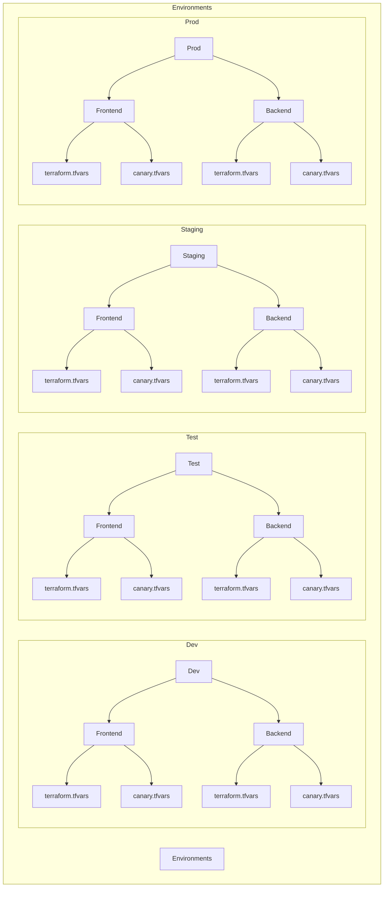
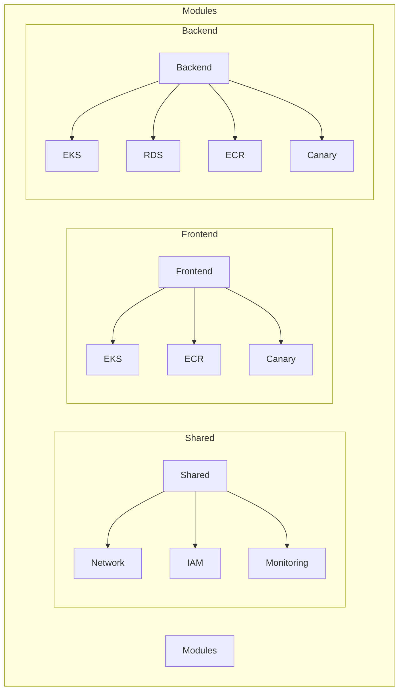
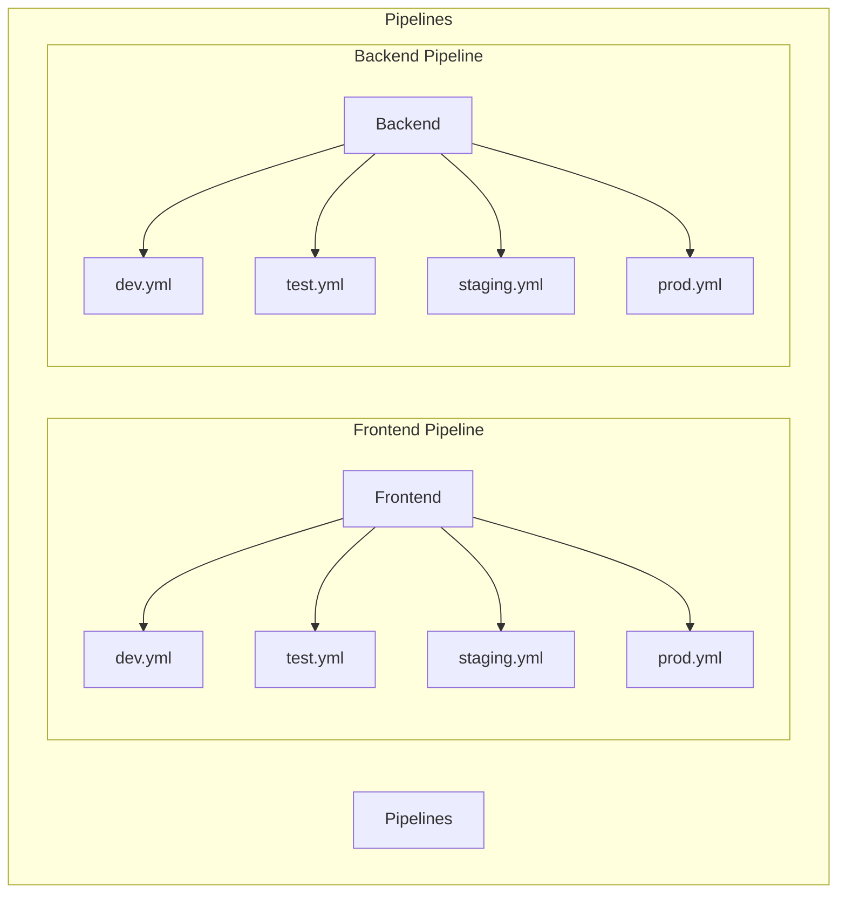
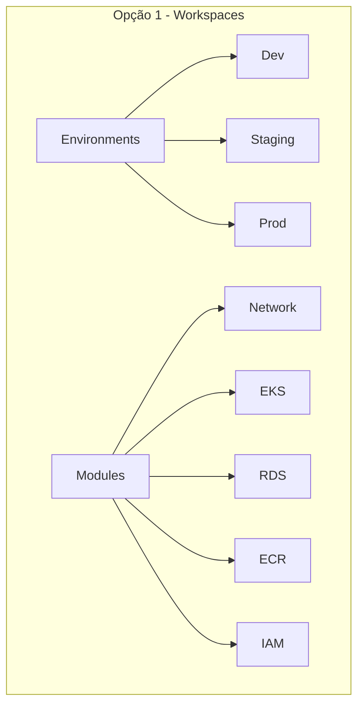
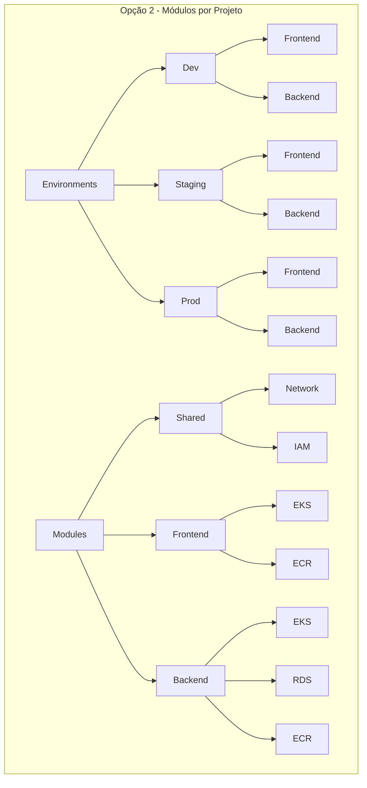
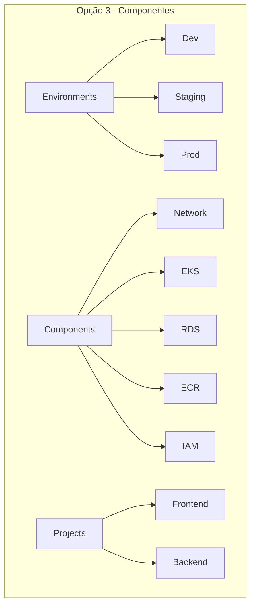
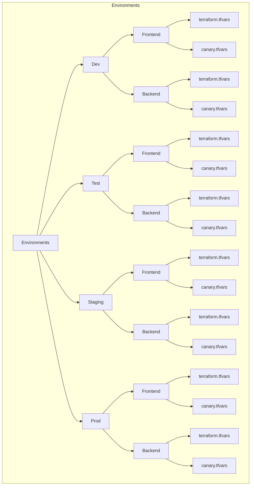
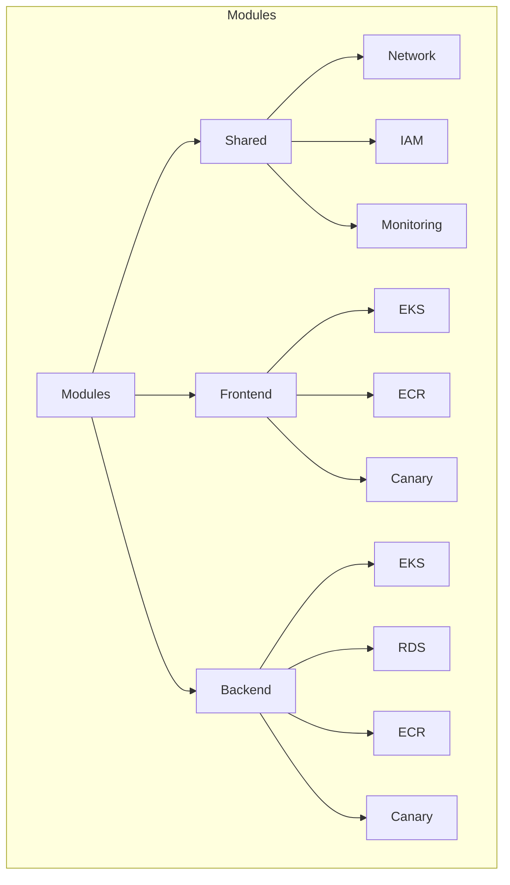
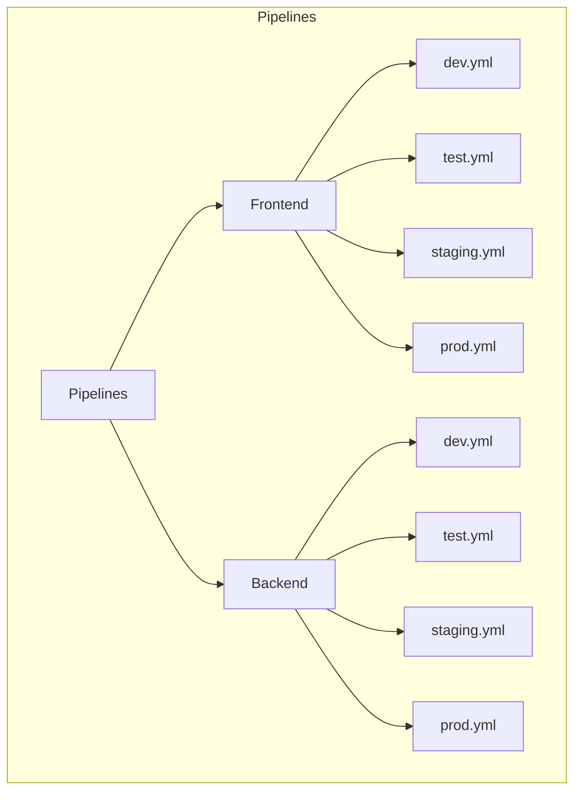

# 🏗️ SoundLink Infrastructure - Documentação de Estrutura

## 📋 Visão Geral do Projeto

**Propósito:** Gerenciar a infraestrutura como código (IaC) para o ambiente SoundLink
**Responsabilidades:** Provisionamento e gerenciamento da infraestrutura utilizando Terraform, Docker e Kubernetes na AWS
**Objetivo:** Suportar múltiplos projetos, incluindo um frontend e um backend com arquitetura de microsserviços
**Dependências:** AWS, Terraform, Docker, Kubernetes

## 🚀 Tecnologias

| Tecnologia | Versão | Propósito |
|------------|--------|-----------|
| Terraform | >= 1.5.0 | Provisionamento e gerenciamento da infraestrutura |
| Docker | >= 24.0 | Containerização das aplicações |
| Kubernetes | >= 1.28 | Orquestração dos containers |
| AWS | - | Provedor de nuvem |

## 🌐 Ambientes Suportados

| Ambiente | Propósito | Configuração |
|----------|-----------|--------------|
| Dev | Desenvolvimento local e testes iniciais | Recursos mínimos |
| Test | Testes automatizados e integração | Recursos médios |
| Staging | Homologação e validação de negócio | Idêntico à produção |
| Prod | Ambiente de produção | Alta disponibilidade |

## Opções de Estrutura do Projeto

### Opção 1 - Estrutura Baseada em Workspaces
```
soundlink-infrastructure/
├── environments/
│   ├── dev/
│   │   └── terraform.tfvars
│   ├── staging/
│   │   └── terraform.tfvars
│   └── prod/
│       └── terraform.tfvars
├── modules/
│   ├── network/
│   ├── eks/
│   ├── rds/
│   ├── ecr/
│   └── iam/
├── main.tf
├── variables.tf
└── outputs.tf
```

**Vantagens:**
- Estrutura simples e direta
- Fácil de entender e manter
- Bom para projetos menores

**Desvantagens:**
- Menos flexível para múltiplos projetos
- Dificuldade em gerenciar configurações específicas
- Menos adequado para pipelines independentes

### Opção 2 - Estrutura Baseada em Módulos por Projeto
```
soundlink-infrastructure/
├── environments/
│   ├── dev/
│   │   ├── frontend/
│   │   │   └── terraform.tfvars
│   │   └── backend/
│   │       └── terraform.tfvars
│   ├── staging/
│   │   ├── frontend/
│   │   │   └── terraform.tfvars
│   │   └── backend/
│   │       └── terraform.tfvars
│   └── prod/
│       ├── frontend/
│       │   └── terraform.tfvars
│       └── backend/
│           └── terraform.tfvars
├── modules/
│   ├── shared/
│   │   ├── network/
│   │   └── iam/
│   ├── frontend/
│   │   ├── eks/
│   │   └── ecr/
│   └── backend/
│       ├── eks/
│       ├── rds/
│       └── ecr/
└── main.tf
```

**Vantagens:**
- Alta flexibilidade por projeto
- Fácil manutenção de configurações específicas
- Suporte a pipelines independentes
- Ideal para equipes separadas
- Melhor para gerenciar microsserviços

**Desvantagens:**
- Possível duplicação de código
- Mais complexa inicialmente
- Requer mais esforço para manter consistência
- Curva de aprendizado mais longa

### Opção 3 - Estrutura Baseada em Componentes
```
soundlink-infrastructure/
├── environments/
│   ├── dev/
│   │   └── terraform.tfvars
│   ├── staging/
│   │   └── terraform.tfvars
│   └── prod/
│       └── terraform.tfvars
├── components/
│   ├── network/
│   ├── eks/
│   ├── rds/
│   ├── ecr/
│   └── iam/
├── projects/
│   ├── frontend/
│   │   └── main.tf
│   └── backend/
│       └── main.tf
└── main.tf
```

**Vantagens:**
- Menos duplicação de código
- Mais fácil manter consistência
- Curva de aprendizado mais curta
- Documentação centralizada
- Otimização de custos

**Desvantagens:**
- Menos flexível para configurações específicas
- Dependências mais complexas
- Recuperação mais complexa
- Menos adequado para equipes separadas

### Opção 4 - Estrutura Híbrida (Recomendada)

#### Estrutura de Ambientes


#### Estrutura de Módulos


#### Estrutura de Pipelines


## Diagramas Comparativos

### Opção 1 - Workspaces


### Opção 2 - Módulos por Projeto


### Opção 3 - Componentes


### Opção 4 - Híbrida: Ambientes


### Opção 4 - Híbrida: Módulos


### Opção 4 - Híbrida: Pipelines


## Comparação Detalhada

| Aspecto | Opção 1 | Opção 2 | Opção 3 | Opção 4 |
|---------|---------|---------|---------|---------|
| Organização | Por ambiente | Por projeto | Por componente | Híbrida |
| Configuração | Centralizada | Por projeto/ambiente | Centralizada | Por projeto/ambiente |
| Flexibilidade | Baixa | Alta | Média | Alta |
| Manutenção | Simples | Complexa | Média | Complexa |
| Duplicação | N/A | Possível | Minimizada | Controlada |
| Consistência | Alta | Requer esforço | Alta | Alta |
| Escalabilidade | Limitada | Fácil | Média | Alta |
| Pipelines | Centralizado | Independentes | Centralizado | Independentes |
| Equipes | Integradas | Separadas | Integradas | Flexível |
| Complexidade | Baixa | Alta | Média | Alta |
| Customização | Limitada | Alta | Média | Alta |
| Reutilização | Alta | Média | Alta | Alta |
| Dependências | Simples | Média | Complexa | Controlada |
| Documentação | Centralizada | Por projeto | Centralizada | Híbrida |
| Aprendizado | Rápido | Longo | Médio | Longo |
| Testes | Centralizados | Por projeto | Centralizados | Por projeto |
| Segurança | Centralizada | Por projeto | Centralizada | Por projeto |
| Custos | Otimizados | Possível duplicação | Otimizados | Otimizados |
| Recuperação | Simples | Independente | Complexa | Independente |
| Monitoramento | Centralizado | Por projeto | Centralizado | Por projeto/versão |
| Compliance | Centralizado | Por projeto | Centralizado | Por projeto |
| Canary Deploy | Não | Não | Não | Sim |
| CI/CD | Básico | Avançado | Básico | Completo |

## Recomendação

Baseado no contexto do projeto SoundLink, que inclui:
- Frontend e Backend como projetos separados
- Backend com arquitetura de microsserviços
- Necessidade de pipelines independentes
- Suporte a canary deployments
- Possível trabalho de equipes diferentes

A **Opção 4 (Estrutura Híbrida)** é recomendada porque:
1. Combina o melhor das outras opções
2. Suporta canary deployments nativamente
3. Permite pipelines completos de CI/CD
4. Mantém a independência entre projetos
5. Facilita a manutenção de configurações específicas
6. Suporta monitoramento por versão
7. Permite rollback automático
8. Otimiza custos e recursos
9. Facilita a escalabilidade
10. Adequado para equipes separadas

## 📊 Monitoramento

### Métricas Principais
- **Disponibilidade**: Uptime dos serviços por ambiente
- **Performance**: Response time e throughput
- **Recursos**: Utilização de CPU, memória e storage
- **Custos**: Gastos por ambiente e serviço

### Health Checks
- **Endpoint**: `/health` em cada serviço
- **Frequência**: 30s
- **Timeout**: 5s
- **Alertas**: Slack + Email para falhas

## 🔍 Troubleshooting

### Problemas Comuns

#### Falha no Deploy
- **Sintomas**: Pipeline falha na aplicação do Terraform
- **Causa**: Conflitos de estado ou recursos já existentes
- **Solução**: Verificar estado do Terraform e resolver conflitos

#### Conectividade entre Ambientes
- **Sintomas**: Serviços não conseguem se comunicar
- **Causa**: Configuração incorreta de Security Groups ou VPC
- **Solução**: Revisar configurações de rede nos módulos

## 📞 Contatos

- **Responsável**: Jesus ([mainjesus@gmail.com])
- **Equipe**: SoundLink DevOps Team
- **Repositório**: [ITSoundLink/soundlink-infrastructure]
- **Documentação**: [docs/]

## 📋 Histórico de Versões

### [0.0.3] - 2024-03-21
- Adição da estrutura híbrida (Opção 4)
- Atualização da análise comparativa
- Documentação detalhada das opções

### [0.0.2] - 2024-03-21
- Implementação do módulo de rede (network)
- Estrutura inicial de diretórios para módulos
- Documentação dos módulos

### [0.0.1] - 2024-03-21
- Estrutura inicial do projeto Terraform
- Configuração básica do provider AWS
- Definição de variáveis principais
- Configuração de ambientes
- Sistema de tags
- Documentação básica
- Criação do repositório inicial

---

<div align="center">

**📅 Criado em:** 21 de Março de 2024  
**🔄 Última atualização:** 21 de Março de 2024  
**👥 Responsável:** Jesus - SoundLink DevOps Team

---

*Documentação da estrutura de infraestrutura como código do projeto SoundLink*

</div>