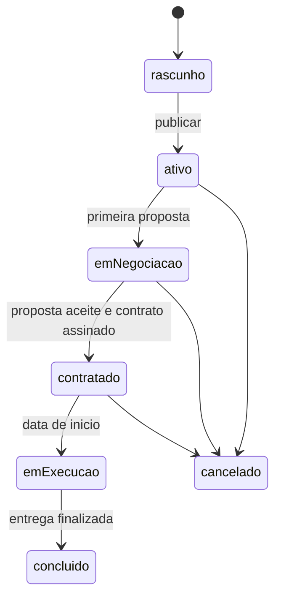

# 09 — Corte 8: Lifecycle do evento + glossário

> **Posição na sequência:** 9 de 10. Depende do Corte 5 (estados de negociação já implementados sob pressão).
> **Plano mestre:** [.cursor/plans/Olinket/olinket_adequacao_cortes_8aac32b9.plan.md](.cursor/plans/Olinket/olinket_adequacao_cortes_8aac32b9.plan.md)
> **Docs P0 obrigatórios:** [docs/planejamento/decisoes-alinhamento-plano-olinket-build-ready.md](docs/planejamento/decisoes-alinhamento-plano-olinket-build-ready.md) (§9), [docs/planejamento/visao-olinket-soundlink-paridade-e-proximo-plano.md](docs/planejamento/visao-olinket-soundlink-paridade-e-proximo-plano.md) (§9), [docs/planejamento/glossario-olinket.md](docs/planejamento/glossario-olinket.md)

## Objetivo

Documentar e cristalizar o lifecycle do **evento** (rascunho → ativo → em negociação → contratado → em execução → concluído; **cancelado**), garantindo que **todas as telas** reagem consistentemente aos mesmos estados.

## Não fazer

- Recriar serviços de proposta/contrato/pagamento (já consolidados no Corte 5).
- Introduzir novos campos no `EventDraftSchema` (cortes 6/7 fecharam).
- Alterar terminologia de produto (Corte 0 fechou).

## Fases

### Fase 1 — Documento canônico de lifecycle

- `docs/planejamento/lifecycle-evento-olinket.md`:
  - Diagrama mermaid de transições.
  - Tabela **estado produto (PT) ↔ `EventStatus` ↔ regras de UI** (botões ativos, badges, avisos, próximo passo).
  - Mapeamento para os sub-ciclos de proposta/contrato/pagamento (referência ao doc do Corte 5 em `docs/planejamento/negociacao-olinket.md`).
- Diagrama:

### Fase 2 — Guardas de transição no domínio

- Evoluir `src/features/eventos/domain/event-status-machine.ts` (novo) com a tabela de transições válidas.
- Reforçar [src/features/eventos/application/services/event-status-label.ts](src/features/eventos/application/services/event-status-label.ts) — só rótulos; a máquina fica no domínio.
- Expor `canTransition(from, to): boolean` para uso nas telas.

### Fase 3 — Consistência de UI

- Componente `EventStatusBadge` em `packages/olinket-ui/src/blocks/` reutilizado em:
  - Listagem `/eventos` (Corte 4).
  - Hub `/eventos/[id]` (Corte 5).
  - Dashboard (Corte 4).
- Regras de habilitação de botões centralizadas num helper `getEventActions(event)` que devolve `{ canInvite, canReceiveProposal, canSign, canPay, canCancel, canClose }`.

### Fase 4 — Glossário atualizado

- Atualizar [docs/planejamento/glossario-olinket.md](docs/planejamento/glossario-olinket.md) com:
  - Termos do lifecycle (PT e técnico).
  - Distinção entre **evento** (entidade Olinket) e **projeto** (novo sentido — obra do músico) já fixada no Corte 0.
- Cross-link com `lifecycle-evento-olinket.md` e `negociacao-olinket.md`.

### Fase 5 — Testes e gates

- Testes unit:
  - `event-status-machine.test.ts` cobrindo **todas** as transições (permitidas + rejeitadas).
  - `getEventActions.test.ts` para combinações representativas.
  - `EventStatusBadge` render por estado.
- **E2E** em [tests/e2e/smoke-routes.spec.ts](tests/e2e/smoke-routes.spec.ts):
  - Criar evento → verificar badge "Rascunho" em lista, hub e dashboard (mesmo texto e cor em todas).
  - Transicionar para ativo/contratado via happy-path do Corte 5 → badges atualizam em todas as telas.
- Gates: `npm run typecheck && npm run lint && npm run test && npm run test:e2e` verdes.

## Hooks para cortes seguintes

- `EventStatusBadge` e `getEventActions` prontos para serem consumidos por novos perfis (ex.: prestador no Corte 9).

## Definição de pronto (DoD)

- `lifecycle-evento-olinket.md` é a **única** fonte de verdade de estados/UI.
- `EventStatusBadge` uniforme em lista, dashboard e hub.
- `canTransition` + `getEventActions` cobertos por testes exaustivos.
- Gates verdes; frontmatter `status: completed`.
