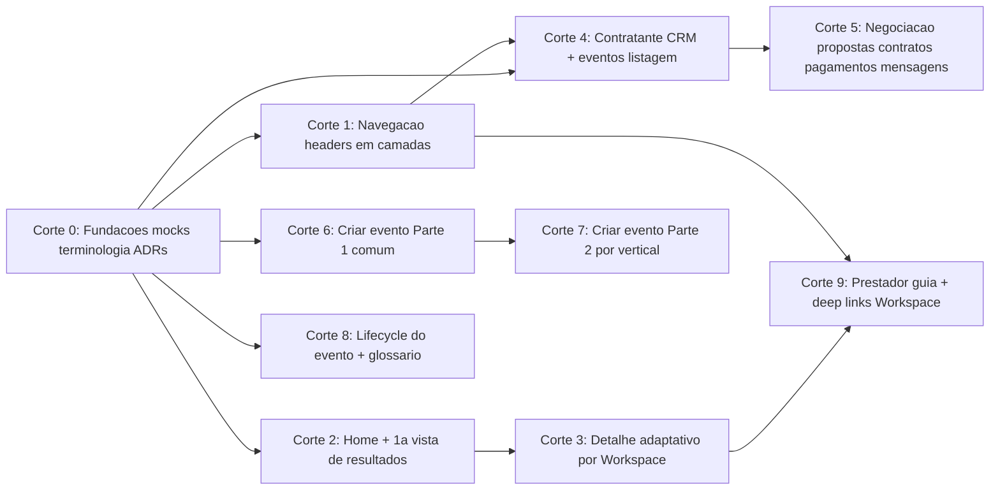

# Planos de adequação Olinket — 9 cortes

> **Rotas canônicas no código (2026-05-01):** descoberta pública **`/discover`**, eventos **`/events`**, auth **`/login`** e **`/signup`**, hub **`/contractor-individual/*`** e **`/contractor-business/*`**. O texto abaixo foi atualizado para esse padrão; decisões históricas citando PT mantêm-se só onde documentam *intenção* já migrada.

## Princípios e restrições comuns a todos os cortes

- **Âmbito:** só Olinket (frontend template). BFF e API ficam fora. Dados via `localStorage` + seed/mocks compartilhados.
- **Regra de ouro:** cada `.plan.md` = 1 corte, com DoD próprio. Não antecipar tarefas de cortes seguintes (apenas deixar "ganchos" de extensão quando a visão §10 pedir).
- **Fonte da verdade (P0):** [docs/planejamento/decisoes-alinhamento-plano-olinket-build-ready.md](docs/planejamento/decisoes-alinhamento-plano-olinket-build-ready.md), [docs/planejamento/visao-olinket-soundlink-paridade-e-proximo-plano.md](docs/planejamento/visao-olinket-soundlink-paridade-e-proximo-plano.md), [docs/planejamento/matriz-ecras-soundlink-olinket.md](docs/planejamento/matriz-ecras-soundlink-olinket.md).
- **Referência SoundLink (P1):** [docs/planejamento/referencia-soundlink-template-frontend-ux.md](docs/planejamento/referencia-soundlink-template-frontend-ux.md) + repo em `D:\SoundLink\Projetos\soundlink-template-frontend`.
- **Gate por corte:** `npm run typecheck`, `npm run lint`, `npm run test`, `npm run test:e2e` verdes antes de fechar.
- **Legado:** [.cursor/plans/Olinket/olinket_workspaces_contratante_build-ready_908b9e64.plan.md](.cursor/plans/Olinket/olinket_workspaces_contratante_build-ready_908b9e64.plan.md) (fases 0–7 concluídas) — **cada corte** marca que tarefas herda, substitui ou arquiva.

---

## Dependências entre cortes

---

## Corte 0 — Fundações: mocks compartilhados, terminologia, ADRs

**Arquivo:** `.cursor/plans/Olinket/olinket_c0_fundacoes_mocks_terminologia.plan.md`

**Objetivo:** criar o package de **mocks compartilhados** entre Olinket e SoundLink, fechar a **renomeação** (Profissionais, Formação Artística, Projeto no novo sentido) e registrar **ADRs** que formalizam as decisões.

**Entregáveis**
- **Package** `packages/olinket-shared-mocks/` (nome npm: `@stec/olinket-shared-mocks`) expondo seeds coerentes de:
  - `eventos[]` (título, vertical/workspace, data, cidade, estado, statusLifecycle) — consumível por Olinket (`/events`, `/discover`) e SoundLink (Find Events).
  - `profissionais[]` com campos mínimos (nome, foto, verticalWorkspace, localizacao, formacaoArtistica[], samples[]).
  - `formacoesArtisticas[]` (ex-"Projetos" no contexto vitrine) e `projetos[]` no **novo** sentido (obra do músico: clipe, gravação).
- Habilitar **npm workspaces** (já existe `packages/olinket-ui`; adicionar `packages/olinket-shared-mocks`) e `transpilePackages` em [next.config.js](next.config.js).
- Refactor **global** de terminologia nos arquivos de código e doc existentes (search & replace criterioso):
  - "Prestador" em copy pública → "Profissionais" (plural) / "Profissional" (singular), exceto em ADRs históricos e em `src/app/prestador/page.tsx` (rota mantém-se mas o copy interno muda).
  - "Projetos" (quando significar vitrine/formação em rede) → "Formação Artística".
- **ADRs**:
  - **ADR-004** `docs/gestao-ideias/00-governanca/decisoes/adr-004-mocks-partilhados-cross-repo.md` — package local com `publishConfig`, estratégia de evolução para GitHub Packages, contrato de tipos.
  - **Addendum ao ADR-001** — terminologia final e busca pública só na Olinket.
- Executar **checklist §11** de [decisoes-alinhamento-plano-olinket-build-ready.md](docs/planejamento/decisoes-alinhamento-plano-olinket-build-ready.md) (atualizar 8 docs listados).
- **Testes unit** de integridade dos mocks (schemas Zod, relações cruzadas evento↔profissional).

**Não fazer:** consumir os mocks do SoundLink neste corte (só criar e publicar localmente); alterar componentes visuais (isso começa no C1/C2).

**DoD:** workspace npm compila; seeds importáveis como `import { eventos, profissionais } from "@stec/olinket-shared-mocks"`; typecheck + lint + testes verdes; ADR-004 aprovado.

---

## Corte 1 — Navegação e headers em camadas

**Arquivo:** `.cursor/plans/Olinket/olinket_c1_navegacao_headers.plan.md`

**Objetivo:** reconstruir o header seguindo o padrão SoundLink em três camadas (público / contratante / profissional simples), com rótulos PT finais.

**Entregáveis**
- Refactor de [src/components/site-header.tsx](src/components/site-header.tsx) para `HeaderWrapper` que decide, por rota/sessão, entre:
  - `PublicHeader` — identidade Olinket + links institucionais (Descobrir, Sou profissional, Entrar/Registro). **Sem campo de busca** (patch pós-DoD C1 2026-04-23): a barra pública vive no body da home — ver `src/components/home/home-search-input.tsx` e Fase 1 do C2, que a promove a `SearchInputHero` em `@stec/olinket-ui`.
  - `ContratanteHeader` — Dashboard, Meu Perfil, Criar Evento, Buscar, Eventos, Contratos, Pagamentos, Mensagens (rótulos da matriz §3).
  - `ProfissionalHeader` **simples** — "O meu Workspace" (deep link) + "Descobrir".
- Tabela de items desktop/mobile + breakpoints documentada em `docs/gestao-tarefas/03-especificacao-produto/ui-canonical/header-olinket.md`.
- Usar primitives do [packages/olinket-ui](packages/olinket-ui/src/index.ts); margens `px-4 md:px-6 lg:px-8` (paridade SoundLink, visão §7).
- **Testes unit** dos três headers (contratos de links por estado) + **smoke E2E** para cada camada.

**Não fazer:** implementar o conteúdo das rotas Dashboard/Mensagens (é C4/C5); busca real (é C2).

**DoD:** headers correctos em todas as rotas atuais; typecheck + e2e verdes.

---

## Corte 2 — Home e 1.ª vista de resultados (busca em camadas)

**Arquivo:** `.cursor/plans/Olinket/olinket_c2_home_busca_primeira_vista.plan.md`

**Objetivo:** home com **só barra de pesquisa** no hero e rota `/discover` como **1.ª vista** (resumo + amostras + prova social, alimentada pelos mocks do C0).

**Entregáveis**
- Refatorar [src/components/home/olinket-public-home.tsx](src/components/home/olinket-public-home.tsx): hero mínimo (headline + input + CTAs Criar evento/Descobrir). Remover listagens de rostos do hero.
- Evoluir [src/app/discover/page.tsx](src/app/discover/page.tsx) e [src/features/busca](src/features/busca/) para ler `@stec/olinket-shared-mocks` e compor:
  - **Resumo** da query (contagem, filtros ativos).
  - **Amostras** agrupadas por "Formação Artística" / portfólio (não Linket como único centro).
  - **Prova social** (depoimentos, destaques).
- Estado da query na URL (`?q=...&vertical=...`).
- **Inspiração de layout** (não cópia): `PublicProjectSearchView`, `EventSearchView`, `ProfessionalSearchView` do SoundLink.
- **Testes unit** de `linket-search-filters` adaptados; **E2E** hero → `/discover` com query.

**Não fazer:** filtros avançados completos ou tela de detalhe (é C3).

**DoD:** pesquisa navegável; typecheck + e2e verdes; sem "Linket" como termo central no copy da 1.ª vista.

---

## Corte 3 — Detalhe adaptativo por Workspace (pós-filtros)

**Arquivo:** `.cursor/plans/Olinket/olinket_c3_detalhe_adaptativo.plan.md`

**Objetivo:** quando filtros avançados são aplicados, navegar para uma **ficha de detalhe** cujo template se **adapta** ao Workspace/vertical do resultado.

**Entregáveis**
- Rota `src/app/discover/[slug]/page.tsx` (ou equivalente) com **resolver** de template por `verticalWorkspace`.
- `src/features/busca/presentation/templates/` com templates por vertical (música, fotografia, …) — slots comuns (cabeçalho, amostras, contatar) + blocos específicos.
- Filtros avançados completos (sheet/drawer) que alimentam a query URL e o detalhe.
- Padrão de 3 abas preparado (Pessoal/Profissional/Atendimento) reutilizado parcialmente aqui — decisão §7 das [decisoes](docs/planejamento/decisoes-alinhamento-plano-olinket-build-ready.md).
- **Testes unit** do resolver + smoke E2E `/discover?q=...&vertical=musica` → detalhe.

**Não fazer:** dashboard prestador completo (fica fora — visão §5 e C9); contratação desse detalhe (C5).

**DoD:** dois verticais com templates distintos; e2e cobrindo ambos.

---

## Corte 4 — Contratante: CRM (Relacionamento com Clientes) + listagem de eventos

**Arquivo:** `.cursor/plans/Olinket/olinket_c4_contratante_crm_eventos.plan.md`

**Objetivo:** paridade UX com o **contratante individual** do SoundLink — dashboard, "Relacionamento com Clientes" (CRM) e listagem de eventos robusta.

**Entregáveis**
- Rotas novas/evoluídas:
  - `/contractor-individual/dashboard`, `/contractor-business/dashboard` — cartões resumo (eventos ativos, propostas pendentes, próximos compromissos).
  - `/contractor-individual/clients`, `/contractor-business/clients` — CRM com lista, filtros e ficha (campos mínimos; dados via mocks compartilhados).
  - Reforço de [src/app/events/page.tsx](src/app/events/page.tsx) — filtros, estados vazios alinhados à SoundLink.
- `src/features/clientes/` em Clean Architecture (domain/application/infrastructure).
- Reutilizar/adaptar componentes do [packages/olinket-ui](packages/olinket-ui/src/index.ts); ordem de nav: Dashboard, Meu Perfil, Criar Evento, Buscar, Eventos, Contratos, Pagamentos, Mensagens (matriz §3).
- **Testes unit** por feature + E2E (dashboard, CRM list, filtro de eventos).

**Não fazer:** criar/editar campos novos no formulário de evento (C6/C7); negociação (C5).

**DoD:** contratante consegue ver cliente, eventos e dashboard com dados dos mocks; e2e verdes.

---

## Corte 5 — Negociação: propostas, contratos, pagamentos, mensagens

**Arquivo:** `.cursor/plans/Olinket/olinket_c5_negociacao_ponto_comum.plan.md`

**Objetivo:** alinhar a **negociação** ao modelo que o SoundLink já usa (Gestão de evento + página individual do evento do músico), de modo que contratante e prestador convirjam no **mesmo ponto** de negociação.

**Entregáveis**
- Evoluir features existentes [src/features/propostas](src/features/propostas/), [src/features/contratos](src/features/contratos/), [src/features/pagamentos](src/features/pagamentos/), [src/features/mensagens](src/features/mensagens/).
- Reforço das rotas `/events/[id]`, `/events/[id]/propostas/[id]`, `/events/[id]/contratos/[id]`, `/events/[id]/pagamentos/[id]` — tabs, estados vazios e copy alinhados a "Gestão de evento" (SoundLink).
- Tabela produto (PT) ↔ enum `EventStatus` ↔ regras de UI (sem exigir API) em `docs/planejamento/negociacao-olinket.md`.
- Ponto comum de negociação mostrando **ambos os lados** (contratante vê proposta enviada; prestador veria convite aceite/recusado) — com flag/mock para simular lados.
- **Testes** expandindo `proposta-state.service.test.ts`, `criar-contrato-de-proposta.service.test.ts`; **E2E** happy-path (convite → proposta → contrato → pagamento mock).

**Não fazer:** back-office prestador completo (fora de escopo, §5 visão).

**DoD:** happy-path E2E verde; regras de UI documentadas.

---

## Corte 6 — Criar evento, Parte 1: comum a todos os Workspaces

**Arquivo:** `.cursor/plans/Olinket/olinket_c6_criar_evento_parte_comum.plan.md`

**Objetivo:** refinar [src/app/events/new/page.tsx](src/app/events/new/page.tsx) com os campos **comuns** a qualquer vertical, em passos (wizard), baseado na aba **Preço e Disponibilidade** da página pública de projeto do SoundLink.

**Entregáveis**
- Refactor do `EventDraftSchema` em [src/features/eventos/domain/schemas/event.schema.ts](src/features/eventos/domain/schemas/event.schema.ts) com **seção comum** (título, descrição, localização, datas, orçamento em faixa, tipo de evento básico, pacotes genéricos, ocultar preço).
- Wizard em passos (`event-form-steps.tsx`), com validação por passo.
- Templates (presets) para agilizar (ex.: "Casamento — rascunho", "Corporativo — rascunho").
- **Testes** ampliando [src/features/eventos/__tests__/event.schema.test.ts](src/features/eventos/__tests__/event.schema.test.ts); E2E criando evento só com campos comuns.

**Não fazer:** seções específicas por vertical (C7).

**DoD:** wizard comum funcional; schema válido; e2e de criação happy-path.

---

## Corte 7 — Criar evento, Parte 2: específicos por vertical

**Arquivo:** `.cursor/plans/Olinket/olinket_c7_criar_evento_parte_vertical.plan.md`

**Objetivo:** seção **por vertical** do formulário (Música, Fotografia, Gastronomia, Construção) usando o mesmo wizard.

**Entregáveis**
- `EventDraftSchema` extendido com **discriminated union** por `verticalWorkspace`.
- Componentes `event-form-vertical/musica.tsx`, `.../fotografia.tsx`, etc., carregados dinamicamente.
- Presets por vertical usando mocks do C0 (repertório esperado, lista de equipamento, etc.).
- **Testes** — schema por vertical + E2E cobrindo 2 verticais distintas.

**Não fazer:** novos verticais sem mock correspondente.

**DoD:** criação de evento funciona para ≥ 2 verticais distintos; typecheck + e2e verdes.

---

## Corte 8 — Lifecycle do evento + glossário produto↔técnico

**Arquivo:** `.cursor/plans/Olinket/olinket_c8_lifecycle_evento.plan.md`

**Objetivo:** formalizar os **estados** de produto (rascunho → ativo → em negociação → contratado → em execução → concluído; cancelado) e ligá-los às regras de UI.

**Entregáveis**
- Tabela **estado produto (PT) ↔ `EventStatus` enum ↔ regras de UI** (botões ativos, destaques, avisos) em `docs/planejamento/lifecycle-evento-olinket.md`.
- Atualizar [docs/planejamento/glossario-olinket.md](docs/planejamento/glossario-olinket.md).
- Reforçar `src/features/eventos/application/services/event-status-label.ts` e componentes de badge/estado com regras consistentes.
- **Testes unit** cobrindo transições válidas e guardas de UI.

**Não fazer:** alterações a proposta/contrato (já feitas no C5).

**DoD:** transições documentadas e cobertas por testes.

---

## Corte 9 — Prestador: `/prestador` como guia + deep links para Workspace

**Arquivo:** `.cursor/plans/Olinket/olinket_c9_prestador_guia.plan.md`

**Objetivo:** assegurar que o **prestador** só encontra na Olinket o **mínimo** para ser encaminhado para o **Workspace** certo (visão §5).

**Entregáveis**
- Refactor de [src/app/prestador/page.tsx](src/app/prestador/page.tsx):
  - Explicar papel (copy curto),
  - Cards de Workspaces existentes (SoundLink, Visualink, …) com **deep links** configuráveis (env/const).
  - Não reconstruir dashboard/gestão.
- Página de perfil resumido (leitura) reutilizando template adaptativo do C3 — abas "Pessoal" + "Profissional" mínimas.
- Remover do Olinket qualquer rota/componente que simule back-office rico (se sobrar de cortes anteriores).
- **Testes** — unit dos links + E2E "ver perfil resumido" e "ir para Workspace".

**Não fazer:** implementar o Workspace (vive no repo SoundLink/Visualink).

**DoD:** prestador tem um único ponto de entrada claro e sai para o Workspace correto; e2e verdes.

---

## Sequência recomendada para executar em "build-ready"

1. **C0 (Fundações)** — obrigatório primeiro; desbloqueia mocks e terminologia para todos os outros.
2. **C1 (Navegação)** — desbloqueia rotas e layout; necessário antes de C4 e C9.
3. **C2 (Home + 1.ª vista)** — começa a ver dados do C0 em contexto real.
4. **C3 (Detalhe adaptativo)** — só depois de C2 ter a query/URL estabilizada.
5. **C4 (Contratante CRM + eventos)** — depois de C1 (nav) e C0 (mocks).
6. **C5 (Negociação)** — depois de C4 (evento listado e selecionável).
7. **C6 (Criar evento parte comum)** — pode correr **em paralelo com C4/C5** se a equipe for ≥ 2 pessoas, pois só depende de C0.
8. **C7 (Criar evento parte vertical)** — depois de C6.
9. **C8 (Lifecycle)** — depois de C5 (estados reais sob pressão); pode fundir ajustes retroativos.
10. **C9 (Prestador)** — fim da sequência; consolida e garante que nada do back-office vazou para a Olinket.

### Como rodar cada plano (fluxo sugerido por corte)

1. Abrir **novo chat** em modo **Agent** (não Plan) e anexar por `@` os arquivos P0 da tabela na decisão §"O que abrir noutro chat", mais o `.plan.md` do corte.
2. Pedir: **"Executar o plano `olinket_cN_*.plan.md` em modo build-ready, corte a corte, seguindo as fases; rodar gates (typecheck/lint/test/test:e2e) no fim de cada fase."**
3. Ao fechar o corte: atualizar a checklist §11 de [decisoes-alinhamento-plano-olinket-build-ready.md](docs/planejamento/decisoes-alinhamento-plano-olinket-build-ready.md), marcar o plano como `status: completed` no front-matter e abrir o **próximo corte**.
4. Se houver retrabalho retroativo (ex.: C8 encontrar gap em C5), criar um **mini-corte de ajuste** (`olinket_cN_patch_*.plan.md`) em vez de reabrir o plano concluído.

---

## Série C0–C9 concluída (2026-04-23)

Todos os 10 cortes estão `status: completed`. Os candidatos ao **próximo ciclo** (integração BFF/API) são — **fora do âmbito desta série**:

| Candidato | Descrição |
|-----------|-----------|
| BFF-1 | Substituir `localStorage` por chamadas BFF real (autenticação federada, sessão persistente). |
| BFF-2 | Deep links `NEXT_PUBLIC_WORKSPACE_*` com UTM/token para contexto real no Workspace. |
| BFF-3 | `/prestador` com resumo dinâmico ("tem 3 convites") via BFF/Auth federada. |
| BFF-4 | Auto-transições de estado do evento (`aberto → em_selecao`, `contratado → em_execucao`) via webhooks. |
| BFF-5 | `PaymentProvider` real (substituir stub do C5). |
