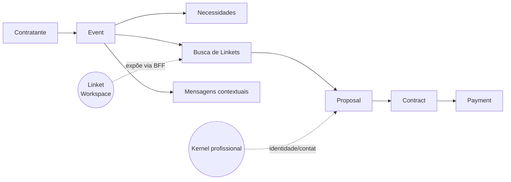
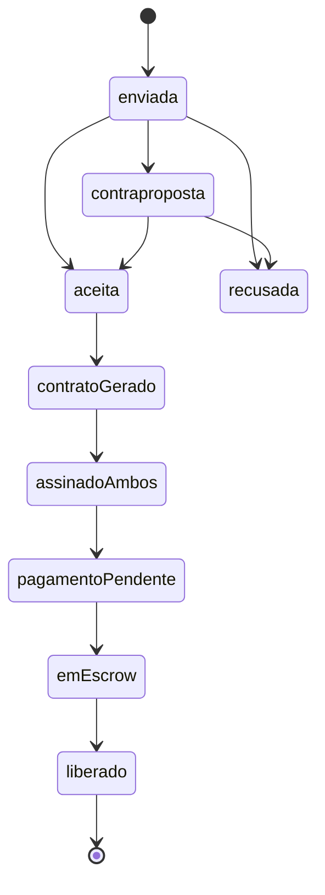

# Plano Aplicável — Olinket Workspaces e Jornada do Contratante

Referência fonte: [plano-olinket-workspaces-e-contratante.md](docs/planejamento/plano-olinket-workspaces-e-contratante.md).  
Estado atual do código: [src/app/conta/page.tsx](src/app/conta/page.tsx), [src/app/olinket/kernel/page.tsx](src/app/olinket/kernel/page.tsx), [src/features/olinket/](src/features/olinket/); legado `/conta/pedidos` via [next.config.js](next.config.js) → `/eventos`; seeds em [src/features/eventos/infrastructure/__seeds__/demo-pedidos.seed.ts](src/features/eventos/infrastructure/__seeds__/demo-pedidos.seed.ts).

---

## 0. Princípios e guard-rails transversais

- **Nomenclatura canônica**: `Workspace` (área de trabalho do prestador — SoundLink, Visualink) substitui `Marketlink` em toda copy nova. `Evento` é a entidade central da Olinket.
- **Regra de ouro**: liquidez/conversão na Olinket; profundidade de ferramenta nos Workspaces. Linket é **criado só dentro do Workspace**; a Olinket consome via BFF.
- **Clean Architecture por feature** (espelha o padrão já existente em `src/features/olinket/`):
  - `domain/` — tipos, schemas Zod, interfaces de repositório. Sem dependências de UI nem de infra.
  - `application/` — hooks (`use-*`), services (regras puras).
  - `infrastructure/` — clientes HTTP, repositórios locais (`localStorage`) e compostos (local + HTTP).
  - `presentation/` — componentes UI.
  - `__tests__/` — unit (Jest, `ts-jest`).
- **Feature-flags / fallback**: enquanto não houver BFF, usar `localStorage` com prefixo `olinket.` e repositórios compostos (padrão já aplicado em [olinket-kernel-composite.repository.ts](src/features/olinket/infrastructure/olinket-kernel-composite.repository.ts)). Nenhum dado demo em produção — apenas em `*-local.repository.ts`.
- **Testes mínimos por feature nova**: (a) unit em `__tests__/` para serviços de domínio/application; (b) smoke Playwright adicionando asserts em [tests/e2e/smoke-routes.spec.ts](tests/e2e/smoke-routes.spec.ts) para cada rota nova.
- **Design system e pacotes compartilhados (decidido)**: UI primitives cross-vertical vivem em `packages/olinket-ui` (npm scope `@stec/olinket-ui`) **desde a Fase 1a**, habilitado por npm workspaces no repo e `transpilePackages: ['@stec/olinket-ui']` no [next.config.js](next.config.js). Escopo inicial = design system completo (tokens Tailwind, tema, tipografia e primitives shadcn-like). Hooks headless de feature (agenda, mensagens, contratos) permanecem em `src/features/<nome>/` até existirem dois consumidores; quando migrarem, entram como subpacote (`packages/olinket-hooks`). **Publicação em registry** (GitHub Packages STEC-Corporate) fica para a **Fase 7**, após ADR-003 que formaliza a estratégia. ADR-001 Alternativa A (monorepo único) **continua rejeitado** — pacotes publicados não violam o ADR; são distribuição versionada.

### Modelo de domínio-alvo (Olinket)



### Estrutura de pastas-alvo após este plano

```
packages/
  olinket-ui/             # novo — design system @stec/olinket-ui (Fase 1a)
    src/
      tokens/             # cores, spacing, radii, sombras (Tailwind preset)
      theme/              # tailwind-preset.ts + globals.css
      typography/         # Heading, Text, Display
      primitives/         # Button, Card, Tabs, Badge, Container, Input, Label
      layout/             # Section, Header, FooterShell
      blocks/             # Hero, StepsGrid, CategoriaCard, WorkspaceCallout
      index.ts            # exports públicos
    package.json          # name: "@stec/olinket-ui"
    tsconfig.json
    README.md
src/features/
  olinket/                # existente (kernel + Linket)
  eventos/                # novo — entidade central
  propostas/              # novo
  contratos/              # novo
  busca/                  # novo — busca agregada de Linkets
  mensagens/              # novo — canal por evento/proposta
  pagamentos/             # novo — escrow/comprovativos
src/app/
  page.tsx                # Home pública — refatorada na Fase 1a
  (app)/
    conta/                # mantido (deprecar `pedidos/` em Fase 6)
    eventos/              # novo grupo de rotas
      page.tsx            # lista
      novo/page.tsx       # criar
      [id]/page.tsx       # hub do evento (tabs)
```

---

## Fase 0 — Glossário, ADR e alinhamento de documentos

**Objetivo**: travar vocabulário (Workspace, Evento) e descoberta primária na Olinket **antes** de escrever código novo.

**Entregáveis**
- Addendum em [docs/gestao-ideias/00-governanca/decisoes/adr-001-olinket-template-frontend-prestador-contratante.md](docs/gestao-ideias/00-governanca/decisoes/adr-001-olinket-template-frontend-prestador-contratante.md):
  - Seção "Workspace (ex-Marketlink)" — sinônimo legado, critério de migração.
  - Seção "Descoberta primária = evento na Olinket"; secundária = convite/deep-link do Workspace.
  - Reforço: Linket é criado **só** no Workspace; Olinket não duplica.
- Novo doc `docs/planejamento/glossario-olinket.md`:
  - Tabela Olinket / Workspace / Linket / Evento / Proposta / Contrato / Kernel / Perfil; com exemplos por vertical (SoundLink: "formação artística"; Visualink: "portfólio").
- Atualizar [docs/planejamento/jornada-contratante-mvp.md](docs/planejamento/jornada-contratante-mvp.md) para apontar à Fase 1/2 abaixo e deprecar "pedidos" como termo público.
- Atualizar [src/components/site-header.tsx](src/components/site-header.tsx) — substituir "Núcleo profissional" por "Núcleo profissional (prestador)" (sem remover rota) e adicionar placeholder "Eventos" (somente visual até Fase 1).
- PR de sincronização com SoundLink: abrir issue/ADR paralelo ADR-035 para garantir espelho de conteúdo.

**Testes**: nenhum código novo — apenas lint de docs. Rodar `npm run lint` e `npm run test` para garantir baseline verde.

**Aceite**: (a) termo "Marketlink" só aparece em ADR-001 como legado; (b) ADR tem seção explícita sobre descoberta evento-cêntrica; (c) glossário publicado.

---

## Fase 1a — Home pública e design system `@stec/olinket-ui`

**Objetivo**: estabelecer a porta de entrada pública da Olinket (`/`) como narrativa de contratação de eventos **e**, no mesmo ciclo, criar o design system compartilhado que serve esta e todas as fases seguintes. Evita dívida de duplicação contra o `soundlink-template-frontend`.

**Decisões já tomadas**
- **Nome do pacote**: `@stec/olinket-ui` (scope da holding, permite futura migração para `@stec/ui` sem quebrar imports via alias).
- **Escopo inicial**: design system completo (tokens + tema + tipografia + primitives + blocks), não só a home.
- **Distribuição na Fase 1a**: **local via npm workspaces** (sem publicar). Publicação vai para Fase 7.

### 1a.1 — Infra do monorepo local

**Entregáveis**
- [package.json](package.json) raiz: adicionar
  ```json
  "workspaces": ["packages/*"]
  ```
- [next.config.js](next.config.js): adicionar `transpilePackages: ['@stec/olinket-ui']`.
- Criar `packages/olinket-ui/package.json`:
  ```json
  {
    "name": "@stec/olinket-ui",
    "version": "0.1.0-local",
    "private": true,
    "main": "./src/index.ts",
    "types": "./src/index.ts",
    "sideEffects": ["**/*.css"],
    "peerDependencies": {
      "react": "^18 || ^19",
      "react-dom": "^18 || ^19",
      "tailwindcss": "^3 || ^4"
    }
  }
  ```
- `packages/olinket-ui/tsconfig.json` extends do raiz; `paths` atualizados no `tsconfig.json` raiz para `"@stec/olinket-ui": ["./packages/olinket-ui/src/index.ts"]`.
- [tailwind.config.ts](tailwind.config.ts): `content` inclui `./packages/olinket-ui/src/**/*.{ts,tsx}`; carregar preset via `presets: [require('@stec/olinket-ui/tailwind-preset')]`.

### 1a.2 — Design system (conteúdo do pacote)

Estrutura em `packages/olinket-ui/src/`:
- `tokens/` — `colors.ts`, `spacing.ts`, `radii.ts`, `shadows.ts` como fonte de verdade.
- `theme/tailwind-preset.ts` — preset Tailwind que mapeia tokens para `theme.extend`.
- `theme/globals.css` — variáveis CSS neutras (light/dark).
- `typography/` — `Heading`, `Text`, `Display` com variantes semânticas.
- `primitives/` — `Button`, `Card`, `Tabs`, `Badge`, `Container`, `Input`, `Label`, `Avatar` (shadcn-like, headless + default skin).
- `layout/Section.tsx` — wrapper equivalente ao `Section.tsx` do SoundLink (padding, título, subtítulo, container).
- `blocks/Hero.tsx` — estrutura visual do `SearchSection.tsx` do SoundLink **sem** copy de busca.
- `blocks/StepsGrid.tsx` — base do `ComoFunciona.tsx` (duas colunas, passos numerados).
- `blocks/CategoriaCard.tsx` — base do `Categorias.tsx` (grid colorido).
- `blocks/FooterShell.tsx` — shell do `Footer.tsx` com slots para links/logo/copyright.
- `blocks/WorkspaceCallout.tsx` — **novo**, específico da Olinket (bloco "Sou prestador" que aponta para SoundLink/Visualink).
- `index.ts` — exports públicos.

### 1a.3 — Refactor da Home Olinket (`src/app/page.tsx`)

Composição nova:
```tsx
<HomePage>
  <HeroContratante />          // Hero do @stec/olinket-ui + copy Olinket
  <AreasDeContratacao />       // CategoriaCard grid (música, fotografia, etc.)
  <ComoFuncionaOlinket />      // StepsGrid: "Para contratar" | "Para prestar"
  <WorkspacesCallout />        // CTA para Workspaces (SoundLink/Visualink)
  <FooterShell />              // Footer Olinket (links, copyright)
</HomePage>
```

**Regras de copy (derivadas do ADR-001)**
- **Proibido**: listar perfis/Linkets na home pública (busca só dentro de `/eventos/[id]/buscar` — Fase 4).
- **Proibido**: usar "Marketlink" ou marcas de Workspace na navegação principal.
- **Obrigatório**: CTA primária leva para `/conta` (ou login → `/conta`), não para listagem.
- **Obrigatório**: bloco `WorkspacesCallout` declara explicitamente "Sou músico/fotógrafo → crie seu Linket no SoundLink/Visualink".

### 1a.4 — Matriz de reuso SoundLink → Olinket

Criar `docs/referencia/matriz-reuso-soundlink-olinket.md`:

| Componente SoundLink | Tratamento | Destino no `@stec/olinket-ui` | Notas |
|---|---|---|---|
| `Section.tsx` | Extrair como está | `layout/Section.tsx` | 100% genérico. |
| `SearchSection.tsx` | Extrair estrutura, trocar copy/CTAs | `blocks/Hero.tsx` | Remover CTAs de busca; slots para título/descrição/CTAs. |
| `ComoFunciona.tsx` | Extrair layout, re-escrever conteúdo | `blocks/StepsGrid.tsx` | Conteúdo Olinket fica na app, não no pacote. |
| `DestaquesUnificados.tsx` | **Não ir para a home**; reaproveitar Tabs em Fase 4 | `primitives/Tabs.tsx` | Filtros de busca, não landing. |
| `Categorias.tsx` | Extrair grid + card, ajustar categorias Olinket | `blocks/CategoriaCard.tsx` | Mapa de categorias fica na app. |
| `Footer.tsx` | Extrair shell, links/copy ficam no consumidor | `blocks/FooterShell.tsx` | Slots: `leftSlot`, `linkGroups`, `rightSlot`. |

### 1a.5 — Testes

- **Unit (pacote)**: `packages/olinket-ui/src/**/__tests__/*.test.tsx` — render + snapshot + prop contracts para `Section`, `Hero`, `StepsGrid`, `CategoriaCard`, `WorkspaceCallout`.
- **Unit (app)**: render da `HomePage` com mocks dos blocks e asserts de ausência das strings `"Marketlink"`, `"SoundLink · "` em posição de marca na navegação.
- **E2E**: adicionar a [tests/e2e/smoke-routes.spec.ts](tests/e2e/smoke-routes.spec.ts):
  - Navegação `/` → `/conta` via CTA primária.
  - Assert `role=banner` sem texto "Marketlink".
  - Breakpoints 360px e 1440px (ADR-029).

### 1a.6 — Aceite

- [ ] `pnpm -w build` (ou `npm run build`) resolve `@stec/olinket-ui` sem publicar.
- [ ] `/` renderiza com 5 blocos acima e **zero** listagens de perfis.
- [ ] Lighthouse: LCP < 2.5s no mobile (360px) com preset local.
- [ ] Tokens Tailwind compartilhados aplicados (sem hex-code hardcoded fora de `packages/olinket-ui/src/tokens/`).
- [ ] Matriz de reuso publicada em `docs/referencia/`.

### 1a.7 — Riscos e mitigação

- **Risco**: Tailwind v4 (CSS-first) diverge do preset em `packages/olinket-ui`. **Mitigação**: confirmar versão em uso antes de começar; se v4, usar `@import` + `@theme` em vez de preset.
- **Risco**: over-engineering se só o Olinket consumir o pacote. **Mitigação**: Fase 7 obriga SoundLink a consumir — critério de sucesso do próprio pacote.
- **Risco**: `transpilePackages` quebra tree-shaking. **Mitigação**: exports nomeados + `sideEffects: ["**/*.css"]` no `package.json` do pacote.

---

## Fase 1 — Dashboard do contratante (Home Olinket)

**Objetivo**: transformar `/conta` em painel evento-cêntrico. **Depende da Fase 1a** (consumir `Section`, `Card`, `Badge`, `Button` do `@stec/olinket-ui`).

**Rotas**
- Manter `/conta` como hub; reorganizar blocos:
  1. CTA primária **"Criar evento"** → `/eventos/novo`.
  2. Lista "Meus eventos" (preview, 3 últimos) → `/eventos`.
  3. Card **Contratações** (projeção por evento) → `/eventos` (Fase 6: rotas legadas `/conta/pedidos` redirecionam; sem lista demo de pedidos na UI).
  4. Card "Núcleo profissional" aparece **só** se `hasProfessionalKernel` (detectado por `use-olinket-kernel`).

**Código**
- `src/features/eventos/domain/types/event.types.ts` — `EventSummary`, `EventStatus` (`rascunho` | `aberto` | `em_selecao` | `contratado` | `em_execucao` | `concluido` | `cancelado`).
- `src/features/eventos/domain/interfaces/event-repository.interface.ts` — `listMyEvents`, `getById`, `create`, `update`, `cancel`.
- `src/features/eventos/infrastructure/event-local.repository.ts` — persiste em `localStorage` com chave `olinket.events.v1`.
- `src/features/eventos/application/hooks/use-my-events.ts` — hook client-side consumindo a factory (compondo HTTP quando `NEXT_PUBLIC_OLINKET_API_BASE_URL` estiver setado).
- Refatorar [src/app/conta/page.tsx](src/app/conta/page.tsx) para compor blocos acima.

**Wireframe textual de `/conta`**
```
[H1] Olá, {displayName ou "Contratante"}
[CTA primária]  + Criar evento
[Seção]  Meus eventos (3 últimos) -> ver todos
  - Card por evento: título · data · estado-chip · nº propostas
[Seção]  Contratações (badge "evento") — liga a meus eventos; DEMO_PEDIDOS só em `__seeds__` (Fase 6)
[Seção condicional]  Núcleo profissional (se kernel existir)
```

**Testes**
- Unit: `src/features/eventos/__tests__/event-local.repository.test.ts` — CRUD básico + filtro por status.
- E2E: adicionar a [tests/e2e/smoke-routes.spec.ts](tests/e2e/smoke-routes.spec.ts) navegação `/ → /conta` e verificar presença do CTA "Criar evento".

**Aceite**: `/conta` exibe CTA + lista (vazia ok) sem referência a "Marketlink"; sem regressão nos smoke tests.

---

## Fase 2 — Criar evento

**Objetivo**: entregar o formulário mínimo que materializa um evento.

**Rota**: `/eventos/novo` (nova).

**Schema Zod (domínio)** — `src/features/eventos/domain/schemas/event.schema.ts`:

```ts
export const EventDraftSchema = z.object({
  title: z.string().min(3).max(120),
  eventType: z.enum(["casamento", "aniversario", "corporativo", "shows", "outro"]),
  date: z.string().regex(/^\d{4}-\d{2}-\d{2}$/),
  timeWindow: z.object({ start: z.string(), end: z.string() }).optional(),
  location: KernelLocationSchema,
  needs: z.array(z.object({
    category: z.string(),
    workspaceHint: z.enum(["sound_link", "visual_link", "point_link", "any"]).default("any"),
    quantity: z.number().int().positive().default(1),
    notes: z.string().max(500).optional(),
  })).min(1),
  budgetBrl: z.object({ min: z.number().nonnegative().optional(), max: z.number().nonnegative().optional() }).optional(),
  notes: z.string().max(2000).optional(),
});
```

Reusar `KernelLocationSchema` de [professional-kernel.schema.ts](src/features/olinket/domain/schemas/professional-kernel.schema.ts) para garantir paridade.

**Contrato BFF esperado** (adicionar a [docs/api-specifications/olinket-endpoints.md](docs/api-specifications/olinket-endpoints.md)):
- `POST /olinket/me/events` → body `EventDraft`, retorna `Event` (com `id`, `status: "aberto"`).
- `GET /olinket/me/events` → lista.
- `GET /olinket/me/events/:id`.
- `PATCH /olinket/me/events/:id` · `POST /olinket/me/events/:id/cancel`.

**Código**
- `src/features/eventos/presentation/components/event-form.tsx` — form controlado com validação Zod + mensagens pt-BR.
- `src/features/eventos/application/hooks/use-create-event.ts` — `POST` com fallback local.
- `src/app/eventos/novo/page.tsx` — compõe o form; redireciona em sucesso para `/eventos/[id]`.

**Wireframe textual**
```
[H1] Criar evento
[Stepper simples]
  1) Básico: título, tipo, data, horário
  2) Local: cidade, estado (+ bairro opcional)
  3) Necessidades: adicionar linhas (categoria + workspaceHint + qtd + notas)
  4) Orçamento (opcional) + notas
[Rodapé] Salvar rascunho | Publicar evento
```

**Testes**
- Unit: schema (`event.schema.test.ts`) — casos válido/inválido por campo.
- Unit: `use-create-event.test.ts` — fallback local quando API off.
- E2E: criar evento com mocks e validar redirecionamento para hub.

**Aceite**: (a) criar evento cria registro visível na lista; (b) validação bloqueia submit sem `needs`; (c) `POST` cai para local se `NEXT_PUBLIC_OLINKET_API_BASE_URL` ausente.

---

## Fase 3 — Hub do evento

**Objetivo**: entregar operação completa do evento num único layout com tabs.

**Rota**: `/eventos/[id]` — layout com tabs:
1. **Resumo** — dados do evento + chips de status; editar campos básicos.
2. **Contratações** — propostas recebidas + contratos (placeholder até Fases 4-5).
3. **Mensagens** — canal por evento (placeholder até Fase 5 resolver fonte de verdade).
4. **Pagamentos** — lista de pagamentos/escrow (placeholder até Fase 5).

**Código**
- `src/app/eventos/[id]/layout.tsx` — carrega evento via `getById`, expõe tabs por search param (`?tab=resumo|contratacoes|mensagens|pagamentos`) para evitar sub-rotas antes de os contratos existirem.
- `src/features/eventos/presentation/components/event-summary.tsx`, `event-tabs.tsx`.
- `src/features/eventos/application/hooks/use-event.ts`.

**Wireframe textual**
```
[Breadcrumb] Eventos / {título}
[Header] título · data · local · chip-estado · ação (Cancelar | Editar)
[Tabs] Resumo · Contratações (n) · Mensagens (n) · Pagamentos
[Conteúdo por tab]
```

**Testes**
- Unit: `use-event.test.ts` — carregamento OK/404.
- E2E: criar evento → abrir hub → alternar tabs → voltar à lista.

**Aceite**: hub acessível por id, tabs funcionais (placeholders OK), deep-link `?tab=` preservado em refresh.

---

## Fase 4 — Busca e seleção de Linkets

**Objetivo**: fechar o loop de oferta sem expor marcas de Workspace no header.

**Rota**: `/eventos/[id]/buscar` — busca agregada dentro do contexto de um evento.

**Feature**: `src/features/busca/`.

**Contrato BFF esperado** (adicionar a [olinket-endpoints.md](docs/api-specifications/olinket-endpoints.md)):
- `GET /olinket/search/linkets?eventId=...&category=...&location=...&availability=...&workspace=...&page=...`
  - Resposta: lista `LinketSummary` (já existe em [linket.types.ts](src/features/olinket/domain/types/linket.types.ts)) **enriquecida** com `kernelSnapshot` (displayName, foto, cidade) e `offerings` (formação/portfólio/pacote) — agregado pelo BFF a partir dos Workspaces.
- `POST /olinket/me/events/:id/invites` — envio de convite/proposta inicial.

**Código**
- `src/features/busca/domain/types/search.types.ts` — `LinketSearchItem` (envelope + snapshot + offerings).
- `src/features/busca/application/hooks/use-linket-search.ts` — filtros, debouncing e paginação.
- `src/features/busca/presentation/components/linket-search-card.tsx` — card **sem marca de Workspace** na cabeceira; chip `workspace` aparece só em metadata secundária.
- `src/app/eventos/[id]/buscar/page.tsx`.

**Wireframe textual**
```
[Filtros laterais] categoria · cidade · faixa de preço · disponibilidade na data · workspace (opcional)
[Resultados] grid de LinketSearchCard
[Ação por card]  Ver detalhes · Enviar convite (→ gera Proposta em Fase 5)
```

**Testes**
- Unit: hook de filtros.
- E2E: buscar → enviar convite stub → hub mostra proposta "enviada".

**Aceite**: contratante encontra Linkets e envia convite sem abrir nenhum Workspace; header não exibe marca "SoundLink/Visualink".

---

## Fase 5 — Proposta → Contrato → Pagamento (+ mensagens contextuais)

**Objetivo**: valor de negócio: materializar contratação e cobrança.

**Rotas** (todas aninhadas ao evento):
- `/eventos/[id]/propostas/[propostaId]` — detalhe, contraproposta, aceitar/recusar.
- `/eventos/[id]/contratos/[contratoId]` — versão do contrato, assinaturas, status.
- `/eventos/[id]/pagamentos/[pagamentoId]` — escrow, comprovativos.

**Features**
- `src/features/propostas/`, `src/features/contratos/`, `src/features/pagamentos/`, `src/features/mensagens/`.

**Máquinas de estado**



**Contratos BFF esperados** (adicionar em `olinket-endpoints.md`):
- `POST /olinket/me/events/:id/proposals` · `PATCH /.../proposals/:pid` (aceitar/recusar/contraproposta).
- `POST /.../proposals/:pid/contract` — gera contrato.
- `PATCH /olinket/me/contracts/:cid/signature` — assinatura.
- `POST /olinket/me/contracts/:cid/payments` — intenção de pagamento.
- `GET /olinket/me/events/:id/messages` · `POST /.../messages` — canal por evento. **Decisão de dono** fica registada em ADR separado antes desta fase (ver Riscos).

**Mensagens — regra de ouro**: canal canônico = **Olinket por evento**; Workspace pode ler (espelho read-only), **não** escreve. Registrar em novo `docs/gestao-ideias/00-governanca/decisoes/adr-002-mensagens-canal-canonico.md`.

**Pagamento — provider**: manter camada abstrata `PaymentProvider` em `src/features/pagamentos/domain/interfaces/`; adaptador concreto fica para quando o BFF definir (Pix/Stripe/Mercado Pago).

**Testes**
- Unit: máquina de estado de propostas (transições inválidas rejeitadas).
- Unit: geração de contrato a partir de proposta aceita (serviço puro).
- E2E happy-path: criar evento → buscar → enviar proposta → aceitar → gerar contrato → assinar (stub) → pagar (stub) → hub mostra "contratado".

**Aceite**: (a) estado do evento avança automaticamente conforme proposta→contrato→pagamento; (b) mensagens são criadas no evento; (c) sem necessidade de abrir SoundLink.

---

## Fase 6 — Deprecação semântica de "pedidos"

**Objetivo**: eliminar ambiguidade entre "pedido" e "evento/contrato".

**Entregáveis**
- Redirect 308 de `/conta/pedidos` e `/conta/pedidos/[id]` → `/eventos` (`next.config.js`; mapeamento `pedido→evento` opcional em `LEGACY_PEDIDO_TO_EVENT_ID` no seed).
- `DEMO_PEDIDOS` em [src/features/eventos/infrastructure/__seeds__/demo-pedidos.seed.ts](src/features/eventos/infrastructure/__seeds__/demo-pedidos.seed.ts) (só testes/seeds; guard Jest).
- Atualizar copy em `/conta` e menus; "Pedidos" → "Contratações" (projeção `Event + Contract`).
- Atualizar [docs/planejamento/jornada-contratante-mvp.md](docs/planejamento/jornada-contratante-mvp.md) marcando o doc como histórico.

**Testes**
- E2E: abrir rota legada e verificar redirect.
- Unit: guardrail — teste falha se `DEMO_PEDIDOS` for importado fora de `__tests__/` ou `__seeds__/` (regex em `*.test.ts`).

**Aceite**: nenhuma UI pública menciona "pedido"; rotas legadas redirecionam.

---

## Fase 7 — Publicação do `@stec/olinket-ui` e consumo cross-repo

**Objetivo**: converter o pacote local (Fase 1a) em artefato versionado consumível por `soundlink-template-frontend` e `visualink-template-frontend`, eliminando a duplicação de home/footer/primitives que motivou a análise inicial.

**Entregáveis**

1. **ADR-003** em [docs/gestao-ideias/00-governanca/decisoes/adr-003-estrategia-pacotes-cross-repo.md](docs/gestao-ideias/00-governanca/decisoes/adr-003-estrategia-pacotes-cross-repo.md):
   - Contexto: Olinket + SoundLink + Visualink são repos separados (ADR-001) mas compartilham design system.
   - Decisão: publicar `@stec/olinket-ui` no **GitHub Packages** (org `STEC-Corporate`), distribuído como npm privado.
   - Versionamento: **Changesets** (`pnpm changeset`) com releases manuais via PR; tags `@stec/olinket-ui@x.y.z`.
   - Política de breaking change: deprecação mínima de 1 versão minor; canal `next` para betas.
   - Rejeita: monorepo único (reafirma ADR-001), Verdaccio interno (infra extra sem retorno hoje).

2. **Pipeline de publicação**
   - `.github/workflows/publish-olinket-ui.yml`:
     - Trigger: push em `main` com changesets pendentes.
     - Steps: `npm ci` → `npm run build -w @stec/olinket-ui` → `npm test -w @stec/olinket-ui` → `changeset publish` com `NODE_AUTH_TOKEN=${{ secrets.GITHUB_TOKEN }}`.
   - `packages/olinket-ui/package.json`:
     - `publishConfig.registry = "https://npm.pkg.github.com"`.
     - Remover `private: true`, bumpar para `0.1.0` (primeira release).
     - `files: ["dist", "src"]` e script `"build": "tsup src/index.ts --format esm,cjs --dts"` (ou `tsc` simples).
   - `.npmrc` nos consumers: `@stec:registry=https://npm.pkg.github.com` + PAT via secret.

3. **Consumo no `soundlink-template-frontend`**
   - Abrir PR no repo SoundLink adicionando `@stec/olinket-ui` como dependência.
   - Substituir `src/components/sections/Section.tsx` por `import { Section } from '@stec/olinket-ui'`.
   - Substituir `ComoFunciona.tsx` pela composição `<StepsGrid data={...}/>` mantendo copy local.
   - Substituir `Categorias.tsx` pelo grid com `<CategoriaCard />`.
   - Substituir `Footer.tsx` pelo `<FooterShell>` com slots locais.
   - **Não** migrar `SearchSection.tsx` do SoundLink para o pacote — SoundLink mantém sua própria Hero (tem busca, a do Olinket não).
   - **Não** migrar `DestaquesUnificados.tsx` — é específico do marketplace SoundLink.

4. **Documentação**
   - `packages/olinket-ui/README.md`: instalação, exemplos de uso, guia de contribuição.
   - `packages/olinket-ui/CHANGELOG.md`: gerido por changesets.
   - Atualizar matriz de reuso ([Fase 1a.4](#1a4--matriz-de-reuso-soundlink--olinket)) com coluna "status no SoundLink".

**Testes**
- Unit: manter suite do pacote verde.
- Integração: smoke no `olinket-template-frontend` após atualizar dependência para `0.1.0` publicado (instalar do registry em vez de workspace local).
- E2E no SoundLink: smoke existente continua verde após substituição dos 4 componentes.

**Aceite**
- [ ] `@stec/olinket-ui@0.1.0` publicado no GitHub Packages STEC-Corporate (ação manual/CI com permissão org).
- [x] ADR-003 proposto e referenciado no ADR-001; pipeline + artefato 0.1.0 + CHANGELOG no repositório.
- [x] `olinket-template-frontend` com build verde; monorepo mantém `workspace:*` e paths `src` (opcional: testar `npm add` a partir do registry após 1.ª publicação).
- [ ] `soundlink-template-frontend` consome do registry, removeu 4 arquivos de componente e build + E2E passam (outro repositório).
- [x] Changelog do pacote em `packages/olinket-ui/CHANGELOG.md`; changesets na raiz.

**Riscos**
- **PAT do GitHub Packages**: cada dev precisa de PAT com `read:packages`. Mitigação: script `scripts/setup-npmrc.sh` + doc em `docs/referencia/dev/`.
- **Dependências duplicadas (React, Tailwind)**: resolver via `peerDependencies` estritas no pacote e `overrides` nos consumers.
- **Quebra acidental do SoundLink**: Fase 7 só fecha quando PR do SoundLink estiver merged e smoke verde nos dois repos.

---

## Dependências cruzadas e sincronização

- **SoundLink (`soundlink-template-frontend`)**:
  - Antes da Fase 4: Workspace deve expor endpoint interno/BFF que alimenta `/olinket/search/linkets` com `kernelSnapshot + offerings`.
  - ADR-035 (SoundLink) atualizado em paralelo ao ADR-001 (Fase 0) e ao ADR-002 (Fase 5, mensagens).
- **BFF Olinket**:
  - Fase 1 usa só `GET /olinket/me/events` (pode cair para local).
  - Fase 2 exige `POST /olinket/me/events`.
  - Fase 4 exige endpoint de busca agregada.
  - Fase 5 exige pagamentos + mensagens.
- **Pacote compartilhado `@stec/olinket-ui`**: criado **local** na Fase 1a; **publicado** no GitHub Packages na Fase 7; SoundLink passa a consumir na Fase 7 (remove duplicação de `Section`, `StepsGrid`, `CategoriaCard`, `FooterShell`). Visualink entra como consumer no mesmo momento.
- **Pacote `packages/olinket-core` (futuro, pós-Fase 7)**: quando houver 2+ consumers de hooks/contratos (não apenas UI), extrair `event.schema.ts`, hooks headless e tipos. Fora do escopo deste plano.

## Riscos e abertas (precisam decisão antes do código)

1. **Mensagens — dono único (Fase 5)**. Sem ADR-002, Fase 5 não inicia.
2. **Identidade multi-Workspace**. Um `olinket_user_id` é premissa; confirmar com backend antes de Fase 4 (busca filtra por `workspace`).
3. **Modelo de pagamento (escrow vs pass-through)**. Determina interface `PaymentProvider`; decidir antes de Fase 5.
4. **Mobile web-first (ADR-029)**: todas as telas propostas devem passar breakpoint 360px no smoke test.

## Estratégia de testes por fase (resumo)

- **Unit (Jest + ts-jest)**: schemas Zod, serviços puros (completude, máquinas de estado), repositórios locais, hooks com mocks.
- **E2E (Playwright)**: incremento a [tests/e2e/smoke-routes.spec.ts](tests/e2e/smoke-routes.spec.ts) + um arquivo novo por fase (`events-create.spec.ts`, `event-hub.spec.ts`, `search-and-invite.spec.ts`, `proposal-to-payment.spec.ts`, `legacy-redirects.spec.ts`).
- **Gate por fase**: `npm run lint && npm run typecheck && npm run test && npm run test:e2e` verde; smoke manual em 360px e 1440px.

## Checklist de aceite global (cobre §9 do plano fonte)

- [ ] Home pública `/` renderiza via `@stec/olinket-ui` sem listagens de perfis e sem marcas de Workspace na navegação (Fase 1a).
- [ ] Contratante conclui **criar evento → busca → proposta → pagamento** sem abrir SoundLink (Fase 5).
- [ ] Prestador continua criando Linket **só no Workspace**; Olinket não duplica (Fases 0 e 4).
- [ ] Header/copys nunca expõem "Marketlink" nem nomes de Workspace (Fase 0 + 4).
- [x] ADR-001 atualizado; ADR-003 (pacotes) criado; ADR-002 (mensagens) e SoundLink ADR-035 a sincronizar por equipe.
- [x] `DEMO_PEDIDOS` saiu de produção e rotas legadas redirecionam (Fase 6).
- [x] **Pipeline e artefato** 0.1.0 prontos (tsup, Changesets, workflow); [ ] **publicação real** e PR SoundLink = passos manuais na org (Fase 7).
