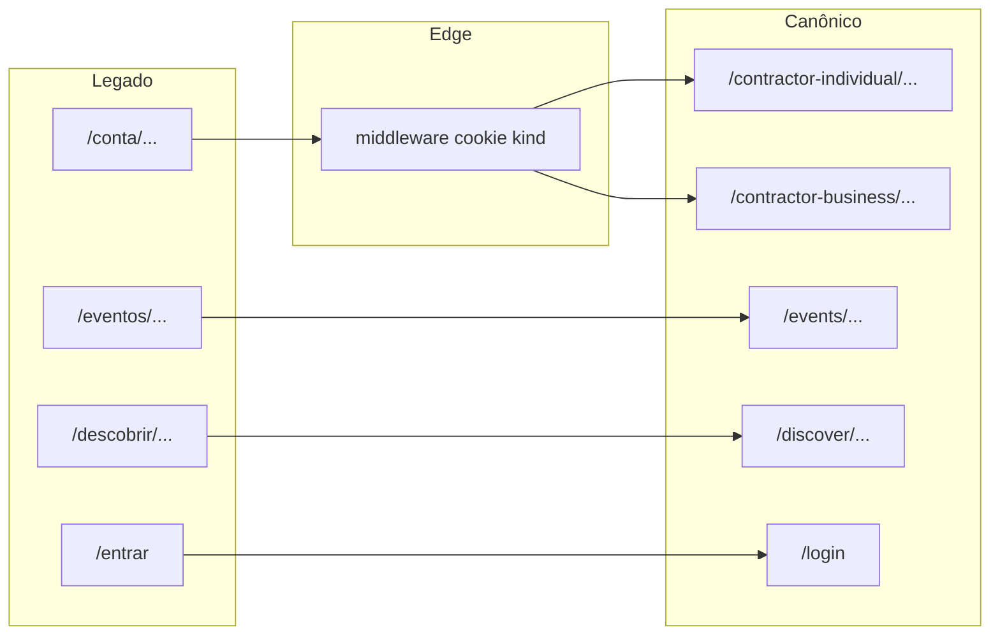

# Plano 1 — Migração de rotas (PT / misto → literal EN + espelho SL)

> **Estado do código (2026-05-03, verificado):** Superfície canônica em inglês em `src/app/`. [`next.config.js`](next.config.js) define `redirects` **308** (`permanent: true`) para `/entrar`→`/login`, `/descobrir/:path*`→`/discover/:path*`, `/eventos/:path*`→`/events/:path*`. [`src/middleware.ts`](src/middleware.ts) aplicado a `/conta/:path*` redireciona com **308** usando [`src/routing/legacy-conta-map.ts`](src/routing/legacy-conta-map.ts) e cookie [`CONTRACTOR_KIND_COOKIE`](src/routing/contractor-routes.ts) (fallback **`individual`**). Cookie espelho: [`auth-local.storage.ts`](src/features/auth/infrastructure/auth-local.storage.ts) (`read`/`write`/`clear` sessão). O corpo abaixo mantém contexto histórico; a tabela legado→canônico está **implementada** no mapa + middleware.

## Contexto e decisão de escopo (confirmado)

- Manter **PT-BR apenas em copy de UI e documentação**, não em **segmentos canônicos** de URL.
- **Superfície implementada (template):** hub contratante [`/contractor-individual/*`](src/app/contractor-individual) e [`/contractor-business/*`](src/app/contractor-business); eventos [`/events/*`](src/app/events); descoberta pública [`/discover/*`](src/app/discover); auth [`/login`](src/app/login); cadastro [`/signup`](src/app/signup). **Legado documental** (pré-migração): `/conta/*`, `/eventos/*`, `/descobrir/*`, `/entrar`, `/conta/cadastro`.
- **Fora do escopo imediato:** `/prestador` (hub profissional) — [auditoria P0](docs/gestao-ideias/05-audits/auditoria-paridade-P0.md) e [ADR-001](docs/gestao-ideias/00-governanca/decisoes/adr-001-olinket-template-frontend-prestador-contratante.md) ainda tratam slug técnico `prestador`; migrar para `/professional` (ou outro) pode ser **Plano 1b** explícito.
- **Conflito documental (histórico):** a auditoria P0 (Lote 2) referia `/conta/*` — **substituído** na documentação viva por prefixos EN; ver [jornada-contratante-mvp.md](docs/gestao-tarefas/03-especificacao-produto/user-flows/contratante-individual/jornada-contratante-mvp.md), [matriz-telas.md](docs/gestao-tarefas/03-especificacao-produto/ui-canonical/matriz-telas.md) e [auditoria-paridade-P0.md](docs/gestao-ideias/05-audits/auditoria-paridade-P0.md).

## Referência SoundLink (segmentos)

Fonte interna: [espelho-soundlink-modulos-crm-eventos-equipe.md](docs/gestao-ideias/04-referencia-tecnica/referencia/espelho-soundlink-modulos-crm-eventos-equipe.md).

- **Individual:** base `/contractor-individual` + `dashboard`, `profile`, `event`, `search`, `events`, `contracts`, `payments`, `messages`.
- **Empresarial:** base `/contractor-business` + (mínimo documentado) `dashboard`, `profile`, `search`, `events`; na Olinket o nav empresarial repete agregadores — **mesmos paths EN** que o individual onde a feature existe, só mudando o **prefixo**.

## Tabela de mapeamento (legado → canônico)

**Rotas globais (iguais para ambos os tipos)**

| Legado | Novo |
|--------|------|
| `/entrar` | `/login` |
| `/conta/cadastro` | `/signup` |
| `/descobrir`, `/descobrir/[slug]` | `/discover`, `/discover/[slug]` |
| `/eventos`, `/eventos/novo`, `/eventos/[id]/*` | `/events`, `/events/new`, `/events/[id]/*` |

**Hub contratante:** `base = /contractor-individual` ou `/contractor-business` (derivado de `contractorKind`)

| Legado | Novo (ex.: Individual) |
|--------|--------------------------|
| `/conta` | *(no template atual: rota inexistente → 404; ver Encerramento)* |
| `/conta/dashboard` | `{base}/dashboard` |
| `/conta/agenda` | `{base}/agenda` (segmento aceite em EN internacional; **não** está no excerto SL — alternativa: `schedule` se quiser 100% glossário EN) |
| `/conta/perfil` (nav placeholder) | `{base}/profile` |
| `/conta/clientes`, `/conta/clientes/[id]` | `{base}/clients`, `{base}/clients/[id]` |
| `/conta/contratos`, `…/assistente` | `{base}/contracts`, `{base}/contracts/assistant` |
| `/conta/pagamentos` | `{base}/payments` |
| `/conta/mensagens` | `{base}/messages` |
| `/conta/notificacoes` | `{base}/notifications` |
| `/conta/empresa` (nav placeholder PJ) | `{base}/company` |

**Nav “Buscar” / hero:** paths antigos usavam `/descobrir` — o canônico é **`/discover`**. Alinhar mentalmente ao `…/search` do SL no **contexto contratante** quando no futuro houver rota prefixada; até lá **`/discover` público** mantém o papel de agregador Olinket (matriz §3.3).

**Redirects / bookmarks:** hoje **não** há bloco `redirects` em [`next.config.js`](next.config.js); destino canônico da **listagem de eventos** continua a ser **`/events`** em links e testes. *Follow-up:* 308 PT→EN e `/conta/*` → hub se produto exigir compatibilidade com bookmarks.

## Implementação técnica (fases)

### Fase A — Constantes e tipos (fonte única)

- Criar módulo central (ex.: [`src/routing/public-routes.ts`](src/routing/public-routes.ts) + [`src/routing/contractor-routes.ts`](src/routing/contractor-routes.ts)) com paths canónicos e helper `contractorBasePath(kind: ContractorKindHub)`.
- Refatorar [`contratante-nav.config.ts`](src/components/headers/contratante-nav.config.ts) para montar `href` com esses helpers (evita regressão em mudanças futuras).

### Fase B — Mover páginas App Router

- Renomear/reestruturar pastas em [`src/app/`](src/app): `eventos` → `events`, `descobrir` → `discover`, `entrar` → `login`.
- **Já aplicado no template:** a antiga árvore `src/app/conta/` deu lugar a **`src/app/contractor-individual/*`** e **`src/app/contractor-business/*`**, partilhando o mesmo componente de página quando o conteúdo for idêntico (import comum da feature layer — já o padrão do repo).
- Onde fizer sentido, extrair **layout** partilhado entre os dois prefixos para não duplicar shells.

### Fase C — Redirects legado e paridade Individual/PJ

- **`next.config.js` `redirects`:** regras **308** para pares **não ambíguos**: `/entrar`→`/login`, `/descobrir/:path*`→`/discover/:path*`, `/eventos/:path*`→`/events/:path*`, `/signup` legado se existir variante, etc.
- **Ambiguidade `/conta/*`:** a sessão demo vive só em **`localStorage`** ([`auth-local.storage.ts`](src/features/auth/infrastructure/auth-local.storage.ts)); o Edge **não** vê `contractorKind`.
  - **Adicionar cookie espelho** (ex.: `olinket_contractor_kind=individual|business`, `Path=/`, `SameSite=Lax`, TTL alinhado à sessão) em `writeAuthSession` / fluxo de login em [`auth-provider.tsx`](src/features/auth/application/auth-provider.tsx) / página demo [`login`](src/app/login/page.tsx).
  - Criar [`src/middleware.ts`](src/middleware.ts): para `/conta` e subpaths, ler cookie e **redirect 308** para `/contractor-individual/...` ou `/contractor-business/...` com o mesmo sufixo de path mapeado; **fallback** `individual` se cookie ausente (documentar).
- Manter rotas legado **mínimas** só onde o middleware não chegue (ou usar só middleware + eliminar pasta `conta`).

### Fase D — Header e regras de UI

- Atualizar [`header-wrapper.config.ts`](src/components/headers/header-wrapper.config.ts):
  - Prefixos contratante: `/contractor-individual`, `/contractor-business`, e **`/events`** (substituindo o antigo acoplamento a `/conta` e `/eventos` em [`header-wrapper.config.ts`](src/components/headers/header-wrapper.config.ts)).
  - Superfície auth: `/signup` e subpaths no lugar de `/conta/cadastro`.
  - `isPrestadorFlowPublicHeaderPath`: `/login` em vez de `/entrar`.
  - `isDescobrirPath`: `/discover`.
- Atualizar [`contratante-header.tsx`](src/components/headers/contratante-header.tsx), [`notificacao-header-bell.tsx`](src/features/notificacoes/presentation/components/notificacao-header-bell.tsx), links em home, busca, eventos, contratos, etc. (varredura `rg` por `/conta`, `/eventos`, `/descobrir`, `/entrar`).

### Fase E — Testes e qualidade

- Atualizar testes unitários de header: [`header-wrapper.test.tsx`](src/components/headers/__tests__/header-wrapper.test.tsx), [`header-wrapper.config.test.ts`](src/components/headers/__tests__/header-wrapper.config.test.ts), [`contratante-header.test.tsx`](src/components/headers/__tests__/contratante-header.test.tsx), [`public-header.test.tsx`](src/components/headers/__tests__/public-header.test.tsx).
- Atualizar E2E: [`smoke-routes.spec.ts`](tests/e2e/smoke-routes.spec.ts), [`legacy-pedidos-redirect.spec.ts`](tests/e2e/legacy-pedidos-redirect.spec.ts) (destino `/events`), [`descobrir-detalhe.spec.ts`](tests/e2e/descobrir-detalhe.spec.ts) (renomear para `discover-*` ou manter ficheiro e trocar paths), [`event-hub-tabs.spec.ts`](tests/e2e/event-hub-tabs.spec.ts), [`institucional-suporte-termos-funil.spec.ts`](tests/e2e/institucional-suporte-termos-funil.spec.ts), helpers em [`tests/e2e/helpers/`](tests/e2e/helpers/).
- [`sitemap.ts`](src/app/sitemap.ts): trocar paths públicos listados.
- Gates: `npm run test`, `npm run lint`, `npm run typecheck`; se tocar em headers, `npm run lint:headers`; E2E com `npm run dev` em paralelo conforme [estrategia-testes](docs/gestao-ideias/04-referencia-tecnica/referencia/dev/estrategia-testes.md).
- Skill [`code-verificar-file-sizes`](.cursor/skills/code-verificar-file-sizes/SKILL.md) em ficheiros tocados.

### Fase F — Documentação (SDD / ciclo de vida)

- Atualizar cabeçalhos e corpo onde listam rotas: [jornada-contratante-mvp.md](docs/gestao-tarefas/03-especificacao-produto/user-flows/contratante-individual/jornada-contratante-mvp.md), [matriz-telas.md](docs/gestao-tarefas/03-especificacao-produto/ui-canonical/matriz-telas.md), [auditoria-paridade-P0.md](docs/gestao-ideias/05-audits/auditoria-paridade-P0.md) (secção Lote 2), user-flows que cite `/conta` ou `/eventos`, comentários em [`packages/olinket-ui`](packages/olinket-ui) / shared-mocks se referirem paths.
- Registar **[PLANEJADO]** apenas onde BFF altere contratos (este plano é front-only).

## Riscos e notas

- **Flash ou hop duplo:** sem cookie, primeiro hit após login pode resolver mal — garantir escrita de cookie **antes** de `router.push` para dashboard.
- **Páginas placeholder:** se o nav apontar para `{base}/profile` e `{base}/company` sem `page.tsx`, criar **rota + placeholder** ou ajustar nav — hoje existem [`src/app/contractor-individual/profile/page.tsx`](src/app/contractor-individual/profile/page.tsx) e `company/` (validar smoke).
- **SEO/bookmarks:** 308 conforme pedido; validar que não encadeia redirects demais (`/conta/pedidos` → `/events` em um salto).

## Diagrama (visão redirects + cookie)

> **Nota (2026-05-03):** middleware + cookie + `redirects` em `next.config.js` **implementados** — o diagrama corresponde ao comportamento atual.

---

## Encerramento

**Status:** CONCLUÍDO | **Data:** 2026-05-03

- **Entregue:** rotas App Router EN + espelho SL; módulo [`src/routing/`](src/routing) (+ [`legacy-conta-map.ts`](src/routing/legacy-conta-map.ts)); nav/header; **Fase C:** [`next.config.js`](next.config.js) `redirects` 308 PT→EN globais; [`src/middleware.ts`](src/middleware.ts) 308 para `/conta/*` com cookie [`olinket_contractor_kind`](src/routing/contractor-routes.ts) sincronizado em [`auth-local.storage.ts`](src/features/auth/infrastructure/auth-local.storage.ts); testes [`smoke-routes.spec.ts`](tests/e2e/smoke-routes.spec.ts) + unitários do mapa.
- **Plano 3+:** paths canônicos estáveis com compatibilidade de bookmarks PT→EN via Edge redirects.
