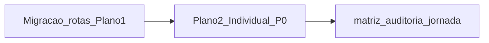

# Plano 2 — Contratante Individual (auditoria-paridade-P0)

## Pré-requisito obrigatório

- **Plano 1 concluído e integrado**: área contratante com segmentos EN em `src/app/`; **redirects** legado são opcionais (validar repo). `href` internos, E2E e docs devem apontar para `contractor-individual`, `/events`, `/discover`, etc. (espelho `contractor-individual` no clone `soundlink-template-frontend`).
- **Princípio**: todo o trabalho abaixo usa **apenas** paths canônicos finais do Plano 1 (`/contractor-individual/...`, `/events`, `/discover`, …). Menções a `/conta/*` ou `/eventos` no texto são **legado documental** — substituir na execução se ainda restarem.

---

## Estado atual (evidências no repo)

- **D3 (auditoria):** saudação e hub genéricos vs **Individual/Empresarial** explícitos — ver [`conta-contratante-dashboard.tsx`](src/features/eventos/presentation/components/conta-contratante-dashboard.tsx) (`displayName = "Contratante"`, overline «Área contratante» sem distinção por `contractorKind`).
- **Matriz secção 3:** linha **3.1 Dashboard** ainda «*A definir*» — [`matriz-telas.md`](docs/gestao-tarefas/03-especificacao-produto/ui-canonical/matriz-telas.md).
- **Nav Individual:** ordem e itens já espelham intenção PBR em [`contratante-nav.config.ts`](src/components/headers/contratante-nav.config.ts); após Plano 1, rever **paridade exata** com `soundlink-template-frontend` → `contractor-individual-nav-links.tsx` (labels, ordem, ausência de itens só Olinket).
- **Copy residual «pedido»:** P0.2b — ainda há strings fora do dashboard educativo; auditoria lista hero, busca, etc. — cruzar com [`auditoria-paridade-P0.md`](docs/gestao-ideias/05-audits/auditoria-paridade-P0.md) secção P0.2b.
- **PT-BR:** no dashboard, «A carregar eventos» deve alinhar ao padrão do projeto (**Carregando**), conforme regra `pt-br-linguagem.mdc`.

---

## Fase A — Inventário paridade SL × Olinket (somente Individual)

**Objetivo:** tabela única «intenção SL → superfície Olinket → estado».

| Atividade | Referência SL (clone local) | Referência Olinket |
|-----------|----------------------------|-------------------|
| Nav principal Individual | `contractor-individual-nav-links.tsx` + layout dashboard | [`contratante-nav.config.ts`](src/components/headers/contratante-nav.config.ts) + header |
| Dashboard | rota `.../contractor-individual/.../dashboard` (views) | componente dashboard + [`useMyEvents`](src/features/eventos/application/hooks/use-my-events.ts) |
| Estados vazios e CTAs primários | screenshots ou walkthrough SL | `ContaContratanteDashboard`, [`eventos-list-page.tsx`](src/app/events/eventos-list-page.tsx) |

**Saída:** documento curto ou secção no plano `.plan.md` de execução com **gaps** (ordem de menu, blocos denso vs esparso, CTA «criar evento» vs «buscar», etc.).

**Gate:** revisão humana (produto) — Cleidir Polese como aprovador P0 já definido na auditoria.

---

## Fase B — Dashboard Contratante Individual (fecho D3 + paridade UX)

**Escopo:**

1. **Saudação e contexto por tipo:** ler `contractorKind` da sessão (já usado no header via [`auth-provider`](src/features/auth/application/auth-provider.tsx) / demo). Para **Individual**: título e descrição explícitos (ex. «Contratante Individual» / PF na língua acordada com ADR-001, sem jargão técnico desnecessário); **não** mostrar copy de Empresarial.
2. **Densidade e ordem mental:** alinhar blocos ao SL (resumo de eventos, atalhos SLC: criar evento → buscar → eventos; secundário: contratos/pagamentos/mensagens como atalhos ou teaser se dados existirem no template).
3. **Estado vazio:** card vazio com CTA alinhado ao SL (tom e passos); evitar texto de «Fase 2» se já não for verdade — atualizar para estado real do template.
4. **Secção educativa legado:** substituir ênfase em «pedido» por **evento/contratações**; após Plano 1, paths em `<code>` devem refletir redirects finais (não só `/conta/pedidos` se o namespace mudar).
5. **Acessibilidade e i18n PT-BR:** revisar strings visíveis no ficheiro.

**Ficheiros prováveis:** [`conta-contratante-dashboard.tsx`](src/features/eventos/presentation/components/conta-contratante-dashboard.tsx); possivelmente testes RTL em `src/features/eventos/**/__tests__` se existirem; página que monta o dashboard sob `src/app/**/dashboard/page.tsx` (path pós-Plano 1).

**Gate:** `npm run test`, `npm run lint`, `npm run typecheck`; se tocar [`contratante-header.tsx`](src/components/headers/contratante-header.tsx) ou nav: `npm run lint:headers`.

---

## Fase C — Jornadas-chave Individual e smoke E2E

**Rotas a cobrir:** login demo **Individual** → hub dashboard → criar evento → lista eventos → hub evento (estado com/sem dados); toque opcional em **Buscar** (`/discover`) e **Agenda** se existir fluxo mínimo.

**Implementação:** estender [`tests/e2e/helpers/seed-contratante-session.ts`](tests/e2e/helpers/seed-contratante-session.ts) ou spec existente para assegurar `contractorKind: 'individual'` (ou equivalente) e assertivas de copy/URL canônica.

**Gate:** `npm run test:e2e` (servidor conforme doc do repo); incluir pelo menos um smoke que falhe se o dashboard voltar a ser genérico (ex.: ausência de texto «Individual» onde produto exigir — ver copy final com aprovador).

---

## Fase D — Mapa desvio P0 → PRs + documentação

| Desvio / ID | PR sugerido | Documentação |
|-------------|-------------|--------------|
| D3 dashboard | PR «dashboard individual kind-aware» | Actualizar [`auditoria-paridade-P0.md`](docs/gestao-ideias/05-audits/auditoria-paridade-P0.md) secção 6 (fechar ou reclassificar D3) |
| P0.2b «pedido» remanescente | PR «copy evento/contratações» (ficheiros da auditoria) | Idem + grep orientado |
| Matriz 3.1 | Incluir no PR do dashboard ou PR doc dedicado | [`matriz-telas.md`](docs/gestao-tarefas/03-especificacao-produto/ui-canonical/matriz-telas.md) linha 3.1: substituir «A definir» por paridade explícita (SL ref + componentes Olinket + **Verificado** atualizado) |
| Nav Individual vs SL | PR menor se diff | Nota na matriz ou auditoria P0.3b |

**Alinhamento SDD:** actualizar também [`jornada-contratante-mvp.md`](docs/gestao-tarefas/03-especificacao-produto/user-flows/contratante-individual/jornada-contratante-mvp.md) nas linhas de rotas **após** Plano 1 (hub dashboard Individual).

Marcar **[PLANEJADO]** onde comportamento depender de BFF (ex.: nome do utilizador real, contagens agregadas cross-evento).

---

## Riscos e decisões

- **Tensão histórica:** a jornada antiga dizia que renomear URLs para `/contratante-individual` seria breaking; **Plano 1** decide o namespace em inglês. O Plano 2 **não** reabre migração de rotas — apenas consome o resultado do Plano 1.
- **«Perda de acesso»** e colisão de e-mail (princípios do prompt mestre): **fora do escopo** deste plano salvo copy de aviso já existente; validar legal antes de implementar fluxo duro.

---

## Critérios de aceitação (Checklist)

- Dashboard Individual **não** usa só «contratante» genérico onde ADR pede distinção; empty states e CTAs **coerentes** com referência SL.
- `matriz-telas.md` secção 3 (Individual): lacunas **3.1** e linhas relacionadas actualizadas; referência SL citada.
- `auditoria-paridade-P0`: D3 e linhas «Em análise» tocadas pelo escopo **actualizadas** ou novos **D*n*** com owner.
- Testes: **Jest + E2E** verdes nos fluxos tocados; lint/typecheck conforme checklist do projeto.

---

## Encerramento

**Status:** CONCLUÍDO | **Data:** 2026-05-01

- **Fase A (inventário SL × Olinket):** não gerado documento separado; paridade operacional coberta pela implementação + matriz §3.1 + smoke E2E. *Follow-up opcional:* diff explícito com `contractor-individual-nav-links.tsx` no clone SoundLink.
- **Plano 3 e seguintes:** não exigem alteração de URLs; o mapa `contractor-*` já estava alinhado ao Plano 1 antes deste recorte.
