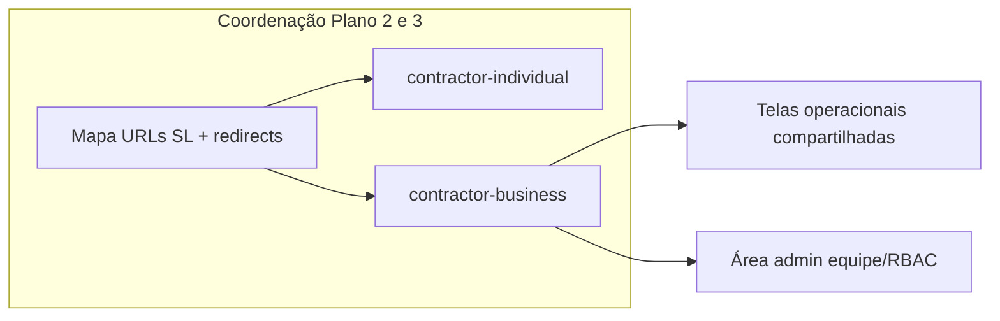

# Plano 3 — Contratante Empresarial + área administrativa

## Contexto no repo

- **Nav e sessão:** [`src/components/headers/contratante-nav.config.ts`](src/components/headers/contratante-nav.config.ts) já distingue `individual` vs `business`; item **Empresa** aponta para `{base}/company` (ex.: `/contractor-business/company`) como **placeholder** (“Dados PJ e equipe — em preparação”).
- **Tipos de sessão demo:** [`src/features/auth/domain/auth-session.types.ts`](src/features/auth/domain/auth-session.types.ts) — `contractorKind: "individual" | "business"` sem **organização**, **papéis** nem **convites**.
- **Área logada:** páginas espelhadas em [`src/app/contractor-individual/`](src/app/contractor-individual/) e [`src/app/contractor-business/`](src/app/contractor-business/) (dashboard, clients, contracts, agenda, …) — **compartilhadas** entre tipos na feature layer; o prompt do Plano 3 exige **mesmo conjunto operacional que Individual** **mais** admin (no SL empresarial o header é mais enxuto; na Olinket a regra de produto é **Individual + extras**).
- **Referência SoundLink (clone externo):** mapa em [`docs/gestao-ideias/04-referencia-tecnica/referencia/espelho-soundlink-modulos-crm-eventos-equipe.md`](docs/gestao-ideias/04-referencia-tecnica/referencia/espelho-soundlink-modulos-crm-eventos-equipe.md) — **Gestão de Equipe** em `…/projects/[projectId]/team/*` (members, permissions, …). Na Olinket, ADR-001 **§3.6.3** e **§3.7.6** fixam RBAC na **conta organizacional**, não nos paths do workspace.
- **Gaps de docs:** [`docs/gestao-tarefas/03-especificacao-produto/user-flows/contratante-empresarial/`](docs/gestao-tarefas/03-especificacao-produto/user-flows/contratante-empresarial/) só tem `INDEX.md`; matriz §3 em [`matriz-telas.md`](docs/gestao-tarefas/03-especificacao-produto/ui-canonical/matriz-telas.md) ainda marca dashboard como *A definir*.
- **Rotas no template (2026-05-01):** prefixos [`contractor-individual`](src/app/contractor-individual) e [`contractor-business`](src/app/contractor-business) já existem em `src/app/`. A [`jornada-contratante-mvp.md`](docs/gestao-tarefas/03-especificacao-produto/user-flows/contratante-individual/jornada-contratante-mvp.md) descreve o mapa EN vigor e o encerramento de `/conta/*`. **Decisões remanescentes** (Plano 3): admin equipe/RBAC, convites demo e paridade operacional Empresarial vs Individual — **sem** reabrir o namespace de URLs salvo novo épico explícito.

## Dependência crítica — Plano 2

- **Plano 2** ([`.cursor/plans/Olinket/olinket-soundlink-planos-prompts.md`](.cursor/plans/Olinket/olinket-soundlink-planos-prompts.md) §182–188) trata de **Individual**, URLs pós-migração e paridade P0.
- **Plano 3 não deve inventar um esquema de URLs diferente:** definir **um mapa canônico** (ex.: `/contractor-individual/*` e `/contractor-business/*` ↔ páginas App Router) **em conjunto** ou imediatamente após o recorte do Plano 2, para evitar dupla refatoração de `HEADER_ROUTE_PREFIXES`, E2E ([`tests/e2e/smoke-routes.spec.ts`](tests/e2e/smoke-routes.spec.ts)), [`header-wrapper.config.ts`](src/components/headers/header-wrapper.config.ts) e links em nav.

## Fases de implementação

### Fase A — Produto e contrato de demo (sem BFF)

1. **Modelo organizacional (demo):** estender persistência demo (localStorage) com **[PLANEJADO] BFF**: `organizationId`, `organizationName`, `membershipId`, `role` (mínimo: `org_owner` / **Administrador principal** copy ADR-001 §3.7.6, `member`), opcional `permissions` como bitmask ou objeto por recurso.
2. **Registo de e-mails por tipo de conta** (demo): estrutura simples (ex.: chave `olinket:account-registry-demo`) para aplicar **mesmo e-mail não pode** registar Individual **e** Empresarial — validação no fluxo de cadastro e mensagens PT-BR (sem persistência servidor).
3. **Convites (demo):** token opaco na URL (ex.: `/signup?convite=` ou rota dedicada) + payload mock (email convidado, org, papel proposto); aceitar convite cria sessão `business` ligada à org.

### Fase B — Rotas e navegação

1. Implementar **árvore canônica** acordada com Plano 2 para **Empresarial**, espelhando **paths relativos** do SL `contractor-business` onde existirem (`dashboard`, `profile`, `search`, `events`) e reutilizar páginas de eventos **`/events/*`** e hub público **`/discover`** onde a Olinket já divergiu por produto.
2. **Legado `/conta/*`:** se ainda existir política de bookmark, documentar em `next.config.js` / `middleware.ts`; senão, manter **404** coerente com a jornada MVP.
3. Atualizar **[`contratante-nav.config.ts`](src/components/headers/contratante-nav.config.ts)** para **Empresarial**: substituir placeholder **Empresa** por entrada explícita para **Administração / Equipe** (rótulo PT-BR alinhado ao glossário) apontando para a nova rota admin; garantir ordem mental próxima ao Individual onde o produto pediu paridade.
4. Se tocar em [`contratante-header.tsx`](src/components/headers/contratante-header.tsx) / drawer / `data-contractor-kind`: rodar **`npm run lint:headers`** (gate do projeto).

### Fase C — UI área administrativa (MVP estilo SL team)

1. **Páginas sugeridas** (ajustar ao mapa final de URLs): landing **organização** com separação **Dados da empresa** vs **Equipe** (tabs ou subrotas `…/equipe/membros`, `…/equipe/permissoes`), inspiradas na densidade de [`espelho-soundlink-modulos-crm-eventos-equipe.md`](docs/gestao-ideias/04-referencia-tecnica/referencia/espelho-soundlink-modulos-crm-eventos-equipe.md) §2 “Gestão de Equipe”.
2. **Membros:** tabela (nome, email, papel, estado convite); acções **Convidar**, **Remover** / alterar papel **[PLANEJADO]** se BFF exigir confirmação server-side.
3. **Matriz permissões MVP:** granularidade mínima **Ver / Editar** para um conjunto fixo alinhado a [`pbr07-especificacao-dominio-permissoes.md`](docs/gestao-tarefas/03-especificacao-produto/business-rules/_shared/pbr07-especificacao-dominio-permissoes.md) (ex.: Eventos, Contratos, Clientes, Pagamentos, Mensagens, **Administração da conta**). Papéis modelo opcionais (“Financeiro”, “Operações”) como presets que pré-preenchem a matriz **sem** exigir paridade total com o SL na primeira entrega.
4. **Copy primeiro utilizador:** “Administrador principal” / “Representação da empresa” (validar com glossário + legal).

### Fase D — Conflito Individual × convite Empresarial

1. **Demo:** ao detectar e-mail já registado como Individual ao aceitar convite Empresarial, **não** implementar automaticamente “perda de acesso Individual” — exibir **estado bloqueado** ou fluxo **somente explicativo** + TODO legal/copy conforme critério de aceite do prompt.
2. Formulários **cadastro Individual** e **convite**: aviso **não usar e-mail empresarial para conta Individual** quando aplicável (produto).

### Fase E — Documentação (SDD / ciclo de vida)

1. Novos ou atualizados: `fe-*` em [`business-rules/contratante-empresarial/`](docs/gestao-tarefas/03-especificacao-produto/business-rules/contratante-empresarial/) e [`user-flows/contratante-empresarial/`](docs/gestao-tarefas/03-especificacao-produto/user-flows/contratante-empresarial/) com cabeçalho **Estado / Verificado / Data**; atualizar [`matriz-telas.md`](docs/gestao-tarefas/03-especificacao-produto/ui-canonical/matriz-telas.md) §3 (Empresarial + admin).
2. Marcar **[PLANEJADO]** endpoints BFF (organização, membros, convites, ACL).

### Fase F — Qualidade

1. **Unitários:** schemas auth/cadastro, helpers de permissão demo, componentes de matriz.
2. **E2E:** estender smoke — fluxo mínimo **criar empresa (cadastro PJ)** → sessão business → **abrir admin** → **convidar** → **aceitar** em segundo contexto (storage isolado ou segunda página); atualizar asserts para rotas `contractor-*` conforme mapa.
3. **`npm run test`**, **`npm run lint`**, **`npm run typecheck`**; **`npm run lint:headers`** se headers alterados.
4. Skill/checklist: limites de linhas por ficheiro ([`code-verificar-file-sizes`](.cursor/skills/code-verificar-file-sizes/SKILL.md)) ao criar vistas grandes — extrair subcomponentes.

## Riscos e mitigação

| Risco | Mitigação |
|-------|-----------|
| Divergência de URLs entre Plano 2 e 3 | Checkpoint único “mapa de rotas” antes de merge amplos |
| Escopo RBAC explode | MVP = 2 papéis + matriz curta; presets claros |
| “Perda de Individual” legal | Só copy e bloqueio até revisão jurídica |

## Critérios de aceite (do prompt)

- Demo: **criar empresa → admin → convidar → aceitar** passa em local/E2E.
- Rotas padrão SL empresarial **com** redirects do legado acordados com Individual.
- Copy/legal revisados antes de fluxo definitivo de **revogação** de conta Individual.

---

## Registo de execução (2026-05-01)

- **Entregue:** campos opcionais em `AuthSessionV1` (`organizationId`, `organizationName`, `membershipRole`); `auth-account-registry.storage.ts` (e-mail único entre tipos); `organization-demo.storage.ts` + `invite-demo.codec.ts`; `signUp` devolve `SignUpResult`; fluxo `/signup?invite=` com bloqueio Individual; área `/contractor-business/company` (layout com tabs), `/company/team/members`, `/company/team/permissions`; nav **Empresa e equipe**; `signIn` regista e-mail na demo; testes unitários novos + E2E `tests/e2e/contractor-business-company.spec.ts`; docs `fe-empresa-equipe*.md`, matriz §3.7, auditoria P0 (nav Empresarial).
- **Nota:** não existe script `npm run lint:headers` neste `package.json` — validação via `npm run lint`.
- **Dívida:** `cadastro-contratante-form.tsx` ultrapassa o limite de linhas recomendado para componentes; extrair seção de convite em arquivo dedicado em iteração seguinte.
