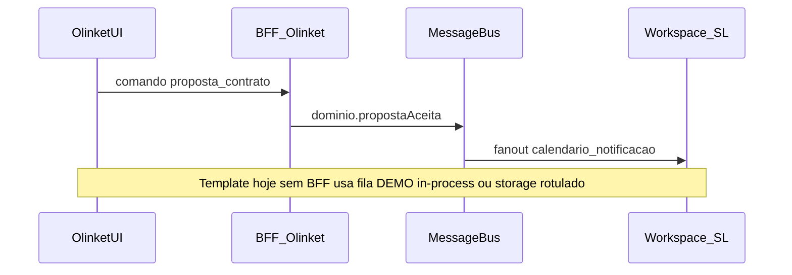

# Plano 7 — Integração Olinket ↔ Workspace

## Contexto no repositório

- **Produto / docs:** [matriz-telas.md](docs/gestao-tarefas/03-especificacao-produto/ui-canonical/matriz-telas.md) §7 define **Agenda de Tarefas** vs **Calendário de Eventos** e a tabela `EventStatus` ↔ visibilidade no calendário (fonte para paridade com SoundLink). [PBR-07](docs/gestao-tarefas/03-especificacao-produto/business-rules/_shared/pbr07-especificacao-dominio-permissoes.md) e [arquitetura-workspace.md](docs/gestao-tarefas/03-especificacao-produto/business-rules/_shared/arquitetura-workspace.md) §6 já afirmam que **eventos/propostas** ligam ao **BFF Olinket** e que Workspaces **alimentam dados** — falta o **contrato de sincronização** e o **caso de simulação** no template.
- **Código:** Domínio de proposta em [`src/features/propostas/domain/proposta-state.service.ts`](src/features/propostas/domain/proposta-state.service.ts); eventos em [`src/features/eventos/domain/event-status-machine.ts`](src/features/eventos/domain/event-status-machine.ts); contratos em [`src/features/contratos/application/services/criar-contrato-de-proposta.service.ts`](src/features/contratos/application/services/criar-contrato-de-proposta.service.ts). Contratos HTTP stub já existem em [`packages/shared-domain/src/contracts/api/`](packages/shared-domain/src/contracts/api/).
- **Restrição do pedido:** fase sem BFF — **contratos TypeScript**, **eventos de domínio** (nomenclatura de integração), demos **[DEMO]** rotuladas; não apresentar localStorage/seed como se fosse produção.

## Visão alvo (runtime futuro vs template)

No **template atual**, o “Workspace” real (outro host/repo) não recebe HTTP; o plano entrega o **contrato** + **simulação** no mesmo app (painel **[DEMO]**) e deixa **outbox real** como **[PLANEJADO]** até BFF/event bus.

## Fases e dependências

| Fase | O quê | Depende de |
|------|--------|------------|
| **1 — Spec** | Catálogo de eventos de integração (nome estável, payload mínimo, correlação, idempotência sugerida), mapa **ação Olinket → efeito esperado no WS** (calendário / notificação / espelho de mensagem se aplicável) | §7 matriz; ADR-002 (mensagens: **canônico escrita** na Olinket; evento de integração pode ser *notificação* ou *read-model*, não segunda fonte de escrita) |
| **2 — Contratos TS** | Tipos + `zod` (se o pacote já usar zod nos schemas) em `packages/shared-domain` | Fase 1 |
| **3 — Pontos de extensão** | Serviço fino tipo `emitWorkspaceIntegrationDemo(event)` chamado a partir de transições **já centralizadas** (proposta; contrato; opcionalmente mudança de `EventStatus` relevante para calendário) | Fases 1–2 |
| **4 — UI / storage DEMO** | Painel ou secção **visível só em demo** (banner + `data-demo`) listando últimos eventos emitidos; persistência opcional em chave explícita tipo `olinket.workspaceSync.demo.v1` **com metadado `demo: true` no payload** | Fase 3 |
| **5 — E2E** | Playwright: fluxo mínimo «ação na Olinket → entrada visível no painel DEMO» (mesma sessão) | Fases 3–4 |
| **6 — Governança** | ADR **curto** (novo ou addendum a [ADR-004](docs/gestao-ideias/00-governanca/decisoes/adr-004-mocks-partilhados-cross-repo.md)) apenas se o plano alterar limites do template (ex.: novo pacote export, convenção de eventos cross-repo, obrigatoriedade de rótulo DEMO) | Após fecho das fases 2–5 |

**Ordem sugerida:** 1 → 2 → 3 → 4 → 5 → 6 (6 pode ser paralelo à documentação de API em markdown).

## Entregáveis por artefato

### 1) Especificação (markdown em `docs/gestao-tarefas/03-especificacao-produto/`)

- Novo doc (ex.: `api-specifications/_shared/integracao-olinket-workspace-eventos.md`) com:
  - **Lista de eventos** (v1 sugerida): `OlinketPropostaEnviada`, `OlinketPropostaAceita`, `OlinketContratoGerado`, `OlinketEventoStatusAlterado` (payload com `eventId`, `propostaId?`, `contratoId?`, `workspaceSlug` ou `verticalWorkspace`, `eventStatus`, timestamps ISO).
  - **Correlação:** `correlationId` / `causaRaiz` para rastrear saga.
  - **Tabela “efeito no Workspace”:** por evento — *atualizar calendário de eventos*, *criar item de notificação*, *nenhuma escrita em canal de mensagens* (alinhar ADR-002).
  - Referência cruzada à **§7.1** de [matriz-telas.md](docs/gestao-tarefas/03-especificacao-produto/ui-canonical/matriz-telas.md).
- Cabeçalho de estado conforme [document-lifecycle.mdc](.cursor/rules/document-lifecycle.mdc): **PLANEJADO** para entrega só spec; após implementação dos tipos + demo alinhados, evoluir para **IMPLEMENTADO** com data.

### 2) Contratos TypeScript

- Local: [`packages/shared-domain/src/contracts/`](packages/shared-domain/src/contracts/) — subpasta sugerida `integration/` (distinto de `api/` síncrono BFF).
- Export em [`packages/shared-domain/src/index.ts`](packages/shared-domain/src/index.ts).
- Conteúdo: `IntegrationEventEnvelope`, discriminated union dos eventos v1, helpers de narrowing; opcionalmente schemas `zod` espelhados para validação em testes e futuro BFF.
- **Naming neutro** no payload (alinhar [Áudio do Plano 7](.cursor/plans/Olinket/olinket-soundlink-planos-prompts.md): UI desacoplada; payload com termos estáveis `eventId`, `professionalAccountId` ou `linketId` conforme já usado em [proposta.contract.ts](packages/shared-domain/src/contracts/api/proposta.contract.ts)).

### 3) Pontos de extensão no `src/`

- Criar módulo pequeno (ex.: `src/features/integracao-workspace/` ou `src/lib/workspace-integration-demo/`):
  - `emitIntegrationEventDemo(ev: IntegrationEventV1): void` — implementação default: publica em `EventTarget`/singleton in-memory + opcional `localStorage` **com prefixo e flag demo**.
  - **Chamadas:** nos serviços de aplicação que já aplicam a transição (evitar espalhar na UI): após sucesso de ações equivalentes a “enviar proposta”, “aceitar”, “gerar contrato”, e opcionalmente após `EventStatus` passar a `contratado` / `em_execucao` (coerente com §7).
- **Não** duplicar regras de negócio: só **observar** resultado já validado pelo domínio.

### 4) Superfície **[DEMO]**

- Rota dedicada (ex.: `/prestador/sincronizacao-demo` — **evitar** reviver `/conta/*` como namespace de demo) com:
  - Título/copy em **PT-BR** explicando que é **simulação local**.
  - Lista dos últimos N eventos (ordem cronológica inversa).
  - Badge “DEMO” / `aria-label` acessível.
- Se tocar em [`src/components/headers/`](src/components/headers/), incluir gate **`npm run lint:headers`** no checklist de execução.

### 5) E2E

- Novo spec Playwright: fluxo mínimo (ex.: login demo existente → navegar ao hub de evento → ação que dispara transição → abrir painel DEMO → assert texto ou `data-testid` do tipo de evento).
- Pré-requisitos: app em `localhost:3000` conforme regra do projeto.

### 6) ADR (condicional)

- Abrir **ADR** novo ou addendum se:
  - os eventos forem **contrato oficial** consumido pelo `soundlink-template-frontend` via package; ou
  - houver decisão nova sobre **dupla verdade** mensagens vs notificação.
- Caso contrário, referenciar apenas o markdown de spec + ADR-002/004 nas “Consequências”.

## Gates (execução)

- `npm run test` (unitários afetados).
- `npm run lint` e `npm run typecheck`.
- `npm run lint:headers` se alterar headers.
- `npm run test:e2e` (ou arquivo específico) com `npm run dev` em paralelo, para o novo fluxo.
- Skill [check-file-sizes](.cursor/skills/code-verificar-file-sizes/SKILL.md) nos novos `.tsx` > 200 linhas.

## Riscos e mitigação

| Risco | Mitigação |
|-------|-----------|
| Dois verdades em mensagens | Eventos de integração = **notificação/read-model**; escrita de chat continua ADR-002. |
| Confundir DEMO com prod | Banner fixo + chave storage + campo `demo: true` no envelope; copy e docs explícitos. |
| Divergência SoundLink | Spec referencia §7.1; coluna SL em matriz continua **[PLANEJADO]** até verificação no clone `main`. |

## Fora de escopo (marcar **[PLANEJADO]**)

- BFF, webhooks, fila real (SQS/EventBridge), consumo no repositório SoundLink em runtime.
- Sincronização bidirecional Workspace → Olinket.
