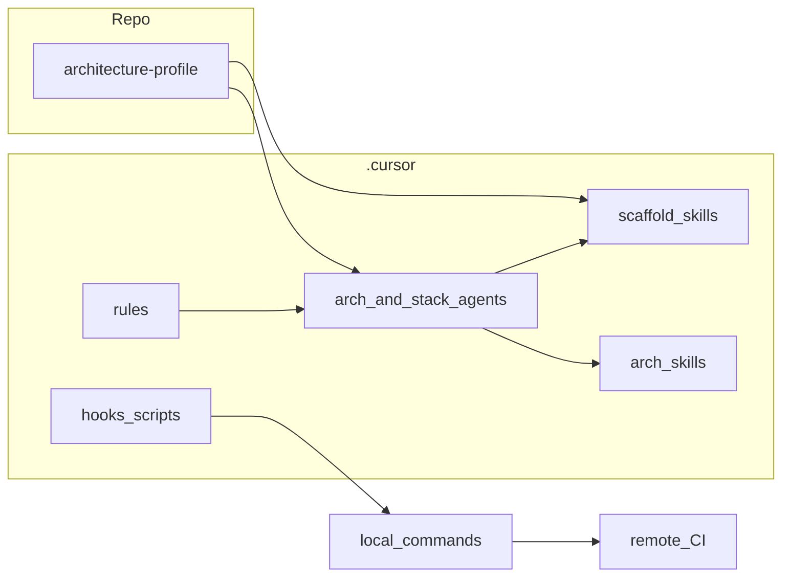

# Plano: agents, skills, rules e hooks por tipo de arquitetura

## Contexto e foco (automação assistida)

O documento [docs/governanca/fluxo-workflow-agent-hooks-ci.md](docs/governanca/fluxo-workflow-agent-hooks-ci.md) fixa o papel de cada camada: **rules** instruem o modelo; **skills** são playbooks; **agents** orquestram entrega; **hooks** são determinísticos (sem “chamar agente por nome”); **CI** é rede de segurança. O plano abaixo **não** tenta um motor de estados só em Markdown: combina perfil declarado no repo + skills de scaffolding + o fluxo já descrito (incl. [`.cursor/hooks.json`](.cursor/hooks.json), [`.cursor/rules/agent-implementation-quality.mdc`](.cursor/rules/agent-implementation-quality.mdc) e [workflow-cursor-agent-entrega](.cursor/skills/workflow-cursor-agent-entrega/SKILL.md)).

## Estado atual (AcoustiCore)

- Já existem agents **`arch-*-guia`** para vários temas (ex.: [arch-clean-architecture-guia.md](.cursor/agents/arch-clean-architecture-guia.md), [arch-hexagonal-guia.md](.cursor/agents/arch-hexagonal-guia.md), [arch-mvc-e-padroes-ui-guia.md](.cursor/agents/arch-mvc-e-padroes-ui-guia.md), [arch-microservicos-guia.md](.cursor/agents/arch-microservicos-guia.md), [arch-monolito-guia.md](.cursor/agents/arch-monolito-guia.md), [arch-sistemas-distribuidos-guia.md](.cursor/agents/arch-sistemas-distribuidos-guia.md), [arch-serverless-guia.md](.cursor/agents/arch-serverless-guia.md), [arch-separacao-frontend-backend-guia.md](.cursor/agents/arch-separacao-frontend-backend-guia.md)).
- As skills em [`.cursor/skills/arch-*/SKILL.md`](.cursor/skills/) hoje são sobretudo **conceituais** (trade-offs, quando usar).
- Já há skills de **blocos DDD/Clean** ao nível de código: [core-entity](.cursor/skills/core-entity/SKILL.md), [core-value-object](.cursor/skills/core-value-object/SKILL.md), [core-repository](.cursor/skills/core-repository/SKILL.md), [core-use-case](.cursor/skills/core-use-case/SKILL.md), [core-dto](.cursor/skills/core-dto/SKILL.md), etc. — boa base para “DDD aplicado”, falta **amarrar** ao perfil e ao stack.

## Problema a resolver

Para cada estilo (DDD, MVC, Hexagonal, Clean, microserviços, monólito, distribuído, cliente/servidor, serverless, camadas) queres **geração assistida** de artefatos concretos (Models/Views/Controllers, agregados/entidades/VOs, DAO, services, adaptadores, etc.). Isso exige:

1. **Taxonomia única** — mapear “tipo de arquitetura” → agent conceitual existente ou novo → **artefatos** suportados.
2. **Scaffolding dependente de stack** — o mesmo “MVC” ou “DAO” muda entre Spring, Nest, ASP.NET, etc.; a geração deve viver em skills **`framework-*` / `stack-*`** ou **`scaffold-*`**, não só em `arch-*` genérico.
3. **Perfil no repositório** — um arquivo versionado que diga *quais* estilos e *qual* stack aplicam a *qual* pacote/serviço, para o Agent/humano não adivinhar.
4. **Hooks** — manter-se **agnósticos** de arquitetura; opcionalmente ler variáveis ou manifesto só para escolher *comando* de teste (ex. workspace monorepo), sem orquestrar agents.

## 1. Manifesto: `architecture-profile` (novo)

**Local sugerido:** [docs/governanca/architecture-profile.schema.md](docs/governanca/architecture-profile.schema.md) (especificação) + exemplo [docs/governanca/architecture-profile.example.yaml](docs/governanca/architecture-profile.example.yaml) **ou** `.cursor/architecture-profile.yaml` na raiz do projeto consumidor (a definir por convenção).

**Conteúdo mínimo por módulo/pacote:**

- `id`, `path` (ex. `apps/backend`, `packages/domain`)
- `stack` (ex. `nestjs`, `spring`, `dotnet`)
- `styles[]`: enum alinhado à tabela abaixo
- `artifacts_enabled[]`: lista explícita do que pode ser gerado (evita VO em projeto só CRUD anémico, etc.)

**Objetivo:** o Agent (e documentação) apontam “abre o perfil → segue skills listadas”.

## 2. Matriz estilo → agent → artefatos → skills

| Estilo (pedido) | Agent conceitual (preferir existente) | Artefatos típicos | Skills de geração (a criar ou ligar) |
|-----------------|--------------------------------------|--------------------|--------------------------------------|
| **DDD** | Novo **`arch-ddd-guia`** *ou* extensão de [arch-clean-architecture-guia](.cursor/agents/arch-clean-architecture-guia.md) com seção DDD explícita | Agregado, entidade, VO, domain service, evento de domínio, factory | Reutilizar [core-entity](.cursor/skills/core-entity/SKILL.md), [core-value-object](.cursor/skills/core-value-object/SKILL.md), [core-domain-service](.cursor/skills/core-domain-service/SKILL.md); acrescentar **`scaffold-ddd-aggregate`** (orquestra pasta + invariantes + testes) |
| **MVC / MVP / MVVM** | [arch-mvc-e-padroes-ui-guia](.cursor/agents/arch-mvc-e-padroes-ui-guia.md) | Model, View, Controller (ou VM/Presenter) | Skills **`scaffold-mvc-<stack>`** (ex. `scaffold-mvc-spring`, `scaffold-mvc-nest`) com convenções de pastas do repo |
| **Hexagonal** | [arch-hexagonal-guia](.cursor/agents/arch-hexagonal-guia.md) | Porta, adaptador in/out, composição | **`scaffold-hexagonal-ports-adapters`** + pointers para [migracao-executar-migracao-hexagonal](.cursor/skills/migracao-executar-migracao-hexagonal/SKILL.md) quando for migração |
| **Clean Architecture** | [arch-clean-architecture-guia](.cursor/agents/arch-clean-architecture-guia.md) | Entities, use cases, interface adapters, frameworks | Encadear [core-use-case](.cursor/skills/core-use-case/SKILL.md), [core-dto](.cursor/skills/core-dto/SKILL.md), **`scaffold-clean-layer-skeleton`** (pastas + imports proibidos) |
| **Microserviços** | [arch-microservicos-guia](.cursor/agents/arch-microservicos-guia.md) | Serviço, contrato API, boundary, cliente HTTP | [code-criar-novo-microsservico](.cursor/skills/code-criar-novo-microsservico/SKILL.md), [config-new-module](.cursor/skills/config-new-module/SKILL.md) onde couber; **`scaffold-microservice-contract`** (OpenAPI stub) |
| **Monólito / monólito modular** | [arch-monolito-guia](.cursor/agents/arch-monolito-guia.md), [arch-monolito-modular-guia](.cursor/agents/arch-monolito-modular-guia.md) | Módulo, boundary interno, API interna | **`scaffold-monolith-module`** |
| **Distribuído / dados distribuídos** | [arch-sistemas-distribuidos-guia](.cursor/agents/arch-sistemas-distribuidos-guia.md), [arch-dados-distribuidos-guia](.cursor/agents/arch-dados-distribuidos-guia.md) | Idempotência, sagas, consistência | Skills já existentes de mensageria/sagas em `arch-*` + **`scaffold-idempotent-handler`** genérico |
| **Cliente/servidor** | [arch-separacao-frontend-backend-guia](.cursor/agents/arch-separacao-frontend-backend-guia.md) (+ BFF se aplicável) | Contrato cliente, cliente API, DTOs alinhados | [code-validar-contrato-api-frontend](.cursor/skills/code-validar-contrato-api-frontend/SKILL.md), **`scaffold-bff-route`** opcional |
| **Serverless** | [arch-serverless-guia](.cursor/agents/arch-serverless-guia.md) | Handler, event source, DLQ | **`scaffold-serverless-handler-<provider>`** (fase 2, por provider) |
| **Camadas (genérico)** | Transversal; referenciar Clean/Hex | service, DAO/repository, infra | **`scaffold-layered-service`**, **`scaffold-dao-repository`** mapeando DAO vs Repository conforme stack (ex. JPA repository vs ADO.NET) |

**Nota:** “DAO” vs “Repository (DDD)” — documentar no manifesto e nas skills que **DAO** é padrão camada de dados clássica; **Repository** no DDD tem semântica diferente; o Agent escolhe skill conforme `styles[]`.

## 3. Agents: alterações recomendadas

- **Novos:** `arch-ddd-guia.md` (se quiseres DDD como primeiro-cidadão separado de Clean) **ou** seção dedicada nos agents Clean + link para skills `core-*`.
- **Atualizar** cada `arch-*-guia.md` relevante com um bloco fixo **“Geração de código”**: tabela resumo → links para skills `scaffold-*` e `core-*` aplicáveis; referência ao manifesto `architecture-profile`.
- **Opcional:** agent **`architecture-scaffold-orchestrator-guia`** (nome a fechar) que só decide *qual* skill de scaffolding invocar com base no perfil + intenção do usuário — sem substituir agents de stack.

## 4. Skills: convenção de nomenclatura e índice

- Prefixo **`scaffold-<estilo>-<artefato>`** para geração mecânica; manter **`core-*`** para regras de qualidade DDD/Clean já existentes.
- Atualizar [`.cursor/skills/INDEX.md`](.cursor/skills/INDEX.md) com seção **“Scaffolding por arquitetura”** agrupada por estilo.
- Cada `scaffold-*` SKILL.md deve incluir: pré-condições, estrutura de pastas, snippet mínimo, testes sugeridos, **limites de tamanho** se aplicável ao repo alvo, e link para doc oficial do framework quando existir.

## 5. Rules (`.cursor/rules`)

- Nova rule opcional **`architecture-profile.mdc`** (`alwaysApply: false`): quando arquivos sob `path` do manifesto estão em foco, exigir alinhamento ao perfil (ex. não criar VO em módulo marcado só como “anemic layered”).
- Referência cruzada em [00-sdd-governance.mdc](.cursor/rules/00-sdd-governance.mdc) ou rule SDD: mudanças de fronteira/arquitetura → atualizar `docs/produto/fluxo/` ou ADR.

## 6. Hooks e CI (sem por arquitetura no hook)

- Manter hooks genéricos conforme [fluxo-workflow-agent-hooks-ci.md](docs/governanca/fluxo-workflow-agent-hooks-ci.md).
- Estender [`.cursor/hooks/README.md`](.cursor/hooks/README.md) com padrão **multi-pacote**: `CURSOR_HOOK_TEST_CMD` por workspace ou script wrapper que lê `architecture-profile` só para escolher `npm run test --workspace=...` (determinístico).
- Documentar no mesmo fluxo que **CI** deve espelhar esses workspaces (matrix), sem lógica por agente.

## 7. Governança e docs

- Curto ADR ou seção em `docs/governanca/` a explicar: perfil + matriz + limitação dos hooks.
- Atualizar [docs/governanca/catalogo-arch-agents-ia.md](docs/governanca/catalogo-arch-agents-ia.md) (se existir) com novos agents/skills de scaffolding.

## 8. Uso dos paths de exemplo (base evolutiva, sem cópia literal)

- **[/home/jesus/Projetos/projeto-ai](file:///home/jesus/Projetos/projeto-ai)** e **[/home/jesus/Projetos/AI-ProjectDeveloper](file:///home/jesus/Projetos/AI-ProjectDeveloper)** serão usados como **baseline técnica real** (estrutura de agent/skill/rule/hook), não apenas referência mental.
- O objetivo é criar **aqui no AcoustiCore** um **agent equivalente e unificado** para orquestrar decisão e geração por arquitetura, no formato deste projeto (frontmatter, naming, links para `arch-*`, `stack-*`, `framework-*` e `scaffold-*`).
- Esse agent será **melhorado** em relação aos exemplos: adiciona leitura do `architecture-profile`, matriz estilo→artefato→skill, política de fallback por stack e integração explícita com o fluxo [docs/governanca/fluxo-workflow-agent-hooks-ci.md](docs/governanca/fluxo-workflow-agent-hooks-ci.md).
- Regra de ouro: **reuso de ideias, não copy/paste**. Toda implementação passa por adaptação ao padrão local, validação de nomenclatura e checklist de automação assistida (Rule → Skill → Agent → Hook → CI).

## 9. Agent unificado (nome e escopo inicial)

**Nome sugerido:** `architecture-codegen-orchestrator-guia.md` (em `.cursor/agents/`).

**Missão:** decidir, por pedido do usuário, **quais skills de geração** (core/scaffold/framework/stack) devem ser aplicadas conforme `architecture-profile` e estilo arquitetural solicitado.

### Entradas mínimas

- Intenção do usuário (ex.: “gerar agregado DDD”, “montar MVC”, “criar service+DAO”).
- Contexto de código em foco (path/módulo).
- `architecture-profile` do projeto (stack, styles, artifacts habilitados).

### Saídas esperadas

- Plano curto de execução com sequência de skills.
- Lista de artefatos a gerar/alterar.
- Checklist de validação local (test/lint/typecheck) e referência ao fluxo Hook/CI.

### Critérios de decisão (MVP)

1. **Profile-first:** se `architecture-profile` existe, ele manda.
2. **Style-to-skill mapping:** mapear estilo solicitado para a matriz do plano (seção 2).
3. **Stack gate:** só acionar scaffold compatível com stack do módulo.
4. **Fallback explícito:** sem mapeamento direto, usar `arch-*-guia` + `stack-*` e pedir confirmação antes de gerar artefato fora do perfil.
5. **SDD guard:** se impactar comportamento/contrato, exigir atualização de docs `docs/produto/fluxo/`.

### Não-objetivos (evitar escopo indevido)

- Não substituir hooks por “automação de agente em background”.
- Não fazer decisões de produto/arquitetura sem validação humana.
- Não gerar artefato que viole `architecture-profile` apenas por conveniência.

### Dependências para implementação deste agent

- Definir schema do `architecture-profile` (seção 1).
- Publicar ao menos 2–3 skills `scaffold-*` piloto (seção 4).
- Atualizar 2–3 agents `arch-*` com bloco “Geração de código” (seção 3).

## Ordem de implementação sugerida (incremental)

1. Especificar schema + exemplo de `architecture-profile` e referenciar em [fluxo-workflow-agent-hooks-ci.md](docs/governanca/fluxo-workflow-agent-hooks-ci.md) (seção “Perfil de arquitetura”).
2. Implementar **2–3** skills `scaffold-*` piloto (ex. DDD agregado + Clean use case + MVC num stack que o repo alvo use de facto).
3. Atualizar **2–3** agents `arch-*-guia` com bloco “Geração de código” + links.
4. Rule `architecture-profile.mdc` + entrada no INDEX de skills.
5. Documentar padrão de hook multi-pacote no README dos hooks.
6. Expandir matriz (serverless por provider, DAO por stack) em ondas.

## Riscos e decisões

- **Explosão combinatória** estilo × stack: mitigar com perfil obrigatório e scaffolding **só** para stacks suportados explicitamente nas skills.
- **Hooks não orquestram agents:** a “automação assistida” é conversa + scripts determinísticos + CI, como no fluxo já acordado.
