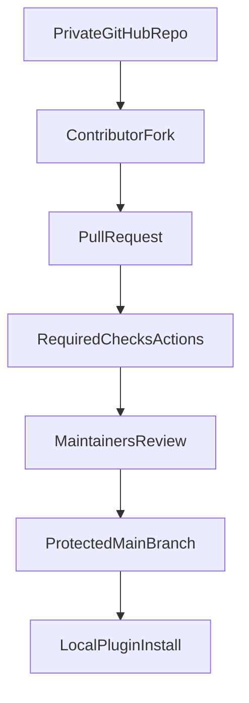

# Plano de Lançamento do Plugin Ralph Loop para CursorAI

## Viabilidade confirmada
- É **possível distribuir plugin no ecossistema Cursor** de duas formas:
  - **Pública (comunidade/Marketplace)**: submissão via página de publicação do Cursor.
  - **Privada (times)**: Team Marketplace com importação de repositório GitHub (planos Teams/Enterprise).
- A estrutura esperada do plugin no Cursor usa `/.cursor-plugin/plugin.json` (manifesto) e componentes em `skills/`, `rules/`, `agents/`, `commands/`, `hooks/`, `mcp.json`.
- Para este plano, a opção adotada é **repositório privado** com governança de contribuição por fork/PR.

## Estratégia recomendada
- Criar **repositório separado** no GitHub do usuário `jcjesus` para o plugin: `cursor-ralph-loop`.
- Manter o repositório **privado** e exigir contribuição **somente via fork + Pull Request**.
- Bloquear push direto em `main` por regra de proteção de branch.
- Não publicar no Marketplace nesta fase; foco em distribuição controlada e operação local do plugin.

## Definição de destino GitHub
- **Owner**: `jcjesus`
- **Repo**: `cursor-ralph-loop`
- **URL alvo**: `https://github.com/jcjesus/cursor-ralph-loop`
- **Branch inicial**: `main`
- **Visibilidade inicial**: `private`
- **Política de contribuição**: apenas `fork + PR` (sem push direto em `main`)

## Definição de caminho local
- **Padrão obrigatório de workspace local**: `/home/jesus/Projetos/<nome-do-projeto>`
- **Para este plano**:
  - `nome-do-projeto`: `cursor-ralph-loop`
  - caminho final: `/home/jesus/Projetos/cursor-ralph-loop`

## Escopo do novo repositório
- Migrar o MVP já criado para o formato de plugin Cursor:
  - `/.cursor-plugin/plugin.json`
  - `/commands/` (comandos de uso: iniciar/parar/ajuda)
  - `/hooks/hooks.json` (se houver hook de loop)
  - `/scripts/` (runner e verificador)
  - `/skills/` e `/rules/` (opcional no v1, recomendado no v1.1)
  - `README.md`, `LICENSE`, `CHANGELOG.md`
- Incluir guia de instalação/importação pelo fluxo de configurações do Cursor.
- Incluir governança de contribuição:
  - `CODEOWNERS`
  - `CONTRIBUTING.md` com fluxo obrigatório via fork
  - branch protection para bloquear push direto
  - templates de PR e issue

## Perfil de segurança (obrigatório no v1)
- Adotar princípio de menor privilégio para scripts/hooks.
- Documentar comandos potencialmente sensíveis e exigir confirmação explícita quando aplicável.
- Proibir comportamento destrutivo por padrão (`dry-run` e validações antes de execução real).
- Revisar dependências e fixar versões mínimas quando necessário.
- Incluir política de reporte em `SECURITY.md` e checklist de publicação segura.

## Estratégia de testes (obrigatória no v1)
- **Testes de unidade (scripts)**:
  - parse de estado (`scratchpad.md`)
  - condições de parada (`completion_promise`, `max_iterations`)
  - execução do `verify.sh` com cenários pass/fail
- **Testes de integração**:
  - fluxo ponta a ponta do loop em modo de simulação
  - atualização correta de logs e estado por iteração
- **Smoke test de distribuição**:
  - instalação por repositório no Cursor Settings
  - validação de discoverability de comandos/skills/hooks
- Definir matriz mínima Linux/macOS para scripts shell.
- Incluir validação de política de PR curto:
  - alerta/falha para PR acima do limite definido de linhas alteradas.

## Plano de execução
1. **Scaffold do repositório**
- Criar novo repo a partir do template oficial de plugin (`cursor/plugin-template`) no modo single plugin.
- Criar o remoto diretamente no usuário `jcjesus` e configurar `origin` para `https://github.com/jcjesus/cursor-ralph-loop.git`.
- Clonar/inicializar o projeto localmente em `/home/jesus/Projetos/cursor-ralph-loop`.
- Definir metadados iniciais no manifesto (`name`, `displayName`, `author`, `description`, `license`, `version`).
- Configurar repositório como **privado** e proteção de branch em `main`:
  - bloquear push direto
  - exigir PR aprovado
  - exigir checks obrigatórios

2. **Empacotar o Ralph Loop como plugin**
- Adaptar os artefatos atuais em [`/home/jesus/Projetos/AcoustiCore/.cursor/ralph/ralph-loop.sh`](/home/jesus/Projetos/AcoustiCore/.cursor/ralph/ralph-loop.sh), [`/home/jesus/Projetos/AcoustiCore/.cursor/ralph/verify.sh`](/home/jesus/Projetos/AcoustiCore/.cursor/ralph/verify.sh), [`/home/jesus/Projetos/AcoustiCore/.cursor/ralph/README.md`](/home/jesus/Projetos/AcoustiCore/.cursor/ralph/README.md) para a estrutura do novo repo.
- Criar comandos de alto nível (ex.: iniciar loop, cancelar loop, ajuda).

3. **Qualidade e submissão**
- Rodar checklist de prontidão (manifesto, discoverability, frontmatter, documentação).
- Usar o checklist da skill `review-plugin-submission` como gate.
- Garantir que o repo esteja privado e com licença explícita.
- Executar suite de testes definida para scripts e integração antes da submissão.
- Executar checklist de segurança e anexar evidências no PR/release notes.

4. **Publicação/distribuição**
- **Sem publicação pública nesta fase**.
- Distribuição controlada por colaboradores autorizados via fork/PR no GitHub.
- Opcional para times: Team Marketplace privado quando/onde aplicável.

5. **Go-to-market técnico**
- Publicar release `v0.1.0` com instruções de instalação e exemplo de `verify.commands`.
- Criar issue template para bugs e suggestions da comunidade.
- Criar templates de `security report`, `bug report` e `feature request`.
- Publicar roadmap inicial com prioridades de colaboração.
- Adicionar GitHub Actions para governança:
  - `pr-size-check` (PRs curtos)
  - `ci-tests` (scripts/testes)
  - `release-guard` (validação antes de tag/release)
  - `issue-triage` (padronização de bugs)

## Especificação do README (contexto completo)
- Seções obrigatórias:
  - **Visão geral do projeto**
  - **Motivação e contexto**
  - **Origem da ideia Ralph Loop** (com referência ao projeto original)
  - **Declaração de posicionamento**: este plugin **não é cópia**; é uma implementação própria para incentivar o recurso no ecossistema CursorAI
  - **Como funciona tecnicamente**
  - **Instalação e uso**
  - **Segurança e limites**
  - **Testes e qualidade**
  - **Licença MIT (uso livre)**
  - **Como contribuir**
- Incluir seção obrigatória de governança:
  - “Contribuições apenas via fork e Pull Request”
  - “Push direto em `main` é bloqueado”
  - “PRs devem ser curtos para facilitar revisão/aprovação”
- Incluir seção explícita de recomendação:
  - “Se você puder, conheça também o projeto Ralph original e seu ecossistema.”
- Incluir seção técnica sobre execução:
  - “Plugins do Cursor rodam localmente no ambiente do usuário”
  - “Não é necessário hospedar este plugin em servidor público/privado para funcionamento básico”
  - “Validado com base na documentação oficial do Cursor sobre plugins”

## Texto-base para convite à comunidade
- “Este projeto é comunitário e open source. Queremos evoluir o Ralph Loop no ecossistema CursorAI com segurança, transparência e testes. Contribuições de código, documentação, testes e feedback são muito bem-vindas. Abra uma issue, proponha uma melhoria ou envie um PR.”
- Complemento de governança:
  - “Para colaborar, faça fork do repositório e envie PR curto. Push direto na branch principal não é permitido.”

## Licenciamento
- Definir `LICENSE` como **MIT**.
- Garantir coerência entre `plugin.json`, `README.md` e arquivo `LICENSE`.
- Manter créditos apropriados às referências originais sem copiar código restritivo.

## Arquitetura de distribuição

## Riscos e mitigação
- **Risco de rejeição na revisão**: mitigar com validação prévia de manifesto, metadados e docs.
- **Risco de licença/conteúdo de terceiros**: manter implementação própria e licença explícita no novo repo.
- **Risco de UX confusa no setup**: incluir `README` com fluxo 1-2-3 e exemplo real de execução.

## Critérios de pronto (DoD)
- Novo repositório criado no usuário `jcjesus` e privado.
- Repositório local criado em `/home/jesus/Projetos/<nome-do-projeto>` e sincronizado com `origin`.
- Manifesto `.cursor-plugin/plugin.json` válido.
- Instalação por repositório/Settings documentada e testada.
- Fluxo de contribuição somente via fork/PR documentado e ativo.
- Proteção de branch impedindo push direto em `main` ativa.
- Versão `v0.1.0` publicada com changelog.
- `README.md` publicado com contexto completo, seção de não-cópia e recomendação ao projeto original.
- `LICENSE` MIT presente e referenciado no manifesto/documentação.
- Baseline de segurança e suíte mínima de testes executadas com evidências.
- Actions de PR, bugs e release configuradas e obrigatórias na branch principal.

## Fontes pesquisadas
- Cursor Marketplace: https://cursor.com/marketplace
- Publish page: https://cursor.com/marketplace/publish
- Changelog 2.6 (Team Marketplaces): https://cursor.com/changelog/2-6
- Template oficial: https://github.com/cursor/plugin-template
- Repositório oficial de plugins Cursor: https://github.com/cursor/plugins
- Skill checklist de submissão: https://github.com/cursor/plugins/blob/main/create-plugin/skills/review-plugin-submission/SKILL.md
