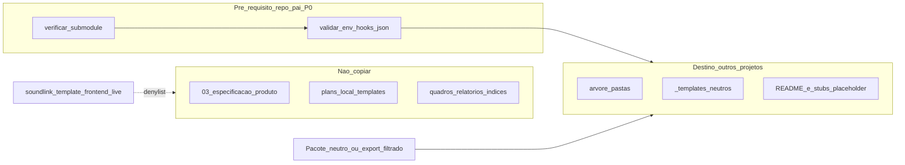

# Plano ajustado: scaffold neutro (estrutura + templates + regras)

## Governança: modo plano e execução (obrigatório para agentes e humanos)

- Uma conversa em **modo plano** serve para **produzir ou ajustar este documento de plano**, esclarecer requisitos e registrar decisões.
- **Não** constitui, por si só, autorização para: mudar para modo agent, criar/editar arquivos de implementação no repositório, ou “executar o plano” no sentido de implementação.
- **Ordem explícita** do usuário é necessária antes de qualquer execução (ex.: frases inequívocas do tipo: “executar o plano”, “implementar em Agent mode”, “aplicar o plano agora”). Palavras ambíguas como “prossiga”, “avança” ou “ajusta o plano” tratam-se, **por defeito**, como **iteração do plano** ou clarificação, **não** como disparo de implementação.
- **Iteração do plano** inclui frases como: “continua a iterar o plano”, “refina o P0”, “acrescenta risco X”, **“prossiga com a adição ao plano”** (só altera este `.plan.md` / anexos no plano) — sem implementação de código ou arquivos de produto fora do plano.
- **Lição registada:** interpretar “prossiga” como execução total foi erro de processo; evitar repetir sem confirmação explícita de execução.
- **Limpeza:** se, numa sessão anterior, tiverem sido criados arquivos de implementação sem ordem explícita, o humano pode revertê-los com `git checkout` / `git restore` no repo e no submodule, conforme política da equipe.

## Fora de escopo: `.cursor/` (submodule)

- **Não** incluir no plano de replicação de `docs/` a cópia, geração ou “wire” de `.cursor/` (agents, skills, rules, hooks, `hooks.json`). Nos projetos STEC isso vem do **submodule** [AI-ProjectDeveloper](https://github.com/STEC-Corporate/AI-ProjectDeveloper) montado em `.cursor/`, conforme **`SUBMODULES.md`** na raiz desse repositório (ex.: clone local `/home/jesus/Projetos/AI-ProjectDeveloper/SUBMODULES.md`).
- **P0 — Obrigatório no fluxo do orchestrator (duas sub-fases):**
  - **P0a — Submodule:** directório `.cursor/` presente; `git submodule status` com submodule inicializado (sem prefixo `-` em `.cursor`); pastas `agents/`, `skills/`, `rules/`. Se falhar: interromper scaffold de `docs/`, remeter a **`SUBMODULES.md`** na raiz do AI-ProjectDeveloper (no consumidor: `.cursor/SUBMODULES.md` quando o submodule está montado).
  - **P0b — TaskLink / hooks (quando `.cursor/` OK):** validação **informativa** ou **bloqueante** conforme política do manifest do projeto (ver seção *Manifest — campos para P0*):
    - **Ambiente:** valores observados ou declarados pelo usuário de `TASKLINK_DOC_LOCK` (`off` \| `soft` \| `strict`; omissão tratada como `off`) e `TASKLINK_BYPASS` (opcional). *Nota:* o agente pode não ver variáveis do shell do usuário; o relatório P0b deve indicar `unknown` quando não for possível ler o ambiente, e recomendar confirmação humana ou arquivo `.env.local` documentado pela equipe (sem commitar segredos).
    - **Arquivos:** existência de `.cursor/hooks.json`; JSON válido; presença de entrada `preToolUse` (ou equivalente na versão do Cursor em uso) que invoque o script de trava (ex.: `tasklink-doc-lock.sh`) quando `p0_require_tasklink_hook` for verdadeiro no manifest.
    - **Coerência Modo C:** se `tasklink_doc_lock_expected` no manifest for `strict` ou `soft`, verificar que a documentação neutra em `docs/gestao-tarefas/tasklink-travas-repos.md` **no destino** lista os mesmos paths bloqueados que o script referencia (amostragem ou diff manual na descrição da skill).
    - Registrar **avisos** vs **bloqueios** no relatório P0; não alterar arquivos até ordem explícita de correcção.

## Princípio reforçado

- **Incluir no destino:** pastas vazias ou com README stub; arquivos em `**/_templates/**` (quando forem reutilizáveis sem conteúdo proprietário SoundLink); Markdown de processo **genéricos** incluídos no pacote neutro (ex.: ponte TaskLink neutra); opcionalmente **stubs** gerados (ex.: `IDEIAS-ATIVAS.md` com seções vazias, `QUADRO-ATUAL.md` esqueleto).
- **TaskLink enforcement (rules, skills, hooks):** assume-se **já disponível** via submodule; o plano não os reproduz no repo pai.
- **Nunca copiar para outros projetos:** qualquer documento que seja **instância** do processo ou **especificação de produto** deste repo — por exemplo conteúdo em [`docs/gestao-tarefas/03-especificacao-produto/`](docs/gestao-tarefas/03-especificacao-produto/) (BR, user-flows, ui-canonical, api-specifications), [`docs/gestao-ideias/02-execucao/planejamento/plans-local-templates/`](docs/gestao-ideias/02-execucao/planejamento/plans-local-templates/) preenchidos, métricas/north-star concretos, quadros e relatórios vivos ([`QUADRO-ATUAL.md`](docs/gestao-tarefas/04-planejamento-execucao/QUADRO-ATUAL.md), [`_indices/RELATORIO-CONFORMIDADE-PROCESSO.md`](docs/gestao-tarefas/_indices/RELATORIO-CONFORMIDADE-PROCESSO.md)), nem cópia literal de [`MAPA-DOCUMENTOS.md`](docs/gestao-ideias/00-governanca/MAPA-DOCUMENTOS.md) / [`tasklink-gestao-tarefas.md`](docs/gestao-tarefas/tasklink-gestao-tarefas.md) se estiverem acoplados a paths e decisões só do SoundLink.



## Fonte de verdade para o scaffold (evitar “cp -r docs/”)

1. **Pacote neutro versionado** (recomendado): pasta na **raiz do repositório AI-ProjectDeveloper** (ex.: `docs/_stec-process-bootstrap/` nesse repo). No **repo consumidor**, o mesmo caminho aparece como `.cursor/docs/_stec-process-bootstrap/` porque `.cursor` é o mount do submodule — **não** confundir com “copiar a pasta `.cursor` do template SoundLink”; a fonte de verdade do pacote neutro é o **commit** do AI-ProjectDeveloper, não o `docs/` de outro produto. Conteúdo: apenas `*-TEMPLATE.md` / `*-stub.md` / stubs **sem** referências obrigatórias a um produto concreto, contendo:
   - Árvore espelhada de `gestao-ideias` / `gestao-tarefas` **só** com READMEs stub + placeholders (`{{PROJECT_NAME}}`, `{{REPO_URL}}`).
   - Versões **genéricas** de pontes TaskLink (equivalente a [`tasklink-gestao-tarefas.md`](docs/gestao-tarefas/tasklink-gestao-tarefas.md) e excertos de [`tasklink-travas-repos.md`](docs/gestao-tarefas/tasklink-travas-repos.md) com paths relativos a `docs/` e sem nome de produto).
2. **Alternativa de manutenção:** script `export-stec-docs-skeleton.sh` neste repo que **gera** o pacote neutro a partir do live aplicando **allowlist** (pastas + `_templates` + arquivos listados) e **denylist** explícita (globs para `03-especificacao-produto/**`, `**/plans-local-templates/**`, `**/*-mapping.md`, `ui-canonical/**`, etc.). O destino em outros projetos consome **só** a saída do export, nunca o `docs/` completo ao vivo.

## Ajuste às skills (em relação ao plano anterior)

| Skill (ajustada) | Comportamento |
|------------------|---------------|
| `tasklink-docs-scaffold-from-template` | Copia **apenas** a partir do **pacote neutro** ou do output do export filtrado; **proíbe** cópia directa de [`docs/gestao-ideias/`](docs/gestao-ideias/) / [`docs/gestao-tarefas/`](docs/gestao-tarefas/) “como está” no repo SoundLink. |
| `tasklink-docs-manifest-schema` | `content_source: neutral_pack_only`; `forbidden_globs[]` obrigatório. Campos opcionais para P0: ver *Manifest — campos para P0*. |
| `tasklink-docs-inventory` | Classifica paths em `structure_only`, `template_ok`, `forbidden_soundlink_instance`. |
| `tasklink-docs-validate-structure` | Falha se detectar arquivos de produto (ex.: `fe-*.md` fora de `_templates`, `ui-canonical/*.md` com corpo além de stub). |
| `tasklink-docs-verify-submodule-cursor` (ou passo P0 do orchestrator) | **P0a:** `.cursor/` + submodule + pastas mínimas; se inválido, `SUBMODULES.md` e **não** altera `docs/`. **P0b:** reportar `TASKLINK_DOC_LOCK` / `TASKLINK_BYPASS`, existência de `.cursor/hooks.json` e coerência com Modo C quando exigido pelo manifest (sem aplicar correcções sem ordem). |
| `docs-criar-doc-structure` (skill no submodule, após pré-requisito) | Cria **pastas vazias** + INDEX stub em `03-especificacao-produto/` por perfil **no destino**, sem trazer conteúdo do template SoundLink. |

## Manifest — campos opcionais para P0 (iteração)

Além dos campos obrigatórios já previstos (`content_source`, `project_name`, `forbidden_globs`), o manifest pode incluir:

| Campo | Tipo | Uso |
|-------|------|-----|
| `p0_require_tasklink_hook` | `boolean` (default `false`) | Se `true`, P0b **falha** se não existir `hooks.json` com hook de trava TaskLink referenciado. |
| `tasklink_doc_lock_expected` | `"off"` \| `"soft"` \| `"strict"` \| `"any"` (default `"any"`) | Se não for `"any"`, P0b compara com o valor declarado/observado de `TASKLINK_DOC_LOCK` e regista mismatch (bloqueante se a equipe assim o definir na skill). |
| `p0_env_source` | `"shell"` \| `"user_declared"` \| `"skip"` (default `"user_declared"`) | Como obter variáveis: `skip` = só arquivos; `user_declared` = humano cola valores no chat; `shell` = apenas quando o executor tiver acesso seguro ao ambiente. |

## Relatório P0 (formato sugerido)

Saída Markdown estruturada para colar no PR ou no quadro:

1. **P0a** — `pass` \| `fail`; linha `git submodule status` relevante; lista de pastas `.cursor/{agents,skills,rules}` encontradas.
2. **P0b** — `TASKLINK_DOC_LOCK`: valor \| `unknown`; `TASKLINK_BYPASS`: valor \| `absent`; `hooks.json`: `present` \| `absent` \| `invalid_json`; `preToolUse_tasklink`: `ok` \| `missing` \| `not_inspected`.
3. **Decisão** — `proceed_to_scaffold` \| `blocked_submodule` \| `blocked_p0b` \| `proceed_with_warnings` (último só se o manifest permitir avisos sem falhar).

## Anexo: exemplos `hooks.json` (referência P0)

O Cursor lê `.cursor/hooks.json` no **repo consumidor** (arquivo versionado no submodule AI-ProjectDeveloper, visível como `.cursor/hooks.json` na raiz do projeto pai). Estrutura típica: `version`, objeto `hooks` com chaves = **eventos** (`preToolUse`, `sessionStart`, …), cada um com array de `{ "command": "...", opcionais }`. Os `command` são paths **relativos à raiz do workspace** onde o Cursor corre (normalmente raiz do repo pai). O schema exato pode mudar com versões do Cursor; o P0 valida **presença**, **JSON válido** e, se `p0_require_tasklink_hook`, a entrada `preToolUse` que aponta para `tasklink-doc-lock.sh`.

### A) Mínimo — só trava TaskLink (`preToolUse`)

Útil quando o equipe só quer Modo C / soft sem outros hooks:

```json
{
  "version": 1,
  "hooks": {
    "preToolUse": [
      {
        "command": ".cursor/skills/hooks/tasklink-doc-lock.sh",
        "timeout": 5,
        "failClosed": false
      }
    ]
  }
}
```

### B) Catálogo STEC completo (como no AI-ProjectDeveloper atual)

Combina contexto ao arranque, aviso pós-edição, guarda de shell e TaskLink:

```json
{
  "version": 1,
  "hooks": {
    "sessionStart": [
      {
        "command": ".cursor/skills/hooks/inject-context.sh"
      }
    ],
    "afterFileEdit": [
      {
        "command": ".cursor/skills/hooks/after-file-edit.sh"
      }
    ],
    "beforeShellExecution": [
      {
        "command": ".cursor/skills/hooks/guard-shell.sh"
      }
    ],
    "preToolUse": [
      {
        "command": ".cursor/skills/hooks/tasklink-doc-lock.sh",
        "timeout": 5,
        "failClosed": false
      }
    ]
  }
}
```

### C) Sem TaskLink — só guardas operacionais

Quando `p0_require_tasklink_hook` é `false` e o projeto não exige trava em `docs/gestao-*`:

```json
{
  "version": 1,
  "hooks": {
    "beforeShellExecution": [
      {
        "command": ".cursor/skills/hooks/guard-shell.sh"
      }
    ]
  }
}
```

### D) Exemplos que **reprovam** o P0b (falhas típicas)

Usar para testes da skill e para o humano reconhecer erros comuns. Quando `p0_require_tasklink_hook === true`, qualquer caso abaixo (excepto o último, se for só aviso de path) deve levar a `preToolUse_tasklink: missing` ou `hooks.json: invalid_json` e decisão `blocked_p0b` (ou `proceed_with_warnings` só se o manifest o permitir).

**D1 — JSON inválido** (vírgula a mais no fim do objeto interior → parse falha):

```json
{
  "version": 1,
  "hooks": {
    "preToolUse": [
      {
        "command": ".cursor/skills/hooks/tasklink-doc-lock.sh",
      }
    ]
  }
}
```

- **Resultado P0b:** `hooks.json: invalid_json` (ou arquivo ignorado pelo Cursor).

**D2 — `preToolUse` vazio** com exigência de hook TaskLink:

```json
{
  "version": 1,
  "hooks": {
    "preToolUse": []
  }
}
```

- **Resultado P0b:** `preToolUse_tasklink: missing`.

**D3 — Sem bloco `preToolUse`** (só outros eventos) com `p0_require_tasklink_hook === true`:

```json
{
  "version": 1,
  "hooks": {
    "beforeShellExecution": [
      {
        "command": ".cursor/skills/hooks/guard-shell.sh"
      }
    ]
  }
}
```

- **Resultado P0b:** `preToolUse_tasklink: missing`.

**D4 — Nome do script errado** (não resolve para `tasklink-doc-lock.sh`):

```json
{
  "version": 1,
  "hooks": {
    "preToolUse": [
      {
        "command": ".cursor/skills/hooks/tasklink-doc-lock-typo.sh"
      }
    ]
  }
}
```

- **Resultado P0b:** `preToolUse_tasklink: missing` (basename não coincide com o acordado na skill).

**D5 — Path absoluto ou fora do padrão** (pode falhar no runtime do Cursor ou no repo noutra máquina):

```json
{
  "version": 1,
  "hooks": {
    "preToolUse": [
      {
        "command": "/home/dev/Projetos/custom/tasklink-doc-lock.sh"
      }
    ]
  }
}
```

- **Resultado P0b:** opcionalmente `preToolUse_tasklink: wrong_command` ou aviso **warning** (“path não relativo à raiz do workspace”) sem bloquear, conforme política definida na implementação — o plano recomenda **bloquear** em pipelines que exijam portabilidade.

| Caso | `hooks.json` (campo P0b) | `preToolUse_tasklink` |
|------|--------------------------|------------------------|
| D1 | `invalid_json` | `not_inspected` |
| D2 | `present` | `missing` |
| D3 | `present` | `missing` |
| D4 | `present` | `missing` |
| D5 | `present` | `missing` ou `wrong_command` / warning |

### Checklist P0b sobre `hooks.json`

- Arquivo existe em `.cursor/hooks.json` (relativo à raiz do repo pai).
- Parse JSON sem erro.
- Se `p0_require_tasklink_hook === true`: existe `hooks.preToolUse` (array não vazio) e **algum** elemento tem `"command"` cujo valor identifica `tasklink-doc-lock.sh` (suffixo ou basename acordado na implementação da skill).
- Opcional: registrar no relatório P0 se `timeout` / `failClosed` estão presentes (não obrigatório para `pass`).

## Agent orchestrator (ajustado)

- **`tasklink-docs-scaffold-orchestrator`**: fluxo fixo — **(P0)** `tasklink-docs-verify-submodule-cursor` (P0a submodule; P0b variáveis + `hooks.json`); se P0a falhar, parar e remeter a **`SUBMODULES.md`** — **(1)** validar manifest — **(2)** aplicar pacote neutro em `docs/` — **(3)** opcionalmente invocar `docs-criar-doc-structure` para árvore mínima de produto vazia.
- **Fora deste agente:** alterar `.cursorrules` do repo pai, `hooks.json`, ou copiar skills/rules — isso é responsabilidade do onboarding do submodule (e eventualmente convenções do repo pai), não do scaffold de `gestao-*`.
- **Recusa explícita:** pedidos para “copiar docs do SoundLink” ou “copiar `.cursor` para o projeto” → redireccionar para pacote neutro + `SUBMODULES.md` conforme o caso.

## Regras e TaskLink (submodule apenas)

- Enforcement (`tasklink-enforcement-ideias`, `tasklink-travas-gestao.mdc`, `tasklink-doc-lock.sh`, `hooks.json`) permanece **no AI-ProjectDeveloper**; o repo pai obtém-nos ao ter `.cursor/` inicializado (ver `SUBMODULES.md`).
- No **pacote neutro** de `docs/`, manter apenas Markdown **genérico** alinhado ao conceito de [`tasklink-travas-repos.md`](docs/gestao-tarefas/tasklink-travas-repos.md) (paths bloqueados, modos A/B/C), sem obrigar cópia de arquivos `.cursor`.

## Templates em `gestao-ideias/04-referencia-tecnica/_templates/`

- **Copiar para o pacote neutro** só arquivos cujo nome/contrato seja claramente template (`*TEMPLATE*`, `*-stub.md`, `*.schema.json` de replicação).
- **Rever manualmente** templates que mencionem monorepo SoundLink / BFF / rotas canônicas; ou substituir placeholders no pacote neutro ou **excluir** do allowlist até haver variante STEC-genérica.

## Critérios de aceite (atualizados)

- **P0:** relatório emitido antes de tocar em `docs/`; P0a obrigatório `pass` para continuar; P0b conforme manifest (`p0_require_tasklink_hook`, `tasklink_doc_lock_expected`).
- Num repo “filho”, após scaffold: existe a árvore de fases (`01`–`06`, `90` onde aplicável) **sem** arquivos `fe-*.md` de produto, **sem** `ui-canonical` preenchido, **sem** plans executáveis do SoundLink.
- `03-especificacao-produto/` contém no máximo README + pastas por perfil vazias (se o manifest pedir perfis), geradas por skill, **não** por cópia do template.
- Nenhum path no pacote neutro aponta obrigatoriamente para `soundlink-template-frontend` ou produto SoundLink (apenas placeholders configuráveis).

## Documentação de governança neste repo

- Acrescentar (numa fase de implementação posterior) um parágrafo em [`docs/gestao-tarefas/tasklink-gestao-tarefas.md`](docs/gestao-tarefas/tasklink-gestao-tarefas.md) ou no README do pacote neutro: **replicação = pacote neutro**, não clone de `docs/` completo.

## Riscos e limitações (iteração)

- **Visibilidade de env:** `TASKLINK_DOC_LOCK` pode estar só no ambiente gráfico do Cursor; P0b deve degradar com graça (`unknown` + pedido de confirmação humana).
- **Formato de hooks:** evoluções do produto Cursor podem alterar o schema de `hooks.json`; a skill deve versionar qual versão de documentação Cursor foi assumida ou validar só campos mínimos acordados.
- **Drift submodule:** dois consumidores com SHAs diferentes de `.cursor/` podem ter P0b diferente; o relatório P0 deve incluir **SHA** do submodule (ler `.git/modules` ou `git submodule`).

## Ordem de implementação sugerida

1. Definir **denylist/allowlist** (globs) e manifest **com campos opcionais P0**.
2. Criar **pacote neutro** (ou script de export) no repositório adequado (Modelo / AI-ProjectDeveloper).
3. Implementar skills de scaffold/validate com **neutral_pack_only** + skill **P0** (submodule + variáveis TaskLink + `hooks.json` conforme manifest).
4. Registrar agent orchestrator no **AI-ProjectDeveloper** (índice de agents/skills do submodule), sem expandir o plano para empacotar `.cursor` no repo pai.
