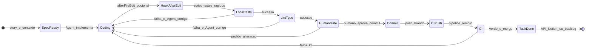

# Plano: workflow Agent + hooks + rules + documento de estado

## Situação atual (repo AcoustiCore / `.cursor`)

| Área | O que existe | Lacuna para o propósito |
|------|----------------|-------------------------|
| **Cursor Hooks** | Não há [`.cursor/hooks.json`](.cursor/hooks.json) nem scripts de hook | Falta configuração e exemplos seguindo [documentação oficial de Hooks](https://cursor.com/docs/hooks) (beta; confirmar eventos na tua versão). |
| **Docs de fluxo** | [`docs/governanca/fluxo-ia-sdd.md`](../../docs/governanca/fluxo-ia-sdd.md) — gates humanos G1–G5, SDD | Não descreve máquina de estados "código → teste → agente corretor → CI → git → Notion". |
| **Skills** | [`workflow-ferramentas-ia`](../skills/workflow-ferramentas-ia/SKILL.md) — contrato multi-ferramenta | Falta playbook **específico Cursor**: loop qualidade + hooks + limites de automação. |
| **Rules** | `cloud-*`, `00-sdd-governance`, stacks, frameworks | Falta rule **transversal pós-implementação** (testes/lint/typecheck após alteração de código). [`rules/INDEX.md`](../rules/INDEX.md) **não lista** as rules `cloud-*` (sincronizar). |
| **Agents** | Muitos `stack-*`, `arch-*`, `cloud-*` | Falta agent **orquestrador de entrega local** (quando invocar loop teste/correção sem confundir com `sdd-orquestrador`, que é documentação/SDD). |

**Nota:** A checklist "pós-implementação" que aparece em alguns workspaces como `post-implementation-checklist.mdc` **não está** neste repositório; pode ser **criada ou fundida** na nova rule (ver abaixo).

---

## Objetivo do documento (item 5 da conversa)

Criar **um único documento** em `docs/governanca/` que sirva de **especificação legível** (só Markdown + Mermaid) para:

- Estados, transições, responsáveis (Agent vs hook determinístico vs CI vs humano).
- Onde **não** existe máquina de estados real só com arquivos `.md` (o LLM não é um scheduler).
- Como combinar: **conversa Agent** + **rules/skills** + **hooks** + **CI** + **API de tarefas** (ex.: Notion via MCP ou REST).

Sugestão de arquivo: [`docs/governanca/fluxo-workflow-agent-hooks-ci.md`](../../docs/governanca/fluxo-workflow-agent-hooks-ci.md) (nome ajustável).

### Máquina de estados (lógica a documentar)

O documento deve **explicitar**:

- **Push para `main` / produção:** gate humano recomendado (alinhar a [`fluxo-ia-sdd.md`](../../docs/governanca/fluxo-ia-sdd.md)).
- **"Notion done":** variáveis de ambiente, MCP Notion (se existir no consumidor), ou webhook; exemplo de payload **sem secrets** no repo.

---

## Fase A — Documento de governação (prioridade)

1. Redigir [`docs/governanca/fluxo-workflow-agent-hooks-ci.md`](../../docs/governanca/fluxo-workflow-agent-hooks-ci.md) com:
   - Tabela **camada** (Rule / Skill / Hook / CI / Human) × **objetivo**.
   - Seção **Limitações do Cursor** (hooks não "chamam outro agente" por nome; orquestração de segundo agente = conversa ou produto).
   - Seção **Notion / tarefas** (genérico + exemplo Notion).
2. Acrescentar em [`docs/governanca/fluxo-ia-sdd.md`](../../docs/governanca/fluxo-ia-sdd.md) um parágrafo + link para o novo doc (encaixe com G4/G5).
3. Atualizar [`.cursor/README.md`](../README.md) com linha "Workflow + Hooks" apontando para o doc e para `.cursor/hooks.json`.

---

## Fase B — Cursor Hooks (determinístico)

1. Adicionar [`.cursor/hooks.json`](../hooks.json) com `version` conforme doc atual do Cursor.
2. Criar pasta [`.cursor/hooks/`](../hooks/) com scripts **pequenos e seguros**:
   - Exemplo **`afterFileEdit`**: invocar wrapper que lê config opcional (ex.: arquivo `.cursor/hooks.config.json` na raiz do **projeto pai** ignorado pelo git, ou env `CURSOR_HOOK_TEST_CMD`) e corre comando curto; se não houver config, **no-op** ou mensagem no Output Hooks.
   - Exemplo **`stop`**: stub documentado para "fecho de tarefa" (exit 0); implementação real Notion **só** com token fora do repo.
3. Documentar no novo `.md` de governação: como ativar, painel **Output → Hooks**, e **nunca** commitar secrets.

**Importante:** validar na tua build do Cursor a lista exata de eventos (`afterFileEdit`, `stop`, `beforeShellExecution`, etc.) — a API está em evolução.

---

## Fase C — Skill + Agent (orquestração "soft")

1. **Skill** nova, ex.: [`.cursor/skills/workflow-cursor-agent-entrega/SKILL.md`](../skills/workflow-cursor-agent-entrega/SKILL.md):
   - Passos: implementar → `npm run test` / equivalente (detectar por `package.json`, `pom.xml`, etc.) → corrigir até verde → lint/typecheck se existir script → resumo para commit.
   - Ligação aos scripts em `.cursor/hooks/` e ao documento de fluxo.
2. **Agent** novo, ex.: [`.cursor/agents/workflow-cursor-entrega-guia.md`](../agents/workflow-cursor-entrega-guia.md):
   - `description` claro: "Usar quando o pedido for entregar código testado localmente, alinhado a hooks/CI".
   - Não duplicar o papel do [`sdd-orquestrador`](../agents/sdd-orquestrador.md) (spec/produto).

---

## Fase D — Rules: criar, alinhar, melhorar

1. **Nova rule** [`.cursor/rules/agent-implementation-quality.mdc`](../rules/agent-implementation-quality.mdc) (nome ajustável):
   - `globs`: padrões de código (`**/*.{ts,tsx,js,jsx,java,py,cs,csproj}` ou o conjunto que a holding usar); `alwaysApply: false`.
   - Conteúdo: após alteração de código, **executar** testes/lint/typecheck quando existirem scripts no repo; **não** declarar concluído com testes a falhar; alinhar a [`00-sdd-governance.mdc`](../rules/00-sdd-governance.mdc).
2. **Rever** [`engineering-discipline.mdc`](../rules/engineering-discipline.mdc): uma linha a referir o novo fluxo quando `docs/` incluir planos de entrega.
3. **Opcional:** rule mínima [`.cursor/rules/cursor-hooks-safety.mdc`](../rules/cursor-hooks-safety.mdc) com `globs: **/.cursor/hooks/**` a lembrar revisão de scripts e paths.
4. **Atualizar** [`rules/INDEX.md`](../rules/INDEX.md): seção **Cloud** (`cloud-*.mdc`) + novas rules.

---

## Fase E — Índices e consistência

1. [`.cursor/skills/INDEX.md`](../skills/INDEX.md): entrada na seção "Núcleo SDD" ou nova seção "Workflow Cursor" com a skill nova.
2. [`.cursor/agents/INDEX.md`](../agents/INDEX.md): linha para `workflow-cursor-entrega-guia`.
3. Verificar consistência do gerador cloud: a skill [`catalogo-cloud-providers-ia`](../skills/catalogo-cloud-providers-ia/SKILL.md) já aponta para [`.cursor/skills/catalogo-cloud-providers-ia/scripts/generate-cloud-agents-skills.py`](../skills/catalogo-cloud-providers-ia/scripts/generate-cloud-agents-skills.py); se ainda existir duplicado em `scripts/` na raiz, **fundir ou remover** na mesma entrega para evitar duas fontes de verdade.

---

## O que **não** fazer neste âmbito (recomendação explícita no doc)

- Push automático para branch protegida sem política organizacional.
- Tokens Notion/GitHub em repositório.
- Depender só do LLM para "sempre" correr testes — **hook + CI** como rede de segurança.

---

## Ordem de execução sugerida

1. Documento `fluxo-workflow-agent-hooks-ci.md` + links em `fluxo-ia-sdd.md` e `.cursor/README.md`.
2. `hooks.json` + scripts stub em `.cursor/hooks/`.
3. Skill + agent de entrega.
4. Rule `agent-implementation-quality` + atualização `rules/INDEX.md`.
5. Revisão final de índices e duplicados de scripts.
