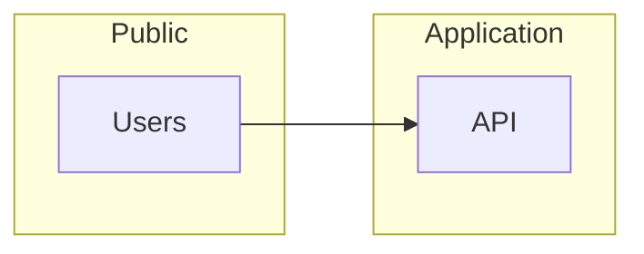

# Skill: Diagramas de arquitetura cloud

## Quando usar

- Após inventário (`cloud-architecture-discover`) ou quando o usuário descrever arquitetura alvo.

## Formato preferido

- **Mermaid:** `flowchart`, `graph` para fluxos; subgraphs para zonas (público, privado, dados).
- Evitar nós com espaços no ID; usar aspas em labels com caracteres especiais.

## Exemplo mínimo (estrutura)

## Agente

- **[cloud-architecture-diagram-guia](../../agents/cloud-architecture-diagram-guia.md)**
